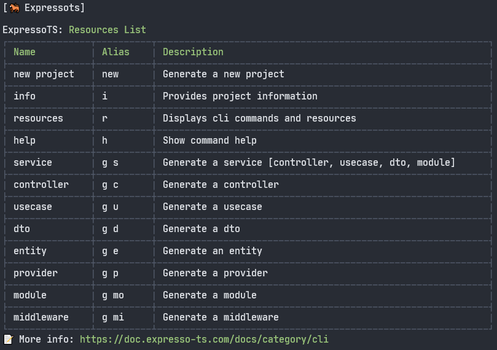

# Overview

The ExpressoTS CLI is a command-line interface tool that helps you to `create` ExpressoTS projects and `scaffold` the application resources such as use cases, controllers, dto's, providers and services.

:::info
We use the `npm` package manager in this tutorial, but you can use your favorite package manager, such as `yarn` or `pnpm`.
:::

## Installation

First install the CLI globally using the command below:

```bash
npm install -g @expressots/cli
```

## Basic usage

```bash
expressots <command> [options]
```

### Help

Verify the available commands and options:

```bash
expressots --help
```

### Info

Providers information about your Operational System, Project and CLI version:

```bash
expressots info or i
```

### Resources list

List all available resources to scaffold:

```bash
expressots resources or r
```



## Create a Project

There are two options to create a new project, interactively or silently (passing the options as arguments).
Here is the complete command syntax:

```bash
expressots new <project-name> -p <package-manager> -t <template> -d <directory>
```

### Interactively

```bash
expressots new <project-name>
```

### Silently

```bash
expressots new <project-name> -p <package-manager> -t <template> -d <directory>
```

-   **package-manager**: `npm`, `yarn` or `pnpm`
-   **template**: `opinionated` or `non-opinionated`
-   **directory**: `./my-project`

The flag `-d` is optional and is used to specify the directory where the project will be created. If not specified, the project will be created in the current directory.

---

## Support the Project

ExpressoTS is an MIT-licensed open source project. It's an independent project with ongoing development made possible thanks to your support. If you'd like to help, please consider:

-   Become a **[sponsor on GitHub](https://github.com/sponsors/expressots)**
-   Follow the **[organization](https://github.com/expressots)** on GitHub and Star ⭐ the project
-   Subscribe to the Twitch channel: **[Richard Zampieri](https://www.twitch.tv/richardzampieri)**
-   Join our **[Discord](https://discord.com/invite/PyPJfGK)**
-   Contribute submitting **[issues and pull requests](https://github.com/expressots/expressots/issues/new/choose)**
-   Share the project with your friends and colleagues
