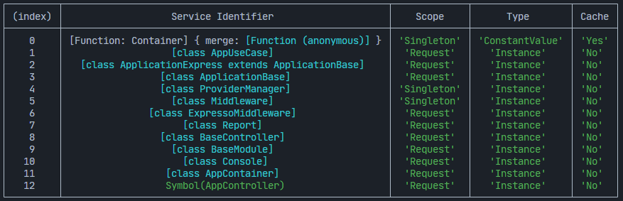

# App Container

ExpressoTS leverages **[InversifyJS](https://inversify.io/)** for its Inversion of Control (IoC) container capabilities, providing a robust system for dependency injection. This type-aware container facilitates object instantiation, resolution, and life cycle management, enabling the creation of complex dependencies with minimal code.

The AppContainer wrapper simplifies integration, allowing for straightforward registration of controllers, use cases, and providers within the application.

## Configuring the container

The application container can be customized with default scopes for dependency binding and options to skip base class checks, enhancing flexibility in dependency management.

-   **defaultScope**: The default scope, `RequestScope`, creates a new instance of a dependency for each request, while `SingletonScope` creates a single instance shared across all requests. The `TransientScope` creates a new instance each time the dependency is requested.
-   **skipBaseClassChecks**: When set to `true`, the container will skip base class checks when working with derived classes.
-   **autoBindInjectable**: When set to `true`, the container will automatically inject classes that are not explicitly bound.

Here is the interface options definition:

```typescript
interface ContainerOptions {
    /**
     * The default scope for bindings in the container.
     * It can be set to Request (default), Singleton, or Transient.
     */
    defaultScope?: interfaces.BindingScope;

    /**
     * Allows skipping of base class checks when working with derived classes.
     */
    skipBaseClassChecks?: boolean;

    /**
     * Allows auto-injection of classes that are not explicitly bound to the container.
     */
    autoBindInjectable: false;
}
```

Creating the container

```typescript
// Adding options to the container
export const appContainer: AppContainer = new AppContainer({
    defaultScope: BindingScopeEnum.Singleton,
    skipBaseClassChecks: true,
    autoBindInjectable: false,
});

// Creating a container module manager
const container = appContainer.create([
    // Add your modules here
    AppModule,
]);

export { container };
```

## Defining the container scope

As mentioned above, if the `defaultScope` option is not provided, it defaults to `RequestScope`. However, it is possible to change the default scope by passing the `defaultScope` as a an option in the container constructor. The `BindingScopeEnum` contains the following values:

-   `BindingScopeEnum.Singleton` - The dependency will be created once and will be shared across all requests.
-   `BindingScopeEnum.Request` - The dependency will be created once per request.
-   `BindingScopeEnum.Transient` - The dependency will be created every time it is requested.

## Viewing container bindings

The container can be used to view all the bindings that have been registered. This can be useful for debugging purposes or to understand the dependencies that have been registered.

```typescript
appContainer.viewContainerBindings();
```



## Registering Modules

The `appContainer` facilitates module registration via its `create([])` method, which accepts an array of modules. This streamlined approach reduces setup complexity and aligns with ExpressoTS's goal of simplifying application architecture:

```typescript
// Create a new container
const appContainer: AppContainer = new AppContainer();

const container: Container = appContainer.create([
    // Register all the modules
    UserModule,
    PaymentModule,
    ProductModule,
]);
```

The use of `appContainer` abstracts away the intricacies of InversifyJS direct usage, providing a straightforward path to integrating and managing modules within ExpressoTS applications.

---

## Support the Project

ExpressoTS is an MIT-licensed open source project. It's an independent project with ongoing development made possible thanks to your support. If you'd like to help, please consider:

-   Become a **[sponsor on GitHub](https://github.com/sponsors/expressots)**
-   Follow the **[organization](https://github.com/expressots)** on GitHub and Star ⭐ the project
-   Subscribe to the Twitch channel: **[Richard Zampieri](https://www.twitch.tv/richardzampieri)**
-   Join our **[Discord](https://discord.com/invite/PyPJfGK)**
-   Contribute submitting **[issues and pull requests](https://github.com/expressots/expressots/issues/new/choose)**
-   Share the project with your friends and colleagues
