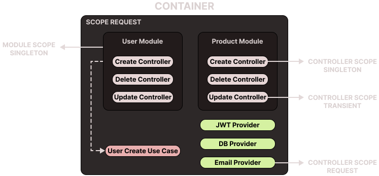

# Dependency Injection

Dependency Injection (DI) is a design pattern used in software development that involves providing an object with the instances of the classes it needs to perform its tasks, rather than having it construct these instances itself. This process of `providing` instances is called `injecting` them, hence the term Dependency Injection.

## Benefits of DI

Here are some of the key benefits of using Dependency Injection:

-   Decoupling: DI helps to decouple the components of your application. Instead of components creating the objects they depend upon, these objects are passed in (injected) by a DI framework or container. This means components don't need to know about the inner workings of their dependencies, and dependencies can be swapped out without the component knowing or caring.

-   Testability: DI makes unit testing easier. Because dependencies are injected, you can easily provide mock objects during testing. This allows each unit of code to be tested in isolation, with full control over its dependencies.

-   Reusable Code: With DI, your classes are typically designed to work with interfaces rather than concrete classes. This means you can reuse the same class in different contexts, with different injected dependencies.

-   Easier Maintenance and Increased Efficiency: By centralizing the creation of objects, and by reducing the amount of hard-coded class instantiation, maintenance becomes easier. When a class changes, you typically only need to update code in one place.

-   Configurability: You can configure your application structure externally, typically through XML or similar files. This means you can modify the structure and dependencies of your components without having to modify the code itself.

-   Lifecycles and Scoping: manage the lifecycle of injected objects, and control their scoping (e.g., singleton scope, request scope).

-   Concurrency Management: containers can automatically handle service lifetimes in a concurrent environment, which can be a complex task to handle correctly without such a tool.

In conclusion, DI is a technique that facilitates loose coupling, increased testability, and more maintainable and flexible code.

## DI on ExpressoTS

Here is how ExpressoTS implements DI:



## DI components breakdown

Here is a breakdown of the DI components used in ExpressoTS:

| Components | Description                                                                                        |
| ---------- | -------------------------------------------------------------------------------------------------- |
| Container  | The DI container of the ExpressoTS application.                                                    |
| Module     | A container module is typically used to group related controllers and their dependencies together. |
| Controller | Primary interface between the client and server. Responsible to handle incoming requests.          |
| Classes    | Any other class part of the ExpressoTS ecosystem, for example, providers, entities, helpers, etc.  |

### Resume

-   Container have its default scope that can be override by the module. The default scope is `Request` scope.
-   Defining a scope for a module forces all controllers under that module to have the same scope.
-   Not defining a scope for a module allow controllers to have their own scope using `@scope()` decorator.
-   All other registered classes such as providers, entities, helpers can have their specific scope based on the decorator used.
-   Decorators:

| Decorator         | Description                                                        |
| ----------------- | ------------------------------------------------------------------ |
| @provide          | Binds a class to a dependency injection container as RequestScope. |
| @provideSingleton | Binds a class to a dependency injection container as Singleton.    |
| @provideTransient | Binds a class to a dependency injection container as Transient.    |

### Container

The container is the main component of the DI system. It is responsible for managing the lifecycle of the objects it creates, and for injecting dependencies into those objects.

The default scope of the container is `Request` scope. This means that the container will create a new instance of a class for each request. For more information about **[Containers](app-container.md)** please refer to the app container section.

### Modules

A container module is used to organize related controllers and their dependencies and coherent units. Modules can also have their own specific scope definition. For more information about modules please refer to the **[Modules](module.md)** section.

### Controllers

Controllers are grouped into modules that usually represents a feature of the application. Controllers are always associated with modules. If a module has a specific scope defined, all controllers within that module will be created with the module scope. If the module doesn't have a scope defined, it inherits the scope of the Application container, which is `Request` scope.

In this particular case, individual controllers can have their own scope defined by using `@scope()` decorator. For more information about controllers please refer to the **[Controllers](controller.md)** section.

### Classes

Any other class part of the ExpressoTS ecosystem, for example, providers, entities, helper classes, etc are injected automatically to the Application Container through the decorator `@provide()` in which injects the classes as `Request` by default.

If you want to define a different scope for your class, you can use the `@provideSingleton()` decorator to inject the class as a singleton or `@provideTransient()` to inject the class as transient.

Example of usage:

#### Request

```typescript
@provide(MyRequest)
class MyRequest {}
```

#### Singleton

```typescript
@provideSingleton(MySingleton)
class MySingleton {}
```

#### Transient

```typescript
@provideTransient(MyTransient)
class MyTransient {}
```

:::tip
To define scope bindings the enum BindingScopeEnum can be used.
:::

-   `BindingScopeEnum.Singleton` - The dependency will be created once and will be shared across all requests.
-   `BindingScopeEnum.Request` - The dependency will be created once per request.
-   `BindingScopeEnum.Transient` - The dependency will be created every time it is requested.

---

## Support the project

ExpressoTS is an MIT-licensed open source project. It's an independent project with ongoing development made possible thanks to your support. If you'd like to help, please consider:

-   Become a **[sponsor on GitHub](https://github.com/sponsors/expressots)**
-   Follow the **[organization](https://github.com/expressots)** on GitHub and Star ⭐ the project
-   Subscribe to the Twitch channel: **[Richard Zampieri](https://www.twitch.tv/richardzampieri)**
-   Join our **[Discord](https://discord.com/invite/PyPJfGK)**
-   Contribute submitting **[issues and pull requests](https://github.com/expressots/expressots/issues/new/choose)**
-   Share the project with your friends and colleagues
