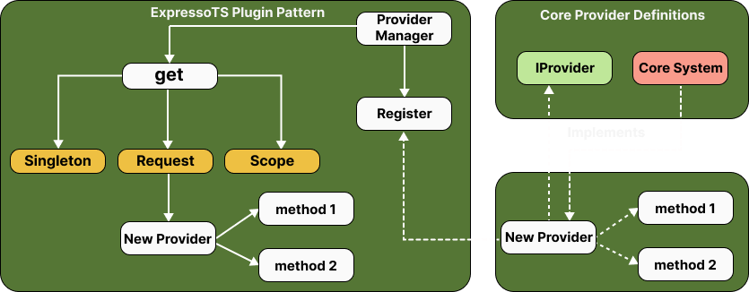

# Providers

In ExpressoTS, providers serve as modular enhancements to an application, encapsulating specific functionalities such as email services, authentication mechanisms, or database connections. This encapsulation is essential for preserving a loosely coupled architecture, enabling seamless swapping or updating of these functionalities without affecting the overall system.

## The role of providers

Providers encapsulate the operations of infrastructure components such as databases, web services, and file systems, presenting a unified interface to the application. This setup not only simplifies the codebase but also enhances its testability, maintainability, and scalability.

### Key advantages

-   Promote loose coupling between application layers.
-   Simplify the testing process by decoupling logic from specific implementations.
-   Enhance code maintainability and flexibility, supporting easy swaps of underlying services.

:::info
ExpressoTS harnesses providers to augment application capabilities, facilitating functionalities like email dispatching, data storage, and more, without tying the application logic to specific implementations.
:::

## Implementing a provider: An email service example

Consider an application needing to send emails under various circumstances, such as user registration or password recovery. By implementing an email provider, ExpressoTS can send emails without directly interacting with the mailing service in the business logic.

### Setting up the provider

First, run the CLI command to scaffold a new provider in your ExpressoTS project:

```bash
expressots g p mailtrap
```

The CLI will add the suffix `Provider` to the provider name, creating a new file in the `providers` directory. This file will contain the provider class, which you can then customize to suit your application's needs.

Here is the default provider file generated by the CLI:

```typescript
import { provide } from "inversify-binding-decorators";

@provide(MailTrapProvider)
class MailTrapProvider {}
```

### Implementing the provider

```typescript
import nodemailer from "nodemailer";
import Mail from "nodemailer/lib/mailer";

const enum EmailType {
    Welcome = 0,
    CreateUser,
    ChangePassword,
    Login,
    RecoveryPassword,
}

@provide(MailTrapProvider)
class MailTrapProvider {
    private transporter: Mail;

    constructor() {
        this.transporter = nodemailer.createTransport({
            host: Env.Mailtrap.HOST,
            port: Env.Mailtrap.PORT,
            auth: {
                user: Env.Mailtrap.USERNAME,
                pass: Env.Mailtrap.PASSWORD,
            },
        });
    }

    private mailSender(message: IMessage): Promise<void> {
        await this.transporter.sendMail({
            to: {
                name: message.to.name,
                address: message.to.email,
            },
            from: {
                name: message.from.name,
                address: message.from.email,
            },
            subject: message.subject,
            html: message.body,
        });
    }

    sendEmail(emailType: EmailType): Promise<void> {
        switch (emailType) {
            case EmailType.Login:
                break;
            case EmailType.Welcome:
                break;
            case EmailType.RecoveryPassword:
                break;
            case EmailType.ChangePassword:
                break;
            case EmailType.CreateUser:
                this.MailSender({
                    to: {
                        name: "User",
                        email: Env.Mailtrap.INBOX_ALIAS,
                    },
                    from: {
                        name: "ExpressoTS",
                        email: "noreply@expresso-ts.com",
                    },
                    subject: "Successfully logged in!",
                    body: "<h1>Welcome to the system!</h1>",
                });
                break;
        }
    }
}

export { MailTrapProvider, EmailType };
```

This `MailTrapProvider` abstracts the complexity of configuring and using nodemailer for email operations, providing a straightforward method sendEmail to send different types of emails.

### Consuming the provider in a use case

Here is the use case implementation making use of the mailtrap provider:

```typescript
@provide(LoginUserUseCase)
class LoginUserUseCase {
    constructor(private mailTrapProvider?: MailTrapProvider) {}

    execute(payload: ILoginUserRequestDTO): boolean {
        const { email, password } = payload;

        if (isAuthenticated(email, password)) {
            return true;
        }

        // Implementation of the use case logic
        mailTrapProvider?.sendEmail(EmailType.Login);

        return false;
    }
}

export { LoginUserUseCase };
```

In this use case, the `MailTrapProvider` is injected through the constructor, leveraging ExpressoTS's dependency injection. This decouples the email sending process from the authentication logic, illustrating the provider's role in maintaining clean and maintainable code.

## Available providers in ExpressoTS

ExpressoTS offers built-in providers for common functionalities, further extending the application's capabilities:

| Provider Name | Description                         |
| ------------- | ----------------------------------- |
| envValidator  | Validate the environment variables. |
| logger        | Add logger to the application.      |

Providers are essential for building scalable, maintainable applications with ExpressoTS, emphasizing clean architecture and separation of concerns.

## Automatic registration with fluent decorators

ExpressoTS facilitates the registration of providers in its dependency injection system through the use of fluent decorators:

-   @provide
-   @provideSingleton
-   @provideTransient

These decorators ensure that providers are automatically registered, streamlining their integration and reducing boilerplate.

## Creating and registering an external provider

ExpressoTS encourages extensibility through the use of external providers. Developers can create reusable packages, following the plugin design pattern, to introduce new functionalities into an ExpressoTS application. This is particularly useful for features that need to be shared across multiple projects or for integrating third-party services.

### Creating an external provider

An external provider should be a CommonJS package implementing the IProvider interface:

```typescript
import { IProvider } from "expressots";

@injectable()
class Logger implements IProvider {
    log(message: string): void {
        console.log(message);
    }
}
```

Interface `IProvider`:

```typescript
export interface IProvider {
    name: string;
    version: string;
    author: string;
    repo: string;
}
```

Once the package is developed and published to the npm registry, it can be easily integrated into any ExpressoTS application.

### Registering Providers at Runtime

Providers are registered in the `App` class of an ExpressoTS application using the `ProviderManager`. The `@injectable` decorator from InversifyJS makes the provider available for registration and resolution within the app's dependency injection system.

```typescript
@provide(App)
export class App extends AppExpress {
    private provider: ProviderManager;

    constructor() {
        super();
        this.provider = container.get(ProviderManager);
    }

    protected configureServices(): void {
        // Registering core and external providers
        this.provider.register(Logger);
    }

    protected postServerInitialization(): void {}

    protected serverShutdown(): void {}
}
```

:::info
By default provider registration binds the provider as request-scoped. To change the scope, use the `BindingScopeEnum`.
:::

Example of registering a provider as a singleton:

```typescript
this.provider.register(Logger, BindingScopeEnum.Singleton);
```

This process grants the flexibility to enhance the application at runtime by integrating additional providers, enabling dynamic scaling and extension of the application's capabilities.

## Visualizing the plugin design pattern

The diagram illustrates the ExpressoTS plugin design pattern, demonstrating how external providers are seamlessly integrated into the client application through the Provider Manager. It showcases the process of registering new providers and their respective lifecycle scopes, which can be singleton, request, or scoped.



## Recommendations for using external providers

When developing external providers for ExpressoTS, consider the following best practices:

-   **Interface Implementation**: Ensure that external providers conform to the IProvider interface for consistency.
-   **Lifecycle Management**: Choose the appropriate scope for the provider based on its intended usage pattern.
-   **Testing**: Thoroughly test providers in isolation before integrating them into the main application.
-   **Documentation**: Provide detailed usage instructions and configuration options for the external provider.

By adhering to these practices, developers can ensure that their external providers are robust, maintainable, and easily integrated into any ExpressoTS application.

---

## Support the project

ExpressoTS is an MIT-licensed open source project. It's an independent project with ongoing development made possible thanks to your support. If you'd like to help, please consider:

-   Become a **[sponsor on GitHub](https://github.com/sponsors/expressots)**
-   Follow the **[organization](https://github.com/expressots)** on GitHub and Star ⭐ the project
-   Subscribe to the Twitch channel: **[Richard Zampieri](https://www.twitch.tv/richardzampieri)**
-   Join our **[Discord](https://discord.com/invite/PyPJfGK)**
-   Contribute submitting **[issues and pull requests](https://github.com/expressots/expressots/issues/new/choose)**
-   Share the project with your friends and colleagues
