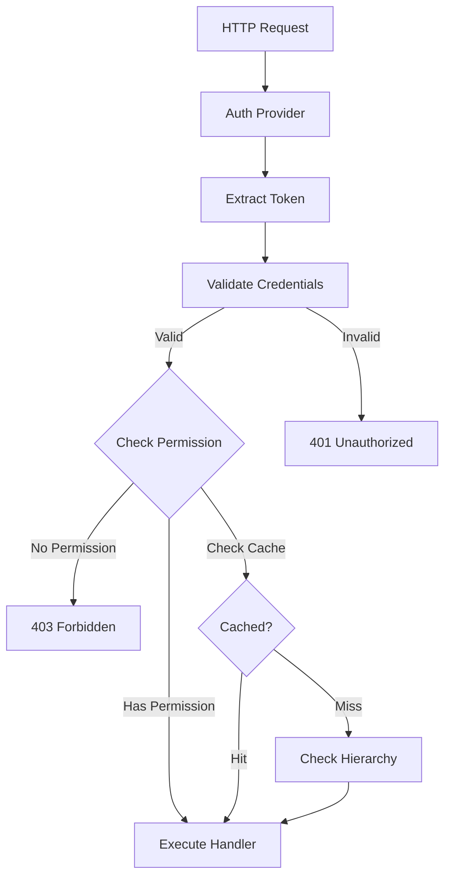

import Tabs from "@theme/Tabs";
import TabItem from "@theme/TabItem";

# Guards & Authorization

Guard system for authentication and authorization.

## Overview

| Feature | Description |
|---------|-------------|
| Built-in Guards | Ready-to-use auth, role, permission guards |
| RBAC | `@RequireRoles()` decorator |
| Permissions | `@RequirePermissions()` decorator |
| ABAC | `RequirePolicy()` for complex rules |
| Ownership | `@RequireOwnership()` for user resources |
| Composition | `combineGuards()`, `sequenceGuards()` |
| Conditional | `whenGuard()` for conditional execution |
| Caching | Request-scoped result caching |



## Basic Usage

### Authentication Guard

Require authentication for routes:

```typescript
import { controller, Get, RequireAuthentication, principal, Principal } from "@expressots/core";

@controller("/api/users")
export class UserController {
    @Get("/profile")
    @RequireAuthentication()
    getProfile(@principal() user: Principal) {
        return { user: user.details };
    }
}
```

### Role-Based Access

Restrict access based on user roles:

```typescript
import { controller, Get, RequireRoles } from "@expressots/core";

@controller("/api/admin")
export class AdminController {
    @Get("/dashboard")
    @RequireRoles("admin")
    getDashboard() {
        return { message: "Welcome, admin!" };
    }

    @Get("/super")
    @RequireRoles("admin", "super-admin") // Any of these roles
    getSuperDashboard() {
        return { message: "Welcome, super admin!" };
    }
}
```

### Permission-Based Access

Control access with granular permissions:

```typescript
import { controller, Get, Post, Delete, RequirePermissions } from "@expressots/core";

@controller("/api/documents")
export class DocumentController {
    @Get("/")
    @RequirePermissions("documents:read")
    listDocuments() {
        return this.documentService.findAll();
    }

    @Post("/")
    @RequirePermissions("documents:write")
    createDocument(@body() dto: CreateDocumentDto) {
        return this.documentService.create(dto);
    }

    @Delete("/:id")
    @RequirePermissions("documents:delete")
    deleteDocument(@param("id") id: string) {
        return this.documentService.delete(id);
    }
}
```

### Resource Ownership

Ensure users can only access their own resources:

```typescript
import { controller, Get, Put, Delete, RequireOwnership } from "@expressots/core";

@controller("/api/posts")
export class PostController {
    @Get("/:id")
    @RequireOwnership("id") // Checks if user.id matches post.authorId
    getPost(@param("id") id: string) {
        return this.postService.findById(id);
    }

    @Put("/:id")
    @RequireOwnership("id")
    updatePost(@param("id") id: string, @body() dto: UpdatePostDto) {
        return this.postService.update(id, dto);
    }

    @Delete("/:id")
    @RequireOwnership("id")
    deletePost(@param("id") id: string) {
        return this.postService.delete(id);
    }
}
```

## Attribute-Based Access Control (ABAC)

Use `RequirePolicy()` for complex authorization rules:

```typescript
import { controller, Get, UseGuards, RequireAuth, RequirePolicy } from "@expressots/core";

@controller("/api/resources")
export class ResourceController {
    @Get("/:id")
    @UseGuards(
        RequireAuth(),
        RequirePolicy((attrs) => {
            // Complex authorization logic
            const { user, resource, request } = attrs;
            
            // Admin can access everything
            if (user.roles.includes("admin")) {
                return true;
            }
            
            // User can access their own resources
            if (resource.ownerId === user.id) {
                return true;
            }
            
            // Users can access public resources
            if (resource.isPublic) {
                return true;
            }
            
            return false;
        })
    )
    getResource(@param("id") id: string) {
        return this.resourceService.findById(id);
    }
}
```

## Guard Composition

### Combining Guards

Require all guards to pass:

```typescript
import { combineGuards, RequireAuth, RequireRole, RequirePermission } from "@expressots/core";

@Post("/critical")
@UseGuards(
    combineGuards(
        RequireAuth(),
        RequireRole("admin"),
        RequirePermission("critical:access")
    )
)
criticalAction() {
    return { message: "Critical action performed" };
}
```

### Sequencing Guards

Execute guards in sequence with dependencies:

```typescript
import { sequenceGuards } from "@expressots/core";

@Get("/data")
@UseGuards(
    sequenceGuards(
        AuthGuard,        // First: authenticate
        TenantGuard,      // Second: verify tenant access
        ResourceGuard     // Third: verify resource access
    )
)
getData() {}
```

### Conditional Guards

Execute guards based on conditions:

```typescript
import { whenGuard, RequireRole, RequireAuth } from "@expressots/core";

@Get("/data")
@Post("/data")
@UseGuards(
    RequireAuth(),
    // Only require admin role for POST requests
    whenGuard(
        ctx => ctx.request.method === "POST",
        RequireRole("admin")
    )
)
handleData() {}
```

## Creating Custom Guards

Implement custom guards by implementing `IGuard`:

```typescript
import { provide, inject, IGuard, GuardContext } from "@expressots/core";

@provide(CustomGuard)
export class CustomGuard implements IGuard {
    constructor(@inject(PermissionService) private permissionService: PermissionService) {}

    async canActivate(context: GuardContext): Promise<boolean> {
        const { request, user } = context;
        
        // Custom authorization logic
        const resourceId = request.params.id;
        const hasAccess = await this.permissionService.checkAccess(
            user.id,
            resourceId
        );
        
        return hasAccess;
    }
}

// Usage
@Get("/:id")
@UseGuards(CustomGuard)
getResource(@param("id") id: string) {}
```

### Guard Decorator

Use `@Guard()` for auto-discovery:

```typescript
import { Guard, IGuard, GuardContext } from "@expressots/core";

@Guard()
@provide(RateLimitGuard)
export class RateLimitGuard implements IGuard {
    constructor(@inject(RateLimitService) private rateLimitService: RateLimitService) {}

    async canActivate(context: GuardContext): Promise<boolean> {
        const { request } = context;
        const clientIp = request.ip;
        
        return await this.rateLimitService.checkLimit(clientIp);
    }
}
```

## Guard Caching

Cache guard results for performance:

```typescript
import { provide, inject, IGuard, IGuardCache, GuardContext } from "@expressots/core";

@provide(ExpensiveGuard)
export class ExpensiveGuard implements IGuard {
    constructor(@inject(IGuardCache) private cache: IGuardCache) {}

    async canActivate(context: GuardContext): Promise<boolean> {
        const cacheKey = `guard:${context.user.id}:${context.request.path}`;
        
        // Check cache first
        const cached = this.cache.get(cacheKey);
        if (cached !== undefined) {
            return cached;
        }
        
        // Expensive check
        const result = await this.expensivePermissionCheck(context);
        
        // Cache for this request
        this.cache.set(cacheKey, result);
        
        return result;
    }

    private async expensivePermissionCheck(context: GuardContext): Promise<boolean> {
        // Complex logic...
        return true;
    }
}
```

## Permission Hierarchy

Define permission inheritance:

```typescript
import { setupAuthorizationForExpress } from "@expressots/adapter-express";

export class App extends AppExpress {
    async configureServices(): Promise<void> {
        setupAuthorizationForExpress(
            this.config.Container,
            {
                permissionHierarchy: {
                    "super-admin": ["admin", "moderator", "user"],
                    "admin": ["moderator", "user"],
                    "moderator": ["user"],
                },
            },
            this.Middleware,
            MyAuthProvider
        );
    }
}
```

With this hierarchy:
- `super-admin` has all permissions of `admin`, `moderator`, and `user`
- `admin` has all permissions of `moderator` and `user`
- `moderator` has all permissions of `user`

## Auth Provider

Implement an `AuthProvider` to integrate with your authentication system:

```typescript
import { provide, AuthProvider, Principal } from "@expressots/core";
import { Request } from "express";

@provide(MyAuthProvider)
export class MyAuthProvider implements AuthProvider {
    async authenticate(request: Request): Promise<Principal | null> {
        const token = request.headers.authorization?.replace("Bearer ", "");
        
        if (!token) {
            return null;
        }
        
        try {
            const decoded = jwt.verify(token, process.env.JWT_SECRET);
            
            return {
                id: decoded.sub,
                roles: decoded.roles,
                permissions: decoded.permissions,
                details: decoded,
            };
        } catch {
            return null;
        }
    }

    async hasRole(principal: Principal, role: string): Promise<boolean> {
        return principal.roles.includes(role);
    }

    async hasPermission(principal: Principal, permission: string): Promise<boolean> {
        return principal.permissions.includes(permission);
    }

    async isResourceOwner(principal: Principal, resourceId: string): Promise<boolean> {
        const resource = await this.resourceService.findById(resourceId);
        return resource?.ownerId === principal.id;
    }
}
```

## Setup

Configure the authorization system in your application:

```typescript
import { setupAuthorizationForExpress } from "@expressots/adapter-express";
import { MyAuthProvider } from "./auth/my-auth-provider";

export class App extends AppExpress {
    async configureServices(): Promise<void> {
        setupAuthorizationForExpress(
            this.config.Container,
            {
                enablePreloading: true,
                enableCaching: true,
                permissionHierarchy: {
                    "super-admin": ["admin", "moderator", "user"],
                    "admin": ["moderator", "user"],
                    "moderator": ["user"],
                },
            },
            this.Middleware,
            MyAuthProvider
        );
    }
}
```

## Testing Guards

### Unit Testing Guards

Test guards in isolation:

```typescript
import { CustomGuard } from "./custom.guard";
import { GuardContext } from "@expressots/core";

describe("CustomGuard", () => {
    let guard: CustomGuard;
    let mockPermissionService: jest.Mocked<PermissionService>;

    beforeEach(() => {
        mockPermissionService = {
            checkAccess: jest.fn(),
        } as any;

        guard = new CustomGuard(mockPermissionService);
    });

    it("should allow access when user has permission", async () => {
        mockPermissionService.checkAccess.mockResolvedValue(true);

        const context: GuardContext = {
            request: { params: { id: "123" } } as any,
            user: { id: "user-1", roles: ["user"] } as any,
        };

        const result = await guard.canActivate(context);

        expect(result).toBe(true);
        expect(mockPermissionService.checkAccess).toHaveBeenCalledWith(
            "user-1",
            "123"
        );
    });

    it("should deny access when user lacks permission", async () => {
        mockPermissionService.checkAccess.mockResolvedValue(false);

        const context: GuardContext = {
            request: { params: { id: "123" } } as any,
            user: { id: "user-1", roles: ["user"] } as any,
        };

        const result = await guard.canActivate(context);

        expect(result).toBe(false);
    });
});
```

### Testing Built-in Guards

Test `@RequireRoles()` and `@RequirePermissions()`:

```typescript
import { RequireRole, RequirePermission } from "@expressots/core";
import { GuardContext } from "@expressots/core";

describe("Built-in Guards", () => {
    describe("RequireRole", () => {
        it("should allow access for users with required role", async () => {
            const guard = RequireRole("admin");
            
            const context: GuardContext = {
                user: {
                    isAuthenticated: async () => true,
                    isInRole: async (role: string) => role === "admin",
                    details: { roles: ["admin"] }
                } as any,
                request: {} as any,
            };

            const result = await guard.canActivate(context);
            expect(result).toBe(true);
        });

        it("should deny access for users without required role", async () => {
            const guard = RequireRole("admin");
            
            const context: GuardContext = {
                user: {
                    isAuthenticated: async () => true,
                    isInRole: async (role: string) => false,
                    details: { roles: ["user"] }
                } as any,
                request: {} as any,
            };

            const result = await guard.canActivate(context);
            expect(result).toBe(false);
        });
    });

    describe("RequirePermission", () => {
        it("should allow access for users with required permission", async () => {
            const guard = RequirePermission("documents:read");
            
            const context: GuardContext = {
                user: {
                    permissions: ["documents:read"],
                    hasPermission: async (perm: string) => perm === "documents:read"
                } as any,
                request: {} as any,
            };

            const result = await guard.canActivate(context);
            expect(result).toBe(true);
        });
    });
});
```

### Testing Guard Composition

Test combined guards:

```typescript
import { combineGuards, RequireAuth, RequireRole } from "@expressots/core";

describe("Guard Composition", () => {
    it("should require all guards to pass", async () => {
        const combined = combineGuards(
            RequireAuth(),
            RequireRole("admin")
        );

        // User is authenticated but not admin
        const context: GuardContext = {
            user: {
                isAuthenticated: async () => true,
                isInRole: async (role: string) => false,
                details: { roles: ["user"] }
            } as any,
            request: {} as any,
        };

        const result = await combined.canActivate(context);
        expect(result).toBe(false);
    });

    it("should pass when all guards pass", async () => {
        const combined = combineGuards(
            RequireAuth(),
            RequireRole("admin")
        );

        const context: GuardContext = {
            user: {
                isAuthenticated: async () => true,
                isInRole: async (role: string) => role === "admin",
                details: { roles: ["admin"] }
            } as any,
            request: {} as any,
        };

        const result = await combined.canActivate(context);
        expect(result).toBe(true);
    });
});
```

### Testing Auth Provider

Test your custom `AuthProvider`:

```typescript
import { MyAuthProvider } from "./my-auth-provider";
import { Request } from "express";

describe("MyAuthProvider", () => {
    let provider: MyAuthProvider;
    let mockJwtService: jest.Mocked<JwtService>;

    beforeEach(() => {
        mockJwtService = {
            verify: jest.fn(),
        } as any;

        provider = new MyAuthProvider(mockJwtService);
    });

    it("should authenticate valid token", async () => {
        const mockDecoded = {
            sub: "user-123",
            roles: ["user"],
            permissions: ["read"],
        };

        mockJwtService.verify.mockReturnValue(mockDecoded);

        const request = {
            headers: { authorization: "Bearer valid-token" },
        } as Request;

        const principal = await provider.authenticate(request);

        expect(principal).toBeDefined();
        expect(principal?.id).toBe("user-123");
        expect(principal?.roles).toEqual(["user"]);
    });

    it("should return null for invalid token", async () => {
        mockJwtService.verify.mockImplementation(() => {
            throw new Error("Invalid token");
        });

        const request = {
            headers: { authorization: "Bearer invalid-token" },
        } as Request;

        const principal = await provider.authenticate(request);

        expect(principal).toBeNull();
    });

    it("should return null when no token provided", async () => {
        const request = {
            headers: {},
        } as Request;

        const principal = await provider.authenticate(request);

        expect(principal).toBeNull();
    });
});
```

### E2E Testing with Guards

Test guards in a real application:

```typescript
import { bootstrap } from "@expressots/core";
import { App } from "./app";

describe("Guards E2E", () => {
    let app: any;

    beforeAll(async () => {
        app = await bootstrap(App, { port: 0 });
    });

    afterAll(async () => {
        await app.close();
    });

    it("should block unauthenticated requests", async () => {
        const response = await fetch(`http://localhost:${app.port}/api/users/profile`);

        expect(response.status).toBe(401);
    });

    it("should allow authenticated requests", async () => {
        const token = await getTestToken({ roles: ["user"] });

        const response = await fetch(
            `http://localhost:${app.port}/api/users/profile`,
            {
                headers: { Authorization: `Bearer ${token}` },
            }
        );

        expect(response.status).toBe(200);
    });

    it("should block requests without required role", async () => {
        const token = await getTestToken({ roles: ["user"] });

        const response = await fetch(
            `http://localhost:${app.port}/api/admin/dashboard`,
            {
                headers: { Authorization: `Bearer ${token}` },
            }
        );

        expect(response.status).toBe(403);
    });

    it("should allow requests with required role", async () => {
        const token = await getTestToken({ roles: ["admin"] });

        const response = await fetch(
            `http://localhost:${app.port}/api/admin/dashboard`,
            {
                headers: { Authorization: `Bearer ${token}` },
            }
        );

        expect(response.status).toBe(200);
    });

    it("should enforce resource ownership", async () => {
        const token = await getTestToken({ userId: "user-1" });

        // Try to access another user's post
        const response = await fetch(
            `http://localhost:${app.port}/api/posts/user-2-post`,
            {
                headers: { Authorization: `Bearer ${token}` },
            }
        );

        expect(response.status).toBe(403);
    });
});

async function getTestToken(payload: any): Promise<string> {
    // Generate a test JWT token
    return jwt.sign(payload, process.env.JWT_SECRET);
}
```

## Real-World RBAC Examples

### Multi-Tenant Application

```typescript
@controller("/api/tenants/:tenantId")
export class TenantController {
    @Get("/data")
    @UseGuards(
        RequireAuth(),
        combineGuards(
            TenantAccessGuard,  // Verify user belongs to tenant
            RequireRole("admin", "member")
        )
    )
    getTenantData(@param("tenantId") tenantId: string, @principal() user: Principal) {
        return this.tenantService.getData(tenantId);
    }

    @Post("/invite")
    @UseGuards(
        RequireAuth(),
        TenantAccessGuard,
        RequireRole("admin", "owner")  // Only admins/owners can invite
    )
    inviteUser(@param("tenantId") tenantId: string, @body() dto: InviteDto) {
        return this.tenantService.inviteUser(tenantId, dto);
    }
}
```

### Content Management System

```typescript
@controller("/api/content")
export class ContentController {
    @Get("/")
    @UseGuards(RequirePermission("content:read"))
    listContent() {
        return this.contentService.findAll();
    }

    @Post("/")
    @UseGuards(
        combineGuards(
            RequireAuth(),
            RequirePermission("content:create")
        )
    )
    createContent(@body() dto: CreateContentDto) {
        return this.contentService.create(dto);
    }

    @Put("/:id")
    @UseGuards(
        RequireAuth(),
        whenGuard(
            ctx => ctx.user.roles.includes("admin"),
            RequirePermission("content:update"),  // Admins need permission
            RequireOwnership("id")  // Non-admins must own the content
        )
    )
    updateContent(@param("id") id: string, @body() dto: UpdateContentDto) {
        return this.contentService.update(id, dto);
    }

    @Delete("/:id")
    @UseGuards(
        combineGuards(
            RequireAuth(),
            RequirePermission("content:delete"),
            // Admin OR owner can delete
            whenGuard(
                ctx => !ctx.user.roles.includes("admin"),
                RequireOwnership("id")
            )
        )
    )
    deleteContent(@param("id") id: string) {
        return this.contentService.delete(id);
    }
}
```

### Healthcare Application (HIPAA Compliant)

```typescript
@controller("/api/patients")
export class PatientController {
    @Get("/:id")
    @UseGuards(
        RequireAuth(),
        combineGuards(
            RequireRole("doctor", "nurse", "admin"),
            RequirePermission("patients:read"),
            PatientAccessGuard  // Verify provider can access this patient
        )
    )
    getPatient(@param("id") id: string) {
        return this.patientService.findById(id);
    }

    @Post("/:id/prescriptions")
    @UseGuards(
        RequireAuth(),
        combineGuards(
            RequireRole("doctor"),  // Only doctors can prescribe
            RequirePermission("prescriptions:write"),
            PatientAccessGuard,
            LicenseValidGuard  // Verify doctor's license is valid
        )
    )
    createPrescription(@param("id") patientId: string, @body() dto: PrescriptionDto) {
        return this.prescriptionService.create(patientId, dto);
    }
}
```

## Security Best Practices

1. **Always Authenticate First**: Use `RequireAuth()` before other guards
2. **Principle of Least Privilege**: Grant minimum permissions needed
3. **Use Permission Hierarchy**: Define role inheritance to reduce configuration
4. **Log Authorization Failures**: Monitor failed authorization attempts
5. **Cache Carefully**: Be cautious when caching authorization results
6. **Test Edge Cases**: Test boundary conditions and permission combinations
7. **Use HTTPS**: Always use HTTPS in production to protect tokens
8. **Rotate Secrets**: Regularly rotate JWT secrets and API keys
9. **Implement Rate Limiting**: Prevent brute force attacks on protected endpoints
10. **Audit Access**: Log all access to sensitive resources

## Common Security Patterns

### Two-Factor Authentication

```typescript
@Post("/sensitive-action")
@UseGuards(
    RequireAuth(),
    RequireTwoFactor(),  // Custom guard to verify 2FA
    RequireRole("admin")
)
performSensitiveAction() {
    return { success: true };
}
```

### IP Whitelisting

```typescript
@Post("/admin/config")
@UseGuards(
    RequireAuth(),
    RequireRole("admin"),
    IPWhitelistGuard  // Only allow from specific IPs
)
updateConfig(@body() config: ConfigDto) {
    return this.configService.update(config);
}
```

### Time-Based Access

```typescript
@Get("/reports")
@UseGuards(
    RequireAuth(),
    RequireRole("analyst"),
    BusinessHoursGuard  // Only allow during business hours
)
getReports() {
    return this.reportService.generate();
}
```

## Best Practices

1. **Use Built-in Guards**: Start with built-in guards before creating custom ones
2. **Combine Guards**: Use `combineGuards()` for multiple requirements
3. **Use Conditions**: Use `whenGuard()` for conditional authorization
4. **Cache Results**: Use `IGuardCache` for expensive checks
5. **Define Hierarchy**: Set up permission hierarchy to reduce configuration
6. **Implement AuthProvider**: Integrate with your auth system properly
7. **Test Thoroughly**: Test all authorization paths and edge cases
8. **Monitor Access**: Log and monitor authorization failures
9. **Use Granular Permissions**: Prefer fine-grained permissions over broad roles
10. **Document Permissions**: Maintain clear documentation of all permissions

## Comparison with Other Frameworks

| Feature                  | ExpressoTS             | NestJS              | Spring Boot         |
| ------------------------ | ---------------------- | ------------------- | ------------------- |
| Built-in Guards          | ✅ 5+ guards           | ⚠️ Basic guards     | ✅ Via Security     |
| Guard Composition        | ✅ `combineGuards()`   | ❌ Manual           | ❌ Manual           |
| Conditional Guards       | ✅ `whenGuard()`       | ❌ Not available    | ❌ Not available    |
| Guard Caching            | ✅ `IGuardCache`       | ❌ Not available    | ❌ Not available    |
| Permission Hierarchy     | ✅ Built-in            | ❌ Manual           | ✅ Via Security     |
| ABAC Support             | ✅ `RequirePolicy()`   | ❌ Manual           | ⚠️ SpEL expressions |

---

## Support the Project

ExpressoTS is MIT-licensed open source. See the **[support guide](../support-us.mdx)** to contribute.
