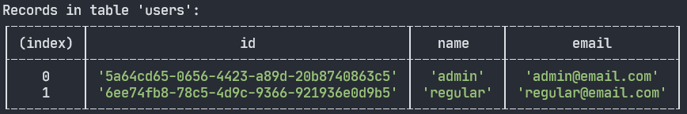

# In memory DB

<span class="span-table">In-memory-db</span> is a provider that uses a simple in memory database to store
data. It is a class that can be registered in the ExpressoTS dependency injection system as a singleton.

```ts
this.provider.register(InMemoryDB, "Singleton");
```

The `InMemoryDB` class provides a simple and efficient way to simulate a database entirely in-memory, which can be particularly useful for testing and rapid development where a full-fledged database might be overkill.

## DB inspector

The `InMemoryDB` class have the ability to print tables to the console. This feature is particularly useful for debugging and testing purposes. It can also be used to quickly inspect the contents of a table.

The table content will be printed to the console every time the repository is used by any endpoint that have operations that read or write to the database.

Here is an image showing the output in the console of the `InMemoryDB` when we create a new user:



:::info
The DB inspector is enabled by default. As soon as you create a new entity and extend the BaseRepository class, the InMemoryDB will print the table to the console.
:::

## Register InMemoryDB

To use the `InMemoryDB` class, you need to import it from the `@expressots/core` package and register it as a singleton in the dependency injection system. Here is an example of how to do this in a service class:

```typescript
import { InMemoryDB } from "@expressots/core";

export class App extends AppExpress {
    private middleware: IMiddleware;
    private provider: ProviderManager;

    constructor() {
        super();
        this.middleware = container.get<IMiddleware>(Middleware);
        this.provider = container.get(ProviderManager);
    }

    protected configureServices(): void {
        this.provider.register(InMemoryDB, "Singleton");
    }
}
```

When registering the `InMemoryDB` class, you can specify the scope as `string` or using the `BindingScopeEnum`.

## Create an entity

Create an entity to represent the data that will be stored in the database. The entity class should have properties that represent the fields of the data that will be stored in the database.

```typescript
@provide(UserEntity)
export class UserEntity {
    id: string;
    name: string;
    email: string;

    constructor() {
        this.id = randomUUID();
    }
}
```

## Repository pattern

The repository pattern is a design pattern that abstracts the data access logic from the rest of the application. It provides a way to access and manipulate data in the database without exposing the details of the database to the rest of the application.

Read more about the repository pattern in here: [Repositories](../tutorials/repositories.mdx)

## Create a repository

The repository is a class that extends the `BaseRepository` class and is used to manage entities of a specific type. The repository class is part of the dependency injection system and is marked by the @provide decorator.

```typescript
@provide(UserRepository)
export class UserRepository extends BaseRepository<UserEntity> {
    constructor() {
        super("users");
    }
}
```

In the class above, we are creating a repository for the `UserEntity` class. The repository is initialized with the table name `users` in the constructor, as well as the entity class `UserEntity`.

By extending the `BaseRepository` class, the `UserRepository` class inherits all the CRUD methods for managing entities in the database.

## Define custom methods

You can also define custom methods for the user repository.

```typescript
@provide(UserRepository)
class UserRepository extends BaseRepository<UserEntity> {
    constructor() {
        super("users");
    }

    findByEmail(email: string): User | null {
        const user = this.table.find((item) => item.email === email);
        return user || null;
    }
}
```

## Usage in a use case

You can inject the repository in the constructor or via property injection. Example:

```typescript title="Injecting repository via property injection"
@provide(UserCreateUseCase)
export class UserCreateUseCase {
    @inject(UserRepository)
    private userRepo: UserRepository;

    @inject(UserEntity)
    private userEntity: UserEntity;

    execute(payload: IUserCreateRequestDTO): IUserCreateResponseDTO {
        this.userEntity.name = payload.name;
        this.userEntity.email = payload.email;

        this.userRepo.create(this.userEntity);

        return {
            id: this.userEntity.id,
            name: this.userEntity.name,
            email: this.userEntity.email,
        };
    }
}
```

```typescript title="Injecting repository in the constructor"
@provide(UserCreateUseCase)
export class UserCreateUseCase {
    constructor(private userEntity: UserEntity, private userRepo: UserRepository) {}

    execute(payload: IUserCreateRequestDTO): IUserCreateResponseDTO {
        this.userEntity.name = payload.name;
        this.userEntity.email = payload.email;

        this.userRepo.create(this.userEntity);

        return {
            id: this.userEntity.id,
            name: this.userEntity.name,
            email: this.userEntity.email,
        };
    }
}
```

Once a request is made to the `UserCreateUseCase`:

-   The `UserEntity` is populated with the request data.
-   The entity is created in the database using the `UserRepository`.
-   The response data is then returned to the client.
-   The `InMemoryDB` will print the table to the console, showing the newly created entity.

---

## Support us ❤️

ExpressoTS is an MIT-licensed open source project. It's an independent project with ongoing development made possible thanks to your support.
If you'd like to help, please read our **[support guide](../support-us.mdx)**.
