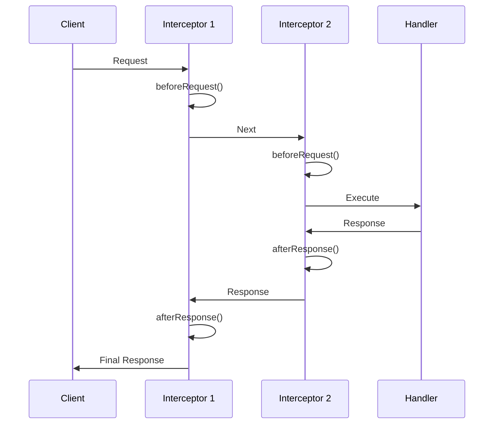

import Tabs from "@theme/Tabs";
import TabItem from "@theme/TabItem";

# Interceptors

Aspect-Oriented Programming (AOP) for cross-cutting concerns.

## Overview

| Feature | Description |
|---------|-------------|
| Pre/Post Processing | Execute code before and after handlers |
| Priority-Based | Control execution order |
| Dependency Injection | Full DI support |
| One-Liner Setup | `setupInterceptorsForExpress()` |
| Built-In | Performance tracking included |
| Type-Safe | Full TypeScript generics |



---

## Quick Start

### 1. Setup Interceptors

Use the one-liner setup function:

```typescript
import { setupInterceptorsForExpress } from "@expressots/adapter-express";
import { CustomLoggingInterceptor, CacheInterceptor } from "./interceptors";

export class App extends AppExpress {
    async configureServices(): Promise<void> {
        const { interceptorsRegistered } = setupInterceptorsForExpress(
            this.config.Container,
            {
                builtIn: { 
                    performance: true  // Enable built-in performance interceptor
                },
                customInterceptors: [
                    CustomLoggingInterceptor,
                    CacheInterceptor
                ]
            }
        );

        console.log(`Registered ${interceptorsRegistered} interceptors`);
    }
}
```

### 2. Create an Interceptor

```typescript
import { provide, inject, Logger, Interceptor } from "@expressots/core";
import type { IInterceptor, ExecutionContext, CallHandler } from "@expressots/core";

@Interceptor({ priority: 10 })
@provide(LoggingInterceptor)
export class LoggingInterceptor implements IInterceptor {
    readonly priority = 10;

    constructor(@inject(Logger) private logger: Logger) {}

    async intercept<T>(context: ExecutionContext, next: CallHandler<T>): Promise<T> {
        const request = context.getRequest();
        
        this.logger.info(`→ ${request.method} ${request.path}`);
        
        const result = await next.handle();
        
        this.logger.info(`← ${request.method} ${request.path}`);
        
        return result;
    }
}
```

### 3. Apply to Routes

Registration via `setupInterceptorsForExpress()` makes interceptors available in the DI container, but does **not** apply them to routes. Use `@UseInterceptors()` to apply them at the controller or method level:

```typescript
import { controller, Get } from "@expressots/adapter-express";
import { UseInterceptors } from "@expressots/core";

@controller("/users")
@UseInterceptors(CacheInterceptor)  // Apply to all routes in controller
export class UserController {
    
    @Get("/:id")
    @UseInterceptors(LoggingInterceptor)  // Apply to specific route
    getUser() {
        return { id: 1, name: "John" };
    }
}
```

---

## Creating Interceptors

### Basic Structure

Every interceptor must:
1. Implement `IInterceptor` interface
2. Have `@Interceptor()` decorator (for auto-discovery and priority)
3. Have `@injectable()` decorator (for DI)
4. Implement `intercept()` method

```typescript
import { injectable, Interceptor } from "@expressots/core";
import type { IInterceptor, ExecutionContext, CallHandler } from "@expressots/core";

@Interceptor({ priority: 10 })
@injectable()
export class MyInterceptor implements IInterceptor {
    async intercept<T>(context: ExecutionContext, next: CallHandler<T>): Promise<T> {
        // Before handler execution
        console.log("Before");

        // Execute handler
        const result = await next.handle();

        // After handler execution
        console.log("After");

        return result;
    }
}
```

### Execution Context

The `ExecutionContext` provides access to request and response objects:

```typescript
async intercept<T>(context: ExecutionContext, next: CallHandler<T>): Promise<T> {
    const request = context.getRequest();
    const response = context.getResponse();

    // Access request properties
    const method = request.method;
    const path = request.path;
    const headers = request.headers;
    const query = request.query;
    const params = request.params;
    const body = request.body;

    // Access response properties
    const statusCode = response.statusCode;

    return next.handle();
}
```

### Call Handler

The `CallHandler` controls execution flow:

```typescript
async intercept<T>(context: ExecutionContext, next: CallHandler<T>): Promise<T> {
    // Option 1: Execute handler
    const result = await next.handle();

    // Option 2: Short-circuit (don't call handler)
    if (someCondition) {
        return cachedResult as T;
    }

    // Option 3: Modify result
    const result = await next.handle();
    return { ...result, modified: true } as T;
}
```

---

## Priority-Based Execution

Interceptors execute in priority order (lower numbers run first):

```typescript
@Interceptor({ priority: 5 })  // Runs first
@provide(AuthInterceptor)
export class AuthInterceptor implements IInterceptor {
    readonly priority = 5;
}

@Interceptor({ priority: 10 })  // Runs second
@provide(LoggingInterceptor)
export class LoggingInterceptor implements IInterceptor {
    readonly priority = 10;
}

@Interceptor({ priority: 15 })  // Runs third
@provide(CacheInterceptor)
export class CacheInterceptor implements IInterceptor {
    readonly priority = 15;
}
```

**Execution Flow**:
```
Request → Auth (5) → Logging (10) → Cache (15) → Handler → Cache (15) → Logging (10) → Auth (5) → Response
```

---

## Built-In Interceptors

### Performance Interceptor

Tracks execution time automatically:

```typescript
setupInterceptorsForExpress(container, {
    builtIn: {
        performance: true  // Enable performance tracking
    }
});
```

**Output**:
```
[Performance] GET /api/users completed in 45ms
```

**Access Performance Data**:
```typescript
@Get("/users")
async getUsers(@req() request: Request) {
    const perfData = request.performanceData;
    // { startTime, endTime, duration }
}
```

---

## Common Interceptor Examples

### 1. Logging Interceptor

Log all requests and responses:

```typescript
@Interceptor({ priority: 5 })
@provide(CustomLoggingInterceptor)
export class CustomLoggingInterceptor implements IInterceptor {
    readonly priority = 5;

    constructor(@inject(Logger) private logger: Logger) {}

    async intercept<T>(context: ExecutionContext, next: CallHandler<T>): Promise<T> {
        const request = context.getRequest();
        const method = request.method;
        const path = request.path;

        this.logger.info(`→ ${method} ${path}`);

        const startTime = Date.now();

        try {
            const result = await next.handle();
            const duration = Date.now() - startTime;

            this.logger.info(`← ${method} ${path} (${duration}ms)`);

            return result;
        } catch (error) {
            const duration = Date.now() - startTime;

            this.logger.error(`✗ ${method} ${path} (${duration}ms)`, error);

            throw error;
        }
    }
}
```

### 2. Cache Interceptor

Cache GET requests:

```typescript
@Interceptor({ priority: 10 })
@provide(CacheInterceptor)
export class CacheInterceptor implements IInterceptor {
    readonly priority = 10;
    private cache: Map<string, { data: unknown; expiry: number }> = new Map();
    private ttl = 5000; // 5 seconds

    constructor(@inject(Logger) private logger: Logger) {}

    async intercept<T>(context: ExecutionContext, next: CallHandler<T>): Promise<T> {
        const request = context.getRequest();
        
        // Only cache GET requests
        if (request.method !== "GET") {
            return next.handle();
        }

        const cacheKey = request.url;
        const cached = this.cache.get(cacheKey);

        // Check if cached and not expired
        if (cached && cached.expiry > Date.now()) {
            this.logger.info(`Cache HIT for ${cacheKey}`);
            return cached.data as T;
        }

        // Cache miss - execute handler
        this.logger.info(`Cache MISS for ${cacheKey}`);
        const result = await next.handle();

        // Store in cache
        this.cache.set(cacheKey, {
            data: result,
            expiry: Date.now() + this.ttl
        });

        return result;
    }
}
```

### 3. Transform Interceptor

Transform responses:

```typescript
@Interceptor({ priority: 15 })
@provide(TransformInterceptor)
export class TransformInterceptor implements IInterceptor {
    readonly priority = 15;

    async intercept<T>(context: ExecutionContext, next: CallHandler<T>): Promise<T> {
        const result = await next.handle();

        // Wrap response in standard format
        return {
            success: true,
            data: result,
            timestamp: new Date().toISOString()
        } as T;
    }
}
```

**Before Transform**:
```json
{ "id": 1, "name": "John" }
```

**After Transform**:
```json
{
    "success": true,
    "data": { "id": 1, "name": "John" },
    "timestamp": "2026-01-10T10:30:45.123Z"
}
```

### 4. Timing Interceptor

Add execution time to response headers:

```typescript
@Interceptor({ priority: 5 })
@provide(TimingInterceptor)
export class TimingInterceptor implements IInterceptor {
    readonly priority = 5;

    async intercept<T>(context: ExecutionContext, next: CallHandler<T>): Promise<T> {
        const response = context.getResponse();
        const startTime = Date.now();

        const result = await next.handle();

        const duration = Date.now() - startTime;
        response.setHeader("X-Response-Time", `${duration}ms`);

        return result;
    }
}
```

### 5. Authentication Interceptor

Check authentication before handler:

```typescript
@Interceptor({ priority: 1 })  // Run first
@provide(AuthInterceptor)
export class AuthInterceptor implements IInterceptor {
    readonly priority = 1;

    async intercept<T>(context: ExecutionContext, next: CallHandler<T>): Promise<T> {
        const request = context.getRequest();
        const response = context.getResponse();

        const token = request.headers.authorization?.replace("Bearer ", "");

        if (!token) {
            response.status(401).json({ error: "Unauthorized" });
            throw new Error("Unauthorized");
        }

        // Verify token
        const user = await this.verifyToken(token);
        
        // Attach user to request
        (request as any).user = user;

        return next.handle();
    }

    private async verifyToken(token: string) {
        // Verify JWT token
        return { id: 1, email: "user@example.com" };
    }
}
```

### 6. Rate Limiting Interceptor

Limit requests per user:

```typescript
@Interceptor({ priority: 2 })
@provide(RateLimitInterceptor)
export class RateLimitInterceptor implements IInterceptor {
    readonly priority = 2;
    private requests: Map<string, number[]> = new Map();
    private limit = 100;      // 100 requests
    private window = 60000;   // per minute

    async intercept<T>(context: ExecutionContext, next: CallHandler<T>): Promise<T> {
        const request = context.getRequest();
        const response = context.getResponse();
        const ip = request.ip;

        const now = Date.now();
        const userRequests = this.requests.get(ip) || [];

        // Filter recent requests
        const recentRequests = userRequests.filter(time => now - time < this.window);

        if (recentRequests.length >= this.limit) {
            response.status(429).json({ 
                error: "Too many requests",
                retryAfter: Math.ceil((recentRequests[0] + this.window - now) / 1000)
            });
            throw new Error("Rate limit exceeded");
        }

        // Add current request
        recentRequests.push(now);
        this.requests.set(ip, recentRequests);

        return next.handle();
    }
}
```

### 7. Validation Interceptor

Validate request data:

```typescript
@Interceptor({ priority: 3 })
@provide(ValidationInterceptor)
export class ValidationInterceptor implements IInterceptor {
    readonly priority = 3;

    async intercept<T>(context: ExecutionContext, next: CallHandler<T>): Promise<T> {
        const request = context.getRequest();
        const response = context.getResponse();

        // Validate request body
        if (request.method === "POST" || request.method === "PUT") {
            const errors = await this.validate(request.body);

            if (errors.length > 0) {
                response.status(400).json({ 
                    error: "Validation failed",
                    details: errors
                });
                throw new Error("Validation failed");
            }
        }

        return next.handle();
    }

    private async validate(body: any): Promise<string[]> {
        const errors: string[] = [];
        // Add validation logic
        return errors;
    }
}
```

### 8. Error Handling Interceptor

Catch and format errors:

```typescript
@Interceptor({ priority: 100 })  // Run last
@provide(ErrorHandlerInterceptor)
export class ErrorHandlerInterceptor implements IInterceptor {
    readonly priority = 100;

    constructor(@inject(Logger) private logger: Logger) {}

    async intercept<T>(context: ExecutionContext, next: CallHandler<T>): Promise<T> {
        try {
            return await next.handle();
        } catch (error) {
            const request = context.getRequest();
            const response = context.getResponse();

            this.logger.error(
                `Error in ${request.method} ${request.path}`,
                error
            );

            // Format error response
            response.status(500).json({
                error: "Internal server error",
                message: error.message,
                timestamp: new Date().toISOString()
            });

            throw error;
        }
    }
}
```

---

## Applying Interceptors

Two steps are required to activate an interceptor:

1. **Register**: `setupInterceptorsForExpress({ customInterceptors: [...] })` in `app.ts` binds the class in the DI container and the `InterceptorRegistry`.
2. **Apply**: `@UseInterceptors(...)` on a controller (all routes) or on a single method (one route).

### Register (app.ts)

```typescript
setupInterceptorsForExpress(container, {
    customInterceptors: [
        LoggingInterceptor,
        CacheInterceptor
    ]
});
```

This makes the interceptors resolvable but does **not** apply them to any route.

### Controller-Level

Apply to all routes in a controller:

```typescript
import { UseInterceptors } from "@expressots/core";

@UseInterceptors(CacheInterceptor)
@controller("/users")
export class UserController {
    // All routes use CacheInterceptor
}
```

### Method-Level

Apply to a specific route:

```typescript
import { UseInterceptors } from "@expressots/core";

@controller("/users")
export class UserController {
    @Get("/:id")
    @UseInterceptors(CacheInterceptor, LoggingInterceptor)
    getUser() {
        // Only this route uses both interceptors
    }
}
```

### Multiple Interceptors

Apply multiple interceptors (execute in priority order):

```typescript
@Get("/data")
@UseInterceptors(AuthInterceptor, LoggingInterceptor, CacheInterceptor)
getData() {
    return { data: "example" };
}
```

---

## Dependency Injection

Interceptors support full dependency injection:

```typescript
@Interceptor({ priority: 10 })
@provide(MyInterceptor)
export class MyInterceptor implements IInterceptor {
    readonly priority = 10;

    constructor(
        @inject(Logger) private logger: Logger,
        @inject(CacheService) private cache: CacheService,
        @inject(AuthService) private auth: AuthService
    ) {}

    async intercept<T>(context: ExecutionContext, next: CallHandler<T>): Promise<T> {
        // Use injected services
        this.logger.info("Processing request");
        const user = await this.auth.getCurrentUser();
        
        return next.handle();
    }
}
```

---

## Best Practices

### 1. Use Priority Wisely

Order interceptors logically:

```typescript
// ✅ Good: Auth → Logging → Cache → Handler
AuthInterceptor: priority 1
LoggingInterceptor: priority 5
CacheInterceptor: priority 10

// ❌ Bad: Cache → Auth (cache would bypass auth)
CacheInterceptor: priority 1
AuthInterceptor: priority 10
```

### 2. Handle Errors Properly

Always handle errors in interceptors:

```typescript
// ✅ Good
async intercept<T>(context: ExecutionContext, next: CallHandler<T>): Promise<T> {
    try {
        return await next.handle();
    } catch (error) {
        this.logger.error("Handler failed", error);
        throw error;  // Re-throw after logging
    }
}

// ❌ Bad
async intercept<T>(context: ExecutionContext, next: CallHandler<T>): Promise<T> {
    return await next.handle();  // Errors not handled
}
```

### 3. Short-Circuit When Appropriate

Return early for cached responses:

```typescript
// ✅ Good
if (cached) {
    return cached as T;  // Don't call handler
}

return next.handle();
```

### 4. Don't Block Event Loop

Avoid synchronous operations:

```typescript
// ✅ Good
const result = await asyncOperation();

// ❌ Bad
const result = syncOperation();  // Blocks event loop
```

### 5. Use Descriptive Names

Name interceptors clearly:

```typescript
// ✅ Good
CustomLoggingInterceptor
CacheInterceptor
AuthInterceptor

// ❌ Bad
MyInterceptor
Interceptor1
Helper
```

---

## Testing Interceptors

### Unit Testing

Test interceptors in isolation with mocked dependencies:

```typescript
import { CustomLoggingInterceptor } from "./custom-logging.interceptor";
import { Logger } from "@expressots/core";

describe("CustomLoggingInterceptor", () => {
    let interceptor: CustomLoggingInterceptor;
    let mockLogger: jest.Mocked<Logger>;

    beforeEach(() => {
        mockLogger = {
            info: jest.fn(),
            error: jest.fn()
        } as any;

        interceptor = new CustomLoggingInterceptor(mockLogger);
    });

    it("should log request and response", async () => {
        const context = {
            getRequest: () => ({
                method: "GET",
                path: "/users"
            }),
            getResponse: () => ({})
        } as any;

        const next = {
            handle: jest.fn().mockResolvedValue({ data: "test" })
        };

        await interceptor.intercept(context, next);

        expect(mockLogger.info).toHaveBeenCalledTimes(2);
        expect(mockLogger.info).toHaveBeenCalledWith(
            expect.stringContaining("→ GET /users")
        );
        expect(mockLogger.info).toHaveBeenCalledWith(
            expect.stringContaining("← GET /users")
        );
    });

    it("should log errors", async () => {
        const context = {
            getRequest: () => ({
                method: "GET",
                path: "/users"
            }),
            getResponse: () => ({})
        } as any;

        const error = new Error("Test error");
        const next = {
            handle: jest.fn().mockRejectedValue(error)
        };

        await expect(
            interceptor.intercept(context, next)
        ).rejects.toThrow(error);

        expect(mockLogger.error).toHaveBeenCalled();
    });

    it("should measure execution time", async () => {
        const context = {
            getRequest: () => ({
                method: "GET",
                path: "/users"
            }),
            getResponse: () => ({})
        } as any;

        const next = {
            handle: jest.fn().mockImplementation(
                () => new Promise(resolve => setTimeout(() => resolve({ data: "test" }), 50))
            )
        };

        await interceptor.intercept(context, next);

        expect(mockLogger.info).toHaveBeenCalledWith(
            expect.stringMatching(/\(\d+ms\)/)
        );
    });
});
```

### Testing Priority Order

Verify interceptors execute in the correct order:

```typescript
import { setupInterceptorsForExpress } from "@expressots/adapter-express";
import { Container } from "@expressots/core";

describe("Interceptor Priority", () => {
    let executionLog: string[] = [];

    class TestInterceptor1 implements IInterceptor {
        readonly priority = 5;
        async intercept(context: ExecutionContext, next: CallHandler) {
            executionLog.push("before-5");
            const result = await next.handle();
            executionLog.push("after-5");
            return result;
        }
    }

    class TestInterceptor2 implements IInterceptor {
        readonly priority = 10;
        async intercept(context: ExecutionContext, next: CallHandler) {
            executionLog.push("before-10");
            const result = await next.handle();
            executionLog.push("after-10");
            return result;
        }
    }

    it("should execute in priority order", () => {
        executionLog = [];

        const container = new Container();
        setupInterceptorsForExpress(container, {
            customInterceptors: [TestInterceptor1, TestInterceptor2]
        });

        // Execute request
        // ...

        expect(executionLog).toEqual([
            "before-5",   // Lower priority runs first (before)
            "before-10",
            "after-10",   // Higher priority runs first (after)
            "after-5"
        ]);
    });
});
```

### Testing Cache Interceptor

Test caching behavior:

```typescript
import { CacheInterceptor } from "./cache.interceptor";

describe("CacheInterceptor", () => {
    let interceptor: CacheInterceptor;
    let mockLogger: jest.Mocked<Logger>;

    beforeEach(() => {
        mockLogger = { info: jest.fn() } as any;
        interceptor = new CacheInterceptor(mockLogger);
    });

    it("should cache GET requests", async () => {
        const context = {
            getRequest: () => ({ method: "GET", url: "/users" }),
            getResponse: () => ({})
        } as any;

        const next = {
            handle: jest.fn().mockResolvedValue({ data: "cached" })
        };

        // First call - cache miss
        const result1 = await interceptor.intercept(context, next);
        expect(next.handle).toHaveBeenCalledTimes(1);
        expect(mockLogger.info).toHaveBeenCalledWith(
            expect.stringContaining("Cache MISS")
        );

        // Second call - cache hit
        const result2 = await interceptor.intercept(context, next);
        expect(next.handle).toHaveBeenCalledTimes(1); // Still 1, not called again
        expect(mockLogger.info).toHaveBeenCalledWith(
            expect.stringContaining("Cache HIT")
        );

        expect(result1).toEqual(result2);
    });

    it("should not cache non-GET requests", async () => {
        const context = {
            getRequest: () => ({ method: "POST", url: "/users" }),
            getResponse: () => ({})
        } as any;

        const next = {
            handle: jest.fn().mockResolvedValue({ data: "not cached" })
        };

        await interceptor.intercept(context, next);
        await interceptor.intercept(context, next);

        expect(next.handle).toHaveBeenCalledTimes(2); // Called both times
    });

    it("should expire cached entries after TTL", async () => {
        jest.useFakeTimers();

        const context = {
            getRequest: () => ({ method: "GET", url: "/users" }),
            getResponse: () => ({})
        } as any;

        const next = {
            handle: jest.fn().mockResolvedValue({ data: "cached" })
        };

        // First call
        await interceptor.intercept(context, next);
        expect(next.handle).toHaveBeenCalledTimes(1);

        // Advance time beyond TTL
        jest.advanceTimersByTime(6000); // 6 seconds

        // Second call - cache expired
        await interceptor.intercept(context, next);
        expect(next.handle).toHaveBeenCalledTimes(2); // Called again

        jest.useRealTimers();
    });
});
```

### E2E Testing

Test interceptors in a real application:

```typescript
import { bootstrap } from "@expressots/core";
import { App } from "./app";

describe("Interceptors E2E", () => {
    let app: any;

    beforeAll(async () => {
        app = await bootstrap(App, { port: 0 });
    });

    afterAll(async () => {
        await app.close();
    });

    it("should add timing header to response", async () => {
        const response = await fetch(`http://localhost:${app.port}/users`);

        expect(response.headers.get("X-Response-Time")).toMatch(/\d+ms/);
    });

    it("should transform response format", async () => {
        const response = await fetch(`http://localhost:${app.port}/users`);
        const data = await response.json();

        expect(data).toHaveProperty("success", true);
        expect(data).toHaveProperty("data");
        expect(data).toHaveProperty("timestamp");
    });

    it("should cache GET requests", async () => {
        const url = `http://localhost:${app.port}/users`;

        const start1 = Date.now();
        const response1 = await fetch(url);
        const duration1 = Date.now() - start1;

        const start2 = Date.now();
        const response2 = await fetch(url);
        const duration2 = Date.now() - start2;

        // Second request should be significantly faster (cached)
        expect(duration2).toBeLessThan(duration1 / 2);

        const data1 = await response1.json();
        const data2 = await response2.json();

        expect(data1).toEqual(data2);
    });

    it("should handle errors gracefully", async () => {
        const response = await fetch(
            `http://localhost:${app.port}/users/error`
        );

        expect(response.status).toBe(500);

        const error = await response.json();
        expect(error).toHaveProperty("error");
        expect(error).toHaveProperty("timestamp");
    });
});
```

## Advanced Patterns

### Composable Interceptors

Create interceptors that can be composed:

```typescript
@Interceptor({ priority: 10 })
@provide(ComposableInterceptor)
export class ComposableInterceptor implements IInterceptor {
    readonly priority = 10;

    constructor(
        @inject(Logger) private logger: Logger,
        @inject("interceptorChain") private chain?: IInterceptor[]
    ) {}

    async intercept<T>(context: ExecutionContext, next: CallHandler<T>): Promise<T> {
        // Execute pre-chain
        for (const interceptor of this.chain || []) {
            await interceptor.intercept(context, next);
        }

        const result = await next.handle();

        // Execute post-chain
        return result;
    }
}
```

### Conditional Interceptor Execution

Execute interceptors based on runtime conditions:

```typescript
@Interceptor({ priority: 5 })
@provide(ConditionalInterceptor)
export class ConditionalInterceptor implements IInterceptor {
    readonly priority = 5;

    async intercept<T>(context: ExecutionContext, next: CallHandler<T>): Promise<T> {
        const request = context.getRequest();

        // Only log in development
        if (process.env.NODE_ENV === "development") {
            console.log(`${request.method} ${request.path}`);
        }

        // Only cache if header is present
        if (request.headers["x-enable-cache"]) {
            // Check cache...
        }

        return next.handle();
    }
}
```

## Performance Optimization

### Async Interceptors

For non-critical operations, use async patterns:

```typescript
@Interceptor({ priority: 100 })
@provide(AsyncLoggingInterceptor)
export class AsyncLoggingInterceptor implements IInterceptor {
    readonly priority = 100;

    constructor(@inject(Logger) private logger: Logger) {}

    async intercept<T>(context: ExecutionContext, next: CallHandler<T>): Promise<T> {
        const request = context.getRequest();

        // Don't await - log asynchronously
        this.logger.info(`${request.method} ${request.path}`).catch(() => {
            // Handle error without blocking request
        });

        return next.handle();
    }
}
```

### Interceptor Pooling

Reuse interceptor instances for better performance:

```typescript
const interceptorPool = new Map<string, IInterceptor>();

function getInterceptor(key: string, factory: () => IInterceptor): IInterceptor {
    if (!interceptorPool.has(key)) {
        interceptorPool.set(key, factory());
    }
    return interceptorPool.get(key)!;
}
```

---

## Performance Considerations

### Overhead

- Each interceptor adds ~1-5ms per request
- Multiple interceptors stack (5 interceptors ≈ 5-25ms)
- Async operations increase overhead

### Recommendations

| Scenario | Recommended Interceptors |
|----------|-------------------------|
| **Production API** | Auth (1), Logging (5), Performance (10) |
| **Development** | Auth (1), Logging (5), Error Handler (100) |
| **High Traffic** | Auth (1), Cache (5) only |
| **Microservice** | Performance (10) only |

### Optimization Tips

1. **Keep interceptors fast**: Avoid heavy operations
2. **Use caching**: Cache expensive checks
3. **Minimize interceptors**: Only add what you need
4. **Order matters**: Put fast interceptors first
5. **Short-circuit early**: Return cached results ASAP
6. **Profile in production**: Monitor interceptor execution time
7. **Use async patterns**: Don't block on non-critical operations

---

## Troubleshooting

### Interceptor Not Running

**Check registration** in `app.ts`:
```typescript
setupInterceptorsForExpress(container, {
    customInterceptors: [MyInterceptor]  // Must be in array
});
```

**Check application** on the controller or method:
```typescript
@UseInterceptors(MyInterceptor)  // Required to apply to routes
@controller("/users")
export class UserController { }
```

**Check class decorators**:
```typescript
@Interceptor({ priority: 10 })  // Required
@injectable()                    // Required
```

### Wrong Execution Order

**Check priorities**:
```typescript
// Lower numbers run first
@Interceptor({ priority: 1 })   // Runs first
@Interceptor({ priority: 10 })  // Runs second
```

### Dependency Injection Not Working

**Check @provide() decorator**:
```typescript
@Interceptor({ priority: 10 })
@provide(MyInterceptor)  // Must have @provide()
export class MyInterceptor { }
```

### Performance Issues

**Profile interceptors**:
```typescript
async intercept<T>(context: ExecutionContext, next: CallHandler<T>): Promise<T> {
    const start = Date.now();
    const result = await next.handle();
    console.log(`Interceptor took ${Date.now() - start}ms`);
    return result;
}
```

---

## API Reference

### IInterceptor Interface

```typescript
interface IInterceptor {
    readonly priority: number;
    intercept<T>(context: ExecutionContext, next: CallHandler<T>): Promise<T>;
}
```

### ExecutionContext

```typescript
interface ExecutionContext {
    getRequest<T = Request>(): T;
    getResponse<T = Response>(): T;
}
```

### CallHandler

```typescript
interface CallHandler<T = any> {
    handle(): Promise<T>;
}
```

### @Interceptor Decorator

```typescript
@Interceptor(options?: { priority?: number })
```

### setupInterceptorsForExpress

```typescript
setupInterceptorsForExpress(
    container: Container,
    options: {
        builtIn?: { performance?: boolean };
        customInterceptors?: Array<new (...args: any[]) => IInterceptor>;
    }
): { interceptorsRegistered: number }
```

---

## Composition helpers

The framework ships four helpers that let you compose interceptors **at the point of attachment** without writing a wrapper class:

| Helper                       | Purpose                                                                       |
| ---------------------------- | ----------------------------------------------------------------------------- |
| `whenInterceptor(cond, i)`   | Apply `i` only when `cond(ctx)` returns `true`.                                |
| `unlessInterceptor(cond, i)` | Apply `i` only when `cond(ctx)` returns `false`, the inverse of `when`.       |
| `pipeInterceptors(...i)`     | Run interceptors **in order**; each `next.handle()` chains to the following.   |
| `combineInterceptors(...i)`  | Run interceptors **in parallel** for side-effect-only work (logging, metrics). |

### `whenInterceptor` / `unlessInterceptor`

```ts
import {
  UseInterceptors,
  whenInterceptor,
  unlessInterceptor,
  PerformanceInterceptor,
  CacheInterceptor,
} from "@expressots/core";

@controller("/users")
export class UserController {
  @Get("/")
  @UseInterceptors(
    PerformanceInterceptor,
    whenInterceptor(
      (ctx) => ctx.request.headers["x-cache"] === "true",
      CacheInterceptor,
    ),
    unlessInterceptor(
      (ctx) => ctx.request.method === "POST",
      LoggingInterceptor,
    ),
  )
  list() {}
}
```

`whenInterceptor` / `unlessInterceptor` evaluate their condition lazily at request time. The condition receives the `ExecutionContext` and can be sync or async.

### `pipeInterceptors`: sequential composition

```ts
import { pipeInterceptors, UseInterceptors } from "@expressots/core";

@Get("/heavy")
@UseInterceptors(pipeInterceptors(AuthCheckInterceptor, RateLimitInterceptor, CacheInterceptor))
heavy() {}
```

Each interceptor's `next.handle()` resolves the next item in the pipe. Short-circuit by returning early, and the rest of the pipe is skipped.

### `combineInterceptors`: parallel composition

```ts
import { combineInterceptors, UseInterceptors } from "@expressots/core";

@Get("/")
@UseInterceptors(combineInterceptors(MetricsInterceptor, AuditInterceptor))
list() {}
```

`combineInterceptors` fires every member side-by-side and waits for all of them to finish before resolving. Use it for **observation-only** interceptors that don't mutate the response.

### Type guards

When inspecting interceptors at runtime (rare, but useful in testing helpers):

```ts
import {
  isComposedInterceptor,
  isConditionalInterceptor,
} from "@expressots/core";

if (isComposedInterceptor(x))     { /* it's a pipe or combine */ }
if (isConditionalInterceptor(x))  { /* it's a when or unless */ }
```

## Built-in interceptors

| Interceptor                  | Purpose                                                                                  |
| ---------------------------- | ---------------------------------------------------------------------------------------- |
| `LoggingInterceptor`         | Structured request/response logging.                                                     |
| `PerformanceInterceptor`     | Per-request timing that feeds the Studio "slow routes" view.                                |
| `PerformanceInterceptorService` | Aggregated metrics service (P50/P95/P99 per route).                                  |
| `TimeoutInterceptor`         | Aborts handlers that exceed `TimeoutOptions.ms`.                                          |

```ts
import {
  UseInterceptors,
  PerformanceInterceptor,
  TimeoutInterceptor,
} from "@expressots/core";

@controller("/api")
export class ApiController {
  @Get("/slow")
  @UseInterceptors(TimeoutInterceptor({ ms: 5000 }), PerformanceInterceptor)
  slow() {}
}
```

## Comparison with Other Frameworks

| Feature | ExpressoTS | NestJS | Fastify |
|---------|------------|--------|---------|
| **Interceptors** | ✅ Built-in | ✅ Built-in | ⚠️ Via hooks |
| **Priority System** | ✅ Numeric priority | ❌ Order-based | ❌ Order-based |
| **One-Liner Setup** | ✅ Yes | ❌ Manual registration | ❌ Manual registration |
| **Dependency Injection** | ✅ Full DI | ✅ Full DI | ⚠️ Limited |
| **Built-In Performance** | ✅ Yes | ❌ Custom only | ⚠️ Via plugins |
| **Type Safety** | ✅ Full TypeScript | ✅ Full TypeScript | ✅ Full TypeScript |

---

## Support the Project

ExpressoTS is MIT-licensed open source. See the **[support guide](../support-us.mdx)** to contribute.
