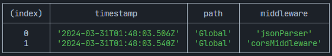

# Middleware

Middleware functions are pivotal in the request-response cycle of an ExpressoTS application, providing the capability to execute code, modify request and response objects, end the request-response cycle, or call the next middleware in the stack. It's essential to call `next()` to avoid request timeouts unless your middleware concludes the cycle.

ExpressoTS seamlessly integrates with Express middleware, enabling the use of its extensive ecosystem to enhance your application.

:::info
ExpressoTS fully supports [Express](https://expressjs.com/en/resources/middleware.html) middleware.
:::

## List of middlewares available

Expressjs middlewares supported by ExpressoTS:

| Middleware Name  | Description                                       |
| ---------------- | ------------------------------------------------- |
| addBodyParser    | Add body parser middleware to the application.    |
| addCompression   | Add compression middleware to the application.    |
| addCors          | Add cors middleware to the application.           |
| addHelmet        | Add helmet middleware to the application.         |
| addCookieParser  | Add cookie parser middleware to the application.  |
| addCookieSession | Add cookie session middleware to the application. |
| addSession       | Add session middleware to the application.        |
| addServerStatic  | Add static middleware to the application.         |
| addRateLimit     | Add rate limit middleware to the application.     |
| addMorgan        | Add morgan middleware to the application.         |
| addPassport      | Add passport middleware to the application.       |
| setMulter        | Add multer middleware to the application.         |
| addServeFavicon  | Add serve favicon middleware to the application.  |
| setErrorHandler  | Add error handler middleware to the application.  |

## Adding middleware

ExpressoTS application supports adding middleware globally to the application as well as per route. It offers all the [middleware supported by Express Team](https://expressjs.com/en/resources/middleware.html) out-of-the-box through the use of `this.middleware` property.

```typescript
@provide(App)
export class App extends AppExpress {
    private middleware: IMiddleware;

    constructor() {
        super();
        this.middleware = container.get<IMiddleware>(Middleware);
    }

    protected configureServices(): void {
        this.middleware.addBodyParser();
        this.middleware.addCors();
        this.middleware.addHelmet();
    }
}
```

:::caution
If you add a middleware that is not installed as dependency, the application will throw a warning message and continue to run.
:::

## Adding global middleware

Middlewares can be added globally using the `App` class through the `this.middleware` property, using the out-of-the-box middleware list provided by Express Team:

```typescript
protected configureServices(): void {
        this.middleware.addBodyParser();
        this.middleware.addCors();
        this.middleware.addHelmet();
    }
```

## Using `addMiddleware` method

For any other middleware, or a custom middleware, you can add it using the `this.middleware.addMiddleware()` method. Using the `addMiddleware` method, you can add any middleware from NPM Registry, custom Expressjs middleware or a custom middleware.

NPM Registry middleware:

```typescript
this.middleware.addMiddleware(cors());
```

### Creating expressjs middleware

```typescript
function myMiddleware(req: Request, res: Response, next: NextFunction) {
    // Do something
    next();
}
```

```typescript
this.middleware.addMiddleware(myMiddleware);
```

### Creating expressots middleware

Custom ExpressoTS middleware:

```typescript
class CustomMiddleware extends ExpressoMiddleware {
    use(req: Request, res: Response, next: NextFunction): void | Promise<void> {
        // Do something
        next();
    }
}
```

```typescript
this.middleware.addMiddleware(new CustomMiddleware());
```

## Route Middleware

Middlewares can be added per route in the `App` class through the `this.middleware.addMiddleware()` method. You can add any middleware from NPM Registry, custom Expressjs middleware or a custom middleware.

```typescript
this.middleware.addMiddleware({ path: "/api", middlewares: [] });
```

:::info
Each route can have multiple middlewares.
:::

### Adding middleware to a specific route

Or you add a middleware to a specific route in the `Controller` class through the `@controller()` and/Or `http Method` decorators.

```typescript
@controller("/")
export class AppController {
    @Post("", express.json())
    execute() {
        return "Hello World";
    }
}
```

### Adding middleware to all routes in a controller

If you want to apply a middleware to all routes under a specific controller, you can add it to the `@controller()` decorator.

```typescript
@controller("/app", express.json())
export class AppController {
    @Post("/create")
    createApp() {
        return "Create App";
    }

    @Patch("/update")
    updateApp() {
        return "Update App";
    }
}
```

## Example of custom expressoTS middleware

To create a custom middleware, you need to extend the `ExpressoMiddleware` class and implement the `use` method.

```typescript
class CustomMiddleware extends ExpressoMiddleware {
    private isOn: boolean;

    constructor(isOn: boolean) {
        super();
        this.isOn = isOn;
    }

    use(req: Request, res: Response, next: NextFunction): void | Promise<void> {
        // Do something
        if (this.isOn) {
            next();
        } else {
            res.status(403).send("Forbidden");
        }
    }
}
```

Custom middleware allows you to pass parameters to the constructor and use them as options in the `use` method of your middleware.

## View all middlewares pipeline

You can view all the middlewares added to the application using the `this.middleware.viewMiddlewarePipeline()` method.



:::tip Use ExpressoTS CLI to scaffold a custom middleware.
:::

CLI command to scaffold a custom middleware:

```bash
expressots g mi <<middleware-name>>
```

---

## Support the project

ExpressoTS is an MIT-licensed open source project. It's an independent project with ongoing development made possible thanks to your support. If you'd like to help, please consider:

-   Become a **[sponsor on GitHub](https://github.com/sponsors/expressots)**
-   Follow the **[organization](https://github.com/expressots)** on GitHub and Star ⭐ the project
-   Subscribe to the Twitch channel: **[Richard Zampieri](https://www.twitch.tv/richardzampieri)**
-   Join our **[Discord](https://discord.com/invite/PyPJfGK)**
-   Contribute submitting **[issues and pull requests](https://github.com/expressots/expressots/issues/new/choose)**
-   Share the project with your friends and colleagues
