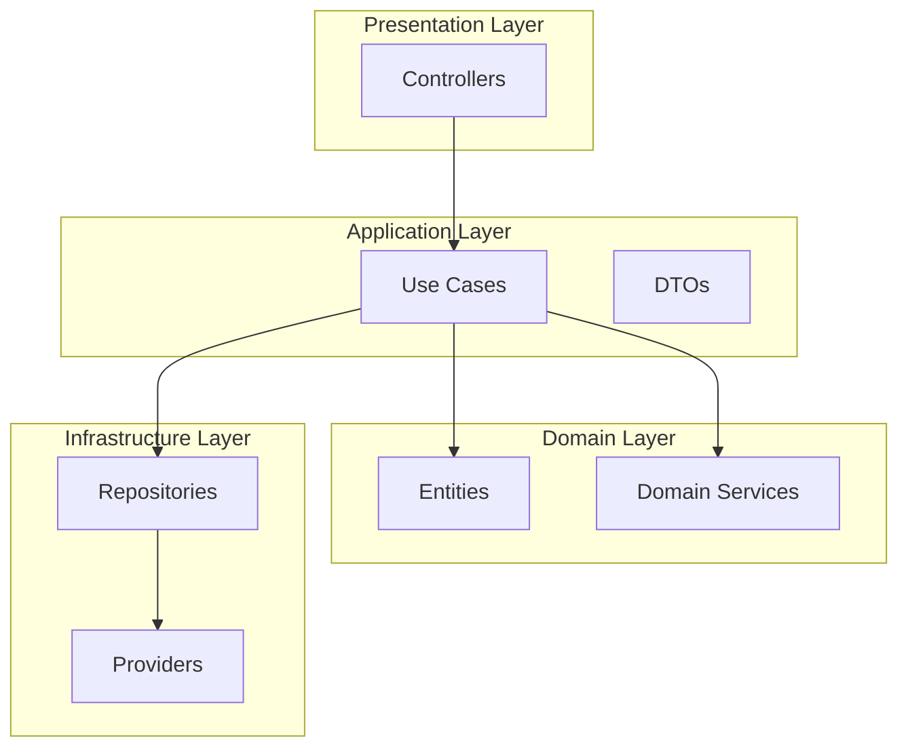
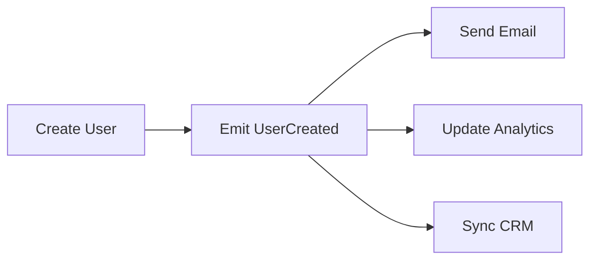

import Tabs from "@theme/Tabs";
import TabItem from "@theme/TabItem";

# Architecture Patterns Guide

This guide covers common architecture patterns and best practices for building scalable ExpressoTS applications.

## Overview



## Clean Architecture

ExpressoTS encourages clean architecture with clear separation of concerns.

### Layer Responsibilities

| Layer | Responsibility | Examples |
|-------|---------------|----------|
| **Presentation** | HTTP handling, routing | Controllers, Middleware |
| **Application** | Business logic orchestration | Use Cases, DTOs |
| **Domain** | Core business rules | Entities, Domain Services |
| **Infrastructure** | External concerns | Repositories, Providers |

### Project Structure

```tree
src/
├── modules/
│   └── users/
│       ├── controllers/
│       │   └── user.controller.ts
│       ├── usecases/
│       │   ├── create-user.usecase.ts
│       │   ├── get-user.usecase.ts
│       │   └── update-user.usecase.ts
│       ├── dto/
│       │   ├── create-user.dto.ts
│       │   └── user-response.dto.ts
│       ├── entities/
│       │   └── user.entity.ts
│       ├── repositories/
│       │   └── user.repository.ts
│       └── user.module.ts
├── shared/
│   ├── providers/
│   ├── middleware/
│   └── errors/
├── app.ts
└── main.ts
```

## Pattern 1: Use Case Pattern

Each use case represents a single application operation.

<Tabs>
    <TabItem value="usecase" label="Use Case">

```typescript title="src/modules/users/usecases/create-user.usecase.ts"
import { provide, inject } from "@expressots/core";
import { UserRepository } from "../repositories/user.repository";
import { User } from "../entities/user.entity";
import { CreateUserDTO } from "../dto/create-user.dto";
import { UserResponseDTO } from "../dto/user-response.dto";
import { EmailService } from "../../shared/providers/email.service";

@provide(CreateUserUseCase)
export class CreateUserUseCase {
    constructor(
        @inject(UserRepository) private userRepo: UserRepository,
        @inject(EmailService) private emailService: EmailService
    ) {}

    async execute(dto: CreateUserDTO): Promise<UserResponseDTO> {
        // 1. Validate business rules
        const existingUser = await this.userRepo.findByEmail(dto.email);
        if (existingUser) {
            throw new UserAlreadyExistsError(dto.email);
        }

        // 2. Create entity
        const user = new User();
        user.name = dto.name;
        user.email = dto.email;
        user.password = await this.hashPassword(dto.password);

        // 3. Persist
        await this.userRepo.save(user);

        // 4. Side effects
        await this.emailService.sendWelcome(user.email, user.name);

        // 5. Return response
        return UserResponseDTO.fromEntity(user);
    }

    private async hashPassword(password: string): Promise<string> {
        // Hash implementation
    }
}
```

    </TabItem>
    <TabItem value="controller" label="Controller">

```typescript title="src/modules/users/controllers/user.controller.ts"
import { controller, Post, body } from "@expressots/adapter-express";
import { provide, inject } from "@expressots/core";
import { Response } from "express";
import { CreateUserUseCase } from "../usecases/create-user.usecase";
import { CreateUserDTO } from "../dto/create-user.dto";

@provide(UserController)
@controller("/users")
export class UserController {
    constructor(
        @inject(CreateUserUseCase) private createUser: CreateUserUseCase
    ) {}

    @Post("/")
    async create(@body() dto: CreateUserDTO, res: Response) {
        const result = await this.createUser.execute(dto);
        return res.status(201).json(result);
    }
}
```

    </TabItem>
    <TabItem value="dto" label="DTOs">

```typescript title="src/modules/users/dto/create-user.dto.ts"
import { IsEmail, IsString, MinLength } from "class-validator";

export class CreateUserDTO {
    @IsString()
    name: string;

    @IsEmail()
    email: string;

    @IsString()
    @MinLength(8)
    password: string;
}
```

```typescript title="src/modules/users/dto/user-response.dto.ts"
import { User } from "../entities/user.entity";

export class UserResponseDTO {
    id: string;
    name: string;
    email: string;
    createdAt: Date;

    static fromEntity(user: User): UserResponseDTO {
        const dto = new UserResponseDTO();
        dto.id = user.id;
        dto.name = user.name;
        dto.email = user.email;
        dto.createdAt = user.createdAt;
        return dto;
    }
}
```

    </TabItem>
</Tabs>

## Pattern 2: Repository Pattern

Abstract data access behind a repository interface.

```typescript title="src/modules/users/repositories/user.repository.interface.ts"
import { User } from "../entities/user.entity";

export interface IUserRepository {
    findById(id: string): Promise<User | null>;
    findByEmail(email: string): Promise<User | null>;
    findAll(): Promise<User[]>;
    save(user: User): Promise<void>;
    update(user: User): Promise<void>;
    delete(id: string): Promise<void>;
}
```

```typescript title="src/modules/users/repositories/user.repository.ts"
import { provide, inject } from "@expressots/core";
import { IUserRepository } from "./user.repository.interface";
import { User } from "../entities/user.entity";
import { DatabaseProvider } from "../../shared/providers/database.provider";

@provide(UserRepository)
export class UserRepository implements IUserRepository {
    constructor(
        @inject(DatabaseProvider) private db: DatabaseProvider
    ) {}

    async findById(id: string): Promise<User | null> {
        return this.db.query("SELECT * FROM users WHERE id = $1", [id]);
    }

    async findByEmail(email: string): Promise<User | null> {
        return this.db.query("SELECT * FROM users WHERE email = $1", [email]);
    }

    async findAll(): Promise<User[]> {
        return this.db.query("SELECT * FROM users");
    }

    async save(user: User): Promise<void> {
        await this.db.query(
            "INSERT INTO users (id, name, email, password, created_at) VALUES ($1, $2, $3, $4, $5)",
            [user.id, user.name, user.email, user.password, user.createdAt]
        );
    }

    async update(user: User): Promise<void> {
        await this.db.query(
            "UPDATE users SET name = $1, email = $2 WHERE id = $3",
            [user.name, user.email, user.id]
        );
    }

    async delete(id: string): Promise<void> {
        await this.db.query("DELETE FROM users WHERE id = $1", [id]);
    }
}
```

## Pattern 3: Provider Pattern

Encapsulate external services as injectable providers.

```typescript title="src/shared/providers/email.provider.ts"
import { provideSingleton } from "@expressots/core";

interface EmailOptions {
    to: string;
    subject: string;
    body: string;
}

@provideSingleton(EmailProvider)
export class EmailProvider {
    private transporter: any; // Email transporter

    async send(options: EmailOptions): Promise<void> {
        await this.transporter.sendMail({
            from: process.env.EMAIL_FROM,
            to: options.to,
            subject: options.subject,
            html: options.body,
        });
    }

    async sendWelcome(email: string, name: string): Promise<void> {
        await this.send({
            to: email,
            subject: "Welcome to Our Platform",
            body: `Hello ${name}, welcome aboard!`,
        });
    }

    async sendPasswordReset(email: string, token: string): Promise<void> {
        await this.send({
            to: email,
            subject: "Password Reset",
            body: `Click here to reset: ${process.env.APP_URL}/reset?token=${token}`,
        });
    }
}
```

## Pattern 4: Event-Driven Architecture

Use events for loose coupling between modules.



<Tabs>
    <TabItem value="event" label="Event Definition">

```typescript title="src/modules/users/events/user-created.event.ts"
import { provide } from "@expressots/core";

@provide(UserCreatedEvent)
export class UserCreatedEvent {
    constructor(
        public readonly userId: string,
        public readonly email: string,
        public readonly name: string,
        public readonly timestamp: Date = new Date()
    ) {}
}
```

    </TabItem>
    <TabItem value="emit" label="Emitting Events">

```typescript title="src/modules/users/usecases/create-user.usecase.ts"
import { provide, inject, EventEmitter } from "@expressots/core";
import { UserCreatedEvent } from "../events/user-created.event";

@provide(CreateUserUseCase)
export class CreateUserUseCase {
    constructor(
        @inject(UserRepository) private userRepo: UserRepository,
        @inject(EventEmitter) private events: EventEmitter
    ) {}

    async execute(dto: CreateUserDTO): Promise<UserResponseDTO> {
        const user = new User();
        // ... create user

        await this.userRepo.save(user);

        // Emit event
        this.events.emit(new UserCreatedEvent(user.id, user.email, user.name));

        return UserResponseDTO.fromEntity(user);
    }
}
```

    </TabItem>
    <TabItem value="handler" label="Event Handlers">

```typescript title="src/modules/notifications/handlers/send-welcome.handler.ts"
import { provide, inject, EventHandler, On } from "@expressots/core";
import { UserCreatedEvent } from "../../users/events/user-created.event";
import { EmailProvider } from "../../shared/providers/email.provider";

@provide(SendWelcomeHandler)
export class SendWelcomeHandler extends EventHandler {
    constructor(@inject(EmailProvider) private email: EmailProvider) {
        super();
    }

    @On(UserCreatedEvent)
    async handle(event: UserCreatedEvent): Promise<void> {
        await this.email.sendWelcome(event.email, event.name);
    }
}
```

    </TabItem>
</Tabs>

## Pattern 5: Middleware Chain

Compose middleware for cross-cutting concerns.

```typescript title="src/shared/middleware/index.ts"
import { Request, Response, NextFunction } from "express";

// Authentication middleware
export function authenticate(req: Request, res: Response, next: NextFunction) {
    if (!req.headers.authorization) {
        return res.status(401).json({ error: "Unauthorized" });
    }
    // Validate token...
    next();
}

// Rate limiting middleware
export function rateLimit(limit: number, windowMs: number) {
    const requests = new Map<string, number[]>();

    return (req: Request, res: Response, next: NextFunction) => {
        const ip = req.ip;
        const now = Date.now();
        const windowStart = now - windowMs;

        const timestamps = (requests.get(ip) || []).filter(t => t > windowStart);
        
        if (timestamps.length >= limit) {
            return res.status(429).json({ error: "Too many requests" });
        }

        timestamps.push(now);
        requests.set(ip, timestamps);
        next();
    };
}

// Request logging middleware
export function requestLogger(req: Request, res: Response, next: NextFunction) {
    const start = Date.now();
    
    res.on("finish", () => {
        console.log(`${req.method} ${req.path} - ${res.statusCode} (${Date.now() - start}ms)`);
    });
    
    next();
}
```

### Applying Middleware

```typescript title="src/app.ts"
protected configureServices(): void {
    this.app.Middleware
        .addMiddleware(requestLogger)
        .addMiddleware(rateLimit(100, 60000)) // 100 req/min
        .addBodyParser()
        .addCors();
}
```

## Pattern 6: Module Organization

Organize code by feature/domain modules.

```typescript title="src/modules/users/user.module.ts"
import { CreateModule } from "@expressots/core";
import { UserController } from "./controllers/user.controller";
import { CreateUserUseCase } from "./usecases/create-user.usecase";
import { GetUserUseCase } from "./usecases/get-user.usecase";
import { UpdateUserUseCase } from "./usecases/update-user.usecase";
import { DeleteUserUseCase } from "./usecases/delete-user.usecase";
import { UserRepository } from "./repositories/user.repository";

export const UserModule = CreateModule([
    // Controllers
    UserController,
    
    // Use Cases
    CreateUserUseCase,
    GetUserUseCase,
    UpdateUserUseCase,
    DeleteUserUseCase,
    
    // Repository
    UserRepository,
]);
```

```typescript title="src/app.module.ts"
import { CreateModule } from "@expressots/core";
import { UserModule } from "./modules/users/user.module";
import { OrderModule } from "./modules/orders/order.module";
import { PaymentModule } from "./modules/payments/payment.module";
import { SharedModule } from "./shared/shared.module";

export const AppModule = CreateModule([
    SharedModule,
    UserModule,
    OrderModule,
    PaymentModule,
]);
```

## Pattern 7: Error Handling Strategy

Centralized error handling with custom error types.

```typescript title="src/shared/errors/app-errors.ts"
import { AppError, StatusCode } from "@expressots/core";

export class NotFoundError extends AppError {
    constructor(resource: string, id: string) {
        super(StatusCode.NotFound, `${resource} with id ${id} not found`);
    }
}

export class ValidationError extends AppError {
    constructor(message: string, public errors: string[]) {
        super(StatusCode.BadRequest, message);
    }
}

export class ConflictError extends AppError {
    constructor(message: string) {
        super(StatusCode.Conflict, message);
    }
}

export class UnauthorizedError extends AppError {
    constructor(message = "Authentication required") {
        super(StatusCode.Unauthorized, message);
    }
}
```

### Usage in Use Cases

```typescript
async execute(id: string): Promise<UserResponseDTO> {
    const user = await this.userRepo.findById(id);
    
    if (!user) {
        throw new NotFoundError("User", id);
    }
    
    return UserResponseDTO.fromEntity(user);
}
```

## Best Practices Summary

| Principle | Practice |
|-----------|----------|
| Single Responsibility | One class, one purpose |
| Dependency Injection | Inject dependencies, don't create them |
| Interface Segregation | Small, focused interfaces |
| Dependency Inversion | Depend on abstractions |
| Separation of Concerns | Clear layer boundaries |
| DRY | Extract common logic to shared modules |
| Fail Fast | Validate early, throw early |

## Anti-Patterns to Avoid

| Anti-Pattern | Problem | Solution |
|--------------|---------|----------|
| God Class | Too many responsibilities | Split into smaller classes |
| Anemic Domain | Logic in controllers | Move to use cases/services |
| Direct DB Access | Tight coupling | Use repository pattern |
| Hardcoded Config | Inflexible | Use environment variables |
| Circular Dependencies | Initialization issues | Reorganize modules |

---

## Support the Project

ExpressoTS is MIT-licensed open source. See the **[support guide](../support-us.mdx)** to contribute.
