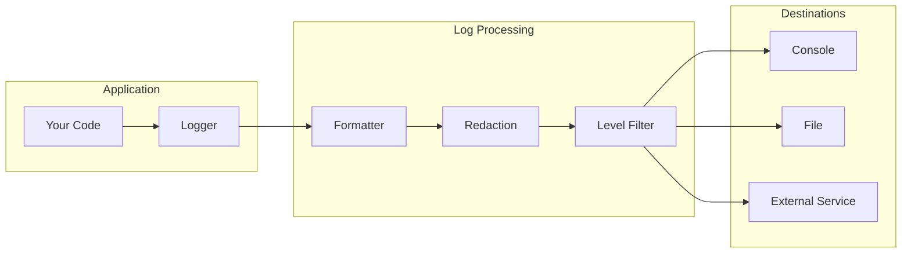

import Tabs from "@theme/Tabs";
import TabItem from "@theme/TabItem";

# Logging Setup Guide

This guide shows you how to configure production-ready logging in ExpressoTS, from basic setup to advanced features like structured logging, file rotation, and sensitive data redaction.

## Overview



## Prerequisites

- ExpressoTS 4.0+ project
- Understanding of log levels (see [Logging System](../features/logging.mdx))

## Step 1: Basic Configuration

Configure logging in your application:

```typescript title="src/app.ts"
import { AppExpress, AppContainer } from "@expressots/adapter-express";
import { Logger, LogLevel } from "@expressots/core";

export class App extends AppExpress {
    private container: AppContainer = this.configContainer([AppModule]);

    protected globalConfiguration(): void {
        // Configure logger
        Logger.configure({
            level: LogLevel.INFO,
            format: "json",
            timestamp: true,
        });
    }
}
```

## Step 2: Environment-Based Configuration

Configure different log levels per environment:

```typescript title="src/app.ts"
import { Logger, LogLevel, Env } from "@expressots/core";

protected globalConfiguration(): void {
    const isDev = Env.get("NODE_ENV") === "development";
    
    Logger.configure({
        level: isDev ? LogLevel.DEBUG : LogLevel.INFO,
        format: isDev ? "pretty" : "json",
        timestamp: true,
        colorize: isDev,
    });
}
```

### Environment Variables

```bash title=".env.development"
NODE_ENV=development
LOG_LEVEL=debug
LOG_FORMAT=pretty
```

```bash title=".env.production"
NODE_ENV=production
LOG_LEVEL=info
LOG_FORMAT=json
```

## Step 3: Structured Logging

Use structured logging for better log analysis:

<Tabs>
    <TabItem value="basic" label="Basic Usage">

```typescript
import { Logger } from "@expressots/core";

const logger = new Logger();

// Simple message
logger.info("User logged in");

// With context
logger.info("User logged in", { userId: "123", ip: "192.168.1.1" });

// With error
logger.error("Failed to process payment", {
    orderId: "456",
    error: new Error("Insufficient funds"),
});
```

    </TabItem>
    <TabItem value="child" label="Child Loggers">

```typescript
import { Logger } from "@expressots/core";

// Create child logger with context
const logger = new Logger();
const userLogger = logger.child({ module: "UserService" });

// All logs include module context
userLogger.info("Creating user", { email: "user@example.com" });
// Output: {"level":"info","module":"UserService","message":"Creating user","email":"user@example.com"}

userLogger.error("Validation failed", { field: "email" });
// Output: {"level":"error","module":"UserService","message":"Validation failed","field":"email"}
```

    </TabItem>
    <TabItem value="request" label="Request Context">

```typescript
import { Logger } from "@expressots/core";
import { Request, Response, NextFunction } from "express";

// Middleware to add request context
function requestLogger(req: Request, res: Response, next: NextFunction) {
    const logger = new Logger();
    
    // Create logger with request context
    req.logger = logger.child({
        requestId: req.headers["x-request-id"] || generateId(),
        method: req.method,
        path: req.path,
        ip: req.ip,
    });

    next();
}

// Use in controller
@Get("/users/:id")
async getUser(@param("id") id: string, req: Request) {
    req.logger.info("Fetching user", { userId: id });
    // ...
}
```

    </TabItem>
</Tabs>

## Step 4: File Logging

Configure file transport for persistent logs:

```typescript title="src/app.ts"
import { Logger, LogLevel, FileTransport } from "@expressots/core";

protected globalConfiguration(): void {
    Logger.configure({
        level: LogLevel.INFO,
        transports: [
            // Console output
            { type: "console", format: "pretty" },
            
            // File output with rotation
            new FileTransport({
                filename: "logs/app-%DATE%.log",
                datePattern: "YYYY-MM-DD",
                maxSize: "20m",
                maxFiles: "14d",
                format: "json",
            }),
            
            // Separate error log
            new FileTransport({
                filename: "logs/error-%DATE%.log",
                datePattern: "YYYY-MM-DD",
                level: LogLevel.ERROR,
                maxSize: "20m",
                maxFiles: "30d",
            }),
        ],
    });
}
```

### Log Rotation Options

| Option | Description | Example |
|--------|-------------|---------|
| `datePattern` | Date format in filename | `"YYYY-MM-DD"` |
| `maxSize` | Max file size before rotation | `"20m"`, `"1g"` |
| `maxFiles` | Max files to keep | `"14d"`, `10` |
| `compress` | Compress rotated files | `true` |

## Step 5: Sensitive Data Redaction

Automatically redact sensitive data from logs:

```typescript title="src/app.ts"
import { Logger, LogLevel } from "@expressots/core";

protected globalConfiguration(): void {
    Logger.configure({
        level: LogLevel.INFO,
        redaction: {
            // Built-in patterns
            patterns: ["password", "token", "secret", "apiKey", "authorization"],
            
            // Custom patterns
            custom: [
                /\b\d{4}[- ]?\d{4}[- ]?\d{4}[- ]?\d{4}\b/g,  // Credit cards
                /\b[A-Za-z0-9._%+-]+@[A-Za-z0-9.-]+\.[A-Z|a-z]{2,}\b/g, // Emails
            ],
            
            // Replacement text
            replacement: "[REDACTED]",
        },
    });
}
```

### Example Output

```typescript
logger.info("User login", {
    email: "user@example.com",
    password: "secret123",
    creditCard: "4111-1111-1111-1111",
});

// Output:
// {
//   "level": "info",
//   "message": "User login",
//   "email": "[REDACTED]",
//   "password": "[REDACTED]",
//   "creditCard": "[REDACTED]"
// }
```

## Step 6: Performance Logging

Track request performance:

```typescript title="src/middleware/performance.middleware.ts"
import { Logger } from "@expressots/core";
import { Request, Response, NextFunction } from "express";

const logger = new Logger();

export function performanceLogger(req: Request, res: Response, next: NextFunction) {
    const start = process.hrtime.bigint();

    res.on("finish", () => {
        const duration = Number(process.hrtime.bigint() - start) / 1e6; // ms

        const logData = {
            method: req.method,
            path: req.path,
            statusCode: res.statusCode,
            duration: `${duration.toFixed(2)}ms`,
        };

        if (duration > 1000) {
            logger.warn("Slow request detected", logData);
        } else {
            logger.info("Request completed", logData);
        }
    });

    next();
}
```

## Step 7: Error Logging with Stack Traces

Configure comprehensive error logging:

```typescript title="src/providers/error-logger.provider.ts"
import { provide, Logger, LogLevel } from "@expressots/core";

@provide(ErrorLogger)
export class ErrorLogger {
    private logger = new Logger();

    logError(error: Error, context?: Record<string, unknown>): void {
        this.logger.error(error.message, {
            name: error.name,
            stack: error.stack,
            ...context,
        });
    }

    logUnhandledRejection(reason: unknown): void {
        this.logger.fatal("Unhandled Promise Rejection", {
            reason: reason instanceof Error ? {
                message: reason.message,
                stack: reason.stack,
            } : reason,
        });
    }
}
```

### Global Error Handlers

```typescript title="src/main.ts"
import { bootstrap, Logger } from "@expressots/core";
import { App } from "./app";

const logger = new Logger();

// Handle uncaught exceptions
process.on("uncaughtException", (error) => {
    logger.fatal("Uncaught Exception", { error: error.message, stack: error.stack });
    process.exit(1);
});

// Handle unhandled rejections
process.on("unhandledRejection", (reason) => {
    logger.fatal("Unhandled Rejection", { reason });
});

await bootstrap(App);
```

## Step 8: Query and Export Logs

Use the in-memory buffer for log querying:

```typescript
import { Logger } from "@expressots/core";

const logger = new Logger();

// Enable buffering
Logger.configure({
    buffer: {
        enabled: true,
        maxSize: 1000,
    },
});

// Query recent logs
const errorLogs = Logger.query({
    level: "error",
    since: new Date(Date.now() - 3600000), // Last hour
});

// Export logs
const exportedLogs = Logger.export({
    format: "json",
    level: "error",
});
```

## Complete Configuration Example

```typescript title="src/app.ts"
import { AppExpress, AppContainer } from "@expressots/adapter-express";
import { Logger, LogLevel, FileTransport, Env } from "@expressots/core";

export class App extends AppExpress {
    private container: AppContainer = this.configContainer([AppModule]);

    protected globalConfiguration(): void {
        const env = Env.get("NODE_ENV", "development");
        const isDev = env === "development";

        Logger.configure({
            // Level based on environment
            level: isDev ? LogLevel.DEBUG : LogLevel.INFO,

            // Format based on environment
            format: isDev ? "pretty" : "json",
            timestamp: true,
            colorize: isDev,

            // Transports
            transports: [
                // Console always enabled
                { type: "console" },

                // File logging in production
                ...(isDev ? [] : [
                    new FileTransport({
                        filename: "logs/app-%DATE%.log",
                        datePattern: "YYYY-MM-DD",
                        maxSize: "50m",
                        maxFiles: "14d",
                    }),
                    new FileTransport({
                        filename: "logs/error-%DATE%.log",
                        datePattern: "YYYY-MM-DD",
                        level: LogLevel.ERROR,
                        maxSize: "50m",
                        maxFiles: "30d",
                    }),
                ]),
            ],

            // Redaction
            redaction: {
                patterns: ["password", "token", "secret", "apiKey", "authorization"],
                replacement: "[REDACTED]",
            },

            // Buffer for querying
            buffer: {
                enabled: true,
                maxSize: isDev ? 100 : 1000,
            },
        });
    }
}
```

## Integration with External Services

### Sending Logs to External Services

```typescript title="src/transports/external.transport.ts"
import { ILogTransport, LogEntry } from "@expressots/core";

export class ExternalLogTransport implements ILogTransport {
    constructor(private endpoint: string, private apiKey: string) {}

    async log(entry: LogEntry): Promise<void> {
        await fetch(this.endpoint, {
            method: "POST",
            headers: {
                "Content-Type": "application/json",
                "Authorization": `Bearer ${this.apiKey}`,
            },
            body: JSON.stringify(entry),
        });
    }
}

// Usage
Logger.configure({
    transports: [
        { type: "console" },
        new ExternalLogTransport(
            "https://logs.example.com/ingest",
            process.env.LOG_API_KEY
        ),
    ],
});
```

## Best Practices

| Practice | Recommendation |
|----------|---------------|
| Log Levels | Use appropriate levels (DEBUG for dev, INFO+ for prod) |
| Structured Data | Always log as objects, not string concatenation |
| Context | Include request IDs, user IDs for traceability |
| Redaction | Always redact sensitive data |
| Rotation | Rotate logs to manage disk space |
| Monitoring | Set up alerts for ERROR/FATAL logs |

## Troubleshooting

| Issue | Solution |
|-------|----------|
| Logs not appearing | Check log level configuration |
| Disk filling up | Configure log rotation |
| Performance issues | Reduce log level, use async transports |
| Missing context | Use child loggers with context |

---

## Support the Project

ExpressoTS is MIT-licensed open source. See the **[support guide](../support-us.mdx)** to contribute.
