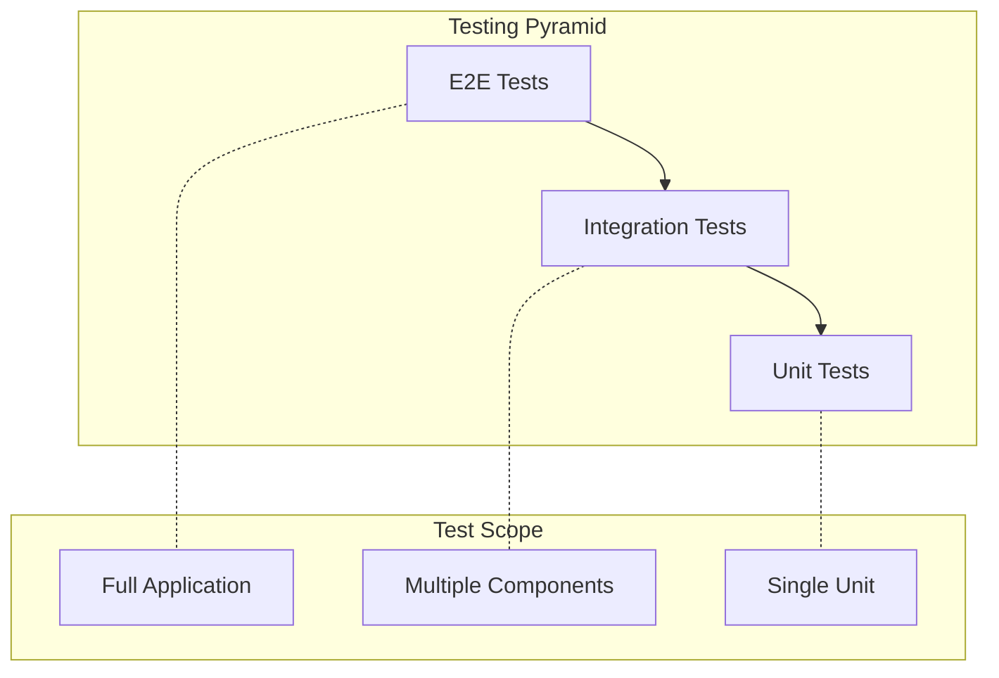

import Tabs from "@theme/Tabs";
import TabItem from "@theme/TabItem";

# Testing Guide

This guide covers testing strategies for ExpressoTS applications, from unit tests to end-to-end testing.

## Overview



## Prerequisites

- ExpressoTS 4.0+ project
- Jest (included in ExpressoTS templates)
- Understanding of the testing module (see [Testing](../features/testing.mdx))

## Test Structure

```tree
project/
├── src/
│   └── modules/
│       └── users/
│           ├── user.controller.ts
│           └── user.usecase.ts
└── test/
    ├── unit/
    │   ├── user.usecase.spec.ts
    │   └── user.service.spec.ts
    ├── integration/
    │   └── user.controller.spec.ts
    └── e2e/
        └── user.e2e.spec.ts
```

## Unit Testing

Unit tests verify individual components in isolation.

### Testing Use Cases

<Tabs>
    <TabItem value="usecase" label="Use Case">

```typescript title="src/modules/users/usecases/create-user.usecase.ts"
import { provide, inject } from "@expressots/core";
import { UserRepository } from "../repositories/user.repository";
import { User } from "../entities/user.entity";

@provide(CreateUserUseCase)
export class CreateUserUseCase {
    constructor(@inject(UserRepository) private userRepo: UserRepository) {}

    async execute(name: string, email: string): Promise<User> {
        const existing = await this.userRepo.findByEmail(email);
        if (existing) {
            throw new Error("User already exists");
        }

        const user = new User();
        user.name = name;
        user.email = email;

        await this.userRepo.save(user);
        return user;
    }
}
```

    </TabItem>
    <TabItem value="test" label="Test">

```typescript title="test/unit/create-user.usecase.spec.ts"
import { CreateUserUseCase } from "../../src/modules/users/usecases/create-user.usecase";
import { UserRepository } from "../../src/modules/users/repositories/user.repository";

describe("CreateUserUseCase", () => {
    let useCase: CreateUserUseCase;
    let mockUserRepo: jest.Mocked<UserRepository>;

    beforeEach(() => {
        // Create mock repository
        mockUserRepo = {
            findByEmail: jest.fn(),
            save: jest.fn(),
            findById: jest.fn(),
            findAll: jest.fn(),
            delete: jest.fn(),
        } as any;

        // Inject mock
        useCase = new CreateUserUseCase(mockUserRepo);
    });

    it("should create a new user", async () => {
        mockUserRepo.findByEmail.mockResolvedValue(null);
        mockUserRepo.save.mockResolvedValue(undefined);

        const result = await useCase.execute("John", "john@example.com");

        expect(result.name).toBe("John");
        expect(result.email).toBe("john@example.com");
        expect(mockUserRepo.save).toHaveBeenCalledWith(expect.objectContaining({
            name: "John",
            email: "john@example.com",
        }));
    });

    it("should throw if user exists", async () => {
        mockUserRepo.findByEmail.mockResolvedValue({ id: "1", email: "john@example.com" } as any);

        await expect(useCase.execute("John", "john@example.com"))
            .rejects.toThrow("User already exists");
    });
});
```

    </TabItem>
</Tabs>

### Testing Services

```typescript title="test/unit/auth.service.spec.ts"
import { AuthService } from "../../src/auth/auth.service";
import { AuthConfig } from "../../src/auth/auth.config";

describe("AuthService", () => {
    let authService: AuthService;
    let mockConfig: AuthConfig;

    beforeEach(() => {
        mockConfig = {
            jwtSecret: "test-secret",
            jwtExpiresIn: "1h",
            refreshExpiresIn: "7d",
            bcryptRounds: 10,
        };

        authService = new AuthService(mockConfig);
    });

    describe("hashPassword", () => {
        it("should hash password", async () => {
            const hash = await authService.hashPassword("password123");
            
            expect(hash).not.toBe("password123");
            expect(hash.length).toBeGreaterThan(0);
        });
    });

    describe("verifyPassword", () => {
        it("should verify correct password", async () => {
            const hash = await authService.hashPassword("password123");
            const result = await authService.verifyPassword("password123", hash);
            
            expect(result).toBe(true);
        });

        it("should reject incorrect password", async () => {
            const hash = await authService.hashPassword("password123");
            const result = await authService.verifyPassword("wrongpassword", hash);
            
            expect(result).toBe(false);
        });
    });

    describe("generateTokens", () => {
        it("should generate access and refresh tokens", () => {
            const tokens = authService.generateTokens({
                userId: "123",
                email: "test@example.com",
                roles: ["user"],
            });

            expect(tokens.accessToken).toBeDefined();
            expect(tokens.refreshToken).toBeDefined();
        });
    });

    describe("verifyToken", () => {
        it("should verify valid token", () => {
            const tokens = authService.generateTokens({
                userId: "123",
                email: "test@example.com",
                roles: ["user"],
            });

            const payload = authService.verifyToken(tokens.accessToken);

            expect(payload).not.toBeNull();
            expect(payload?.userId).toBe("123");
        });

        it("should return null for invalid token", () => {
            const result = authService.verifyToken("invalid-token");
            
            expect(result).toBeNull();
        });
    });
});
```

## Integration Testing

Integration tests verify multiple components working together.

### Testing Controllers

```typescript title="test/integration/user.controller.spec.ts"
import { createTestApp, request, mockProvider } from "@expressots/core";
import { App } from "../../src/app";
import { UserRepository } from "../../src/modules/users/repositories/user.repository";

describe("UserController", () => {
    let testApp: any;
    let mockUserRepo: jest.Mocked<UserRepository>;

    beforeAll(async () => {
        // Create mock
        mockUserRepo = {
            findByEmail: jest.fn(),
            save: jest.fn(),
            findById: jest.fn(),
            findAll: jest.fn(),
            delete: jest.fn(),
        } as any;

        // Create test app with mocked provider
        testApp = await createTestApp(App, {
            providers: [
                mockProvider(UserRepository, mockUserRepo),
            ],
        });
    });

    afterAll(async () => {
        await testApp.close();
    });

    beforeEach(() => {
        jest.clearAllMocks();
    });

    describe("POST /users", () => {
        it("should create a user", async () => {
            mockUserRepo.findByEmail.mockResolvedValue(null);
            mockUserRepo.save.mockResolvedValue(undefined);

            await request(testApp.app)
                .post("/users")
                .send({ name: "John", email: "john@example.com", password: "password123" })
                .expectStatus(201)
                .expectBody((body) => {
                    expect(body.name).toBe("John");
                    expect(body.email).toBe("john@example.com");
                });
        });

        it("should return 400 if user exists", async () => {
            mockUserRepo.findByEmail.mockResolvedValue({ id: "1" } as any);

            await request(testApp.app)
                .post("/users")
                .send({ name: "John", email: "john@example.com", password: "password123" })
                .expectStatus(400);
        });

        it("should validate input", async () => {
            await request(testApp.app)
                .post("/users")
                .send({ name: "", email: "invalid-email" })
                .expectStatus(400)
                .expectBody((body) => {
                    expect(body.errors).toBeDefined();
                });
        });
    });

    describe("GET /users/:id", () => {
        it("should return user by id", async () => {
            mockUserRepo.findById.mockResolvedValue({
                id: "123",
                name: "John",
                email: "john@example.com",
            } as any);

            await request(testApp.app)
                .get("/users/123")
                .expectStatus(200)
                .expectBody((body) => {
                    expect(body.id).toBe("123");
                    expect(body.name).toBe("John");
                });
        });

        it("should return 404 if user not found", async () => {
            mockUserRepo.findById.mockResolvedValue(null);

            await request(testApp.app)
                .get("/users/999")
                .expectStatus(404);
        });
    });
});
```

### Testing with Database

```typescript title="test/integration/user.repository.spec.ts"
import { createTestDatabase } from "@expressots/core";
import { UserRepository } from "../../src/modules/users/repositories/user.repository";
import { User } from "../../src/modules/users/entities/user.entity";

describe("UserRepository", () => {
    let testDb: any;
    let userRepo: UserRepository;

    beforeAll(async () => {
        testDb = await createTestDatabase({
            type: "sqlite",
            database: ":memory:",
        });

        userRepo = new UserRepository(testDb);
    });

    afterAll(async () => {
        await testDb.close();
    });

    beforeEach(async () => {
        await testDb.clear();
    });

    it("should save and retrieve user", async () => {
        const user = new User();
        user.name = "John";
        user.email = "john@example.com";

        await userRepo.save(user);

        const found = await userRepo.findById(user.id);

        expect(found).not.toBeNull();
        expect(found?.name).toBe("John");
    });

    it("should find user by email", async () => {
        const user = new User();
        user.name = "John";
        user.email = "john@example.com";

        await userRepo.save(user);

        const found = await userRepo.findByEmail("john@example.com");

        expect(found).not.toBeNull();
        expect(found?.id).toBe(user.id);
    });

    it("should delete user", async () => {
        const user = new User();
        user.name = "John";
        user.email = "john@example.com";

        await userRepo.save(user);
        await userRepo.delete(user.id);

        const found = await userRepo.findById(user.id);
        expect(found).toBeNull();
    });
});
```

## End-to-End Testing

E2E tests verify the complete application flow.

```typescript title="test/e2e/auth.e2e.spec.ts"
import { createTestApp, request } from "@expressots/core";
import { App } from "../../src/app";

describe("Auth E2E", () => {
    let testApp: any;
    let accessToken: string;

    beforeAll(async () => {
        testApp = await createTestApp(App, {
            environment: "test",
        });
    });

    afterAll(async () => {
        await testApp.close();
    });

    describe("User Registration Flow", () => {
        it("should register a new user", async () => {
            await request(testApp.app)
                .post("/auth/register")
                .send({
                    name: "Test User",
                    email: "test@example.com",
                    password: "password123",
                })
                .expectStatus(201)
                .expectBody((body) => {
                    expect(body.user.email).toBe("test@example.com");
                    expect(body.accessToken).toBeDefined();
                    accessToken = body.accessToken;
                });
        });

        it("should not allow duplicate registration", async () => {
            await request(testApp.app)
                .post("/auth/register")
                .send({
                    name: "Test User",
                    email: "test@example.com",
                    password: "password123",
                })
                .expectStatus(400);
        });
    });

    describe("Login Flow", () => {
        it("should login with valid credentials", async () => {
            await request(testApp.app)
                .post("/auth/login")
                .send({
                    email: "test@example.com",
                    password: "password123",
                })
                .expectStatus(200)
                .expectBody((body) => {
                    expect(body.accessToken).toBeDefined();
                });
        });

        it("should reject invalid credentials", async () => {
            await request(testApp.app)
                .post("/auth/login")
                .send({
                    email: "test@example.com",
                    password: "wrongpassword",
                })
                .expectStatus(401);
        });
    });

    describe("Protected Routes", () => {
        it("should access protected route with token", async () => {
            await request(testApp.app)
                .get("/users/me")
                .set("Authorization", `Bearer ${accessToken}`)
                .expectStatus(200)
                .expectBody((body) => {
                    expect(body.email).toBe("test@example.com");
                });
        });

        it("should reject request without token", async () => {
            await request(testApp.app)
                .get("/users/me")
                .expectStatus(401);
        });

        it("should reject request with invalid token", async () => {
            await request(testApp.app)
                .get("/users/me")
                .set("Authorization", "Bearer invalid-token")
                .expectStatus(401);
        });
    });
});
```

## Mocking Strategies

### Provider Mocking

```typescript
import { mockProvider } from "@expressots/core";

// Automatic mock with jest.fn() for all methods
const autoMock = mockProvider(UserRepository);

// Manual mock with custom implementation
const manualMock = mockProvider(UserRepository, {
    findById: jest.fn().mockResolvedValue({ id: "1", name: "John" }),
    save: jest.fn().mockResolvedValue(undefined),
});

// Spy on real implementation
const spyMock = mockProvider(UserRepository, {
    findById: jest.spyOn(realRepo, "findById"),
});
```

### Request Mocking

```typescript
import { mockReqRes } from "@expressots/core";

it("should handle request", () => {
    const req = createMockRequest({
        method: "POST",
        url: "/users",
        body: { name: "John" },
        headers: { authorization: "Bearer token" },
    });

    const res = createMockResponse();

    await controller.createUser(req, res);

    expect(res.status).toHaveBeenCalledWith(201);
    expect(res.json).toHaveBeenCalledWith(expect.objectContaining({
        name: "John",
    }));
});
```

## Performance Testing

```typescript title="test/performance/user.perf.spec.ts"
import { createTestApp, loadTest } from "@expressots/core";
import { App } from "../../src/app";

describe("Performance", () => {
    let testApp: any;

    beforeAll(async () => {
        testApp = await createTestApp(App);
    });

    afterAll(async () => {
        await testApp.close();
    });

    it("should handle concurrent requests", async () => {
        const results = await loadTest(testApp.app, {
            endpoint: "/users",
            method: "GET",
            concurrency: 100,
            duration: "10s",
        });

        expect(results.avgResponseTime).toBeLessThan(100); // < 100ms
        expect(results.errorRate).toBeLessThan(0.01); // < 1%
        expect(results.requestsPerSecond).toBeGreaterThan(500);
    });

    it("should respond within time limit", async () => {
        await request(testApp.app)
            .get("/users")
            .expectTime(100); // < 100ms
    });
});
```

## Snapshot Testing

```typescript title="test/snapshot/user.snapshot.spec.ts"
import { createTestApp, request } from "@expressots/core";
import { App } from "../../src/app";

describe("API Snapshots", () => {
    let testApp: any;

    beforeAll(async () => {
        testApp = await createTestApp(App);
    });

    it("should match user response snapshot", async () => {
        const response = await request(testApp.app)
            .get("/users/123")
            .send();

        expect(response.body).toMatchSnapshot();
    });

    it("should match error response snapshot", async () => {
        const response = await request(testApp.app)
            .get("/users/invalid")
            .send();

        expect(response.body).toMatchSnapshot();
    });
});
```

## Test Configuration

```typescript title="jest.config.ts"
export default {
    preset: "ts-jest",
    testEnvironment: "node",
    roots: ["<rootDir>/test"],
    testMatch: ["**/*.spec.ts"],
    collectCoverageFrom: [
        "src/**/*.ts",
        "!src/**/*.d.ts",
        "!src/main.ts",
    ],
    coverageThreshold: {
        global: {
            branches: 80,
            functions: 80,
            lines: 80,
            statements: 80,
        },
    },
    setupFilesAfterEnv: ["<rootDir>/test/setup.ts"],
};
```

```typescript title="test/setup.ts"
import { jest } from "@jest/globals";

// Increase timeout for integration tests
jest.setTimeout(30000);

// Global test utilities
global.expectAsync = async (promise: Promise<any>) => {
    try {
        await promise;
    } catch (error) {
        return error;
    }
};
```

## Best Practices

| Practice | Description |
|----------|-------------|
| Test Isolation | Each test should be independent |
| Clear Naming | Describe what is being tested |
| Arrange-Act-Assert | Structure tests clearly |
| Mock External | Mock databases, APIs, file systems |
| Test Edge Cases | Include error paths and boundaries |
| Keep Tests Fast | Unit tests < 100ms, Integration < 1s |

## Common Patterns

### Factory Pattern for Test Data

```typescript title="test/factories/user.factory.ts"
import { User } from "../../src/modules/users/entities/user.entity";

export function createUser(overrides: Partial<User> = {}): User {
    const user = new User();
    user.name = overrides.name || "Test User";
    user.email = overrides.email || `test-${Date.now()}@example.com`;
    user.password = overrides.password || "hashedpassword";
    user.roles = overrides.roles || ["user"];
    return user;
}
```

### Test Helpers

```typescript title="test/helpers/auth.helper.ts"
import { request } from "@expressots/core";

export async function loginAsUser(app: any): Promise<string> {
    const response = await request(app)
        .post("/auth/login")
        .send({ email: "user@example.com", password: "password" });

    return response.body.accessToken;
}

export async function loginAsAdmin(app: any): Promise<string> {
    const response = await request(app)
        .post("/auth/login")
        .send({ email: "admin@example.com", password: "adminpass" });

    return response.body.accessToken;
}
```

---

## Support the Project

ExpressoTS is MIT-licensed open source. See the **[support guide](../support-us.mdx)** to contribute.
