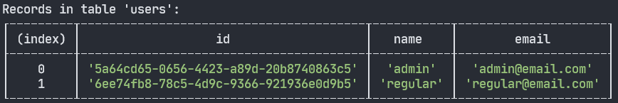

# In Memory DB

In Memory DB is a provider that uses a simple in memory database to store data. It is a class that can be registered in the ExpressoTS dependency injection system as a singleton.

```ts
this.provider.register(InMemoryDB, "Singleton");
```

The InMemoryDB class provides a simple and efficient way to simulate a database entirely in-memory, which can be particularly useful for testing and rapid development where a full-fledged database might be overkill.

## DB Inspector

Another cool feature added to the InMemoryDB class is the ability to print tables to the console using console.table. This feature is particularly useful for debugging and testing purposes. It can also be used to quickly inspect the contents of a table.

The table content will be printed to the console every time the repository is used by any endpoint that have operations that read or write to the database.

Here is an image showing the output in the console of the InMemoryDB when we create a new user:



:::info
The DB inspector is enabled by default. As soon as you create a new entity and extend the BaseRepository class, the InMemoryDB will print the table to the console.
:::

## How to Use InMemoryDB

To use the InMemoryDB class, you need to import it from the `expressots` package and register it as a singleton in the dependency injection system. Here is an example of how to do this in a service class:

### Register InMemoryDB

```typescript
export class App extends AppExpress {
    private middleware: IMiddleware;
    private provider: ProviderManager;

    constructor() {
        super();
        this.middleware = container.get<IMiddleware>(Middleware);
        this.provider = container.get(ProviderManager);
    }

    protected configureServices(): void {
        this.provider.register(InMemoryDB, "Singleton");
    }

    protected postServerInitialization(): void {}

    protected serverShutdown(): void {}
}
```

When registering the InMemoryDB class, you can specify the scope as `string` or using the `BindingScopeEnum`.

### Define your Entity

```typescript
@provide(UserEntity)
export class UserEntity {
    id: string;
    name: string;
    email: string;

    constructor() {
        this.id = randomUUID();
    }
}
```

### Create a Repository

The repository is a class that extends the BaseRepository class and is used to manage entities of a specific type. The repository class is part of the dependency injection system and is marked by the @provide decorator.

```typescript
@provide(UserRepository)
export class UserRepository extends BaseRepository<UserEntity> {
    constructor() {
        super("users");
    }
}
```

In the class above, we are creating a repository for the `UserEntity` class. The repository is initialized with the table name `users` in the constructor.

You can also define custom methods for the user repository.

```typescript
@provide(UserRepository)
class UserRepository extends BaseRepository<UserEntity> {
    constructor() {
        super("users");
    }

    // Custom method implemented for the UserRepository only
    findByEmail(email: string): User | null {
        const user = this.table.find((item) => item.email === email);
        return user || null;
    }
}
```

### Use the Repository

You can inject the repository in the constructor or via property injection.

Property Injection:

```typescript
@provide(UserCreateUseCase)
export class UserCreateUseCase {
    @inject(UserRepository)
    private userRepo: UserRepository;

    @inject(UserEntity)
    private userEntity: UserEntity;

    execute(payload: IUserCreateRequestDTO): IUserCreateResponseDTO {
        this.userEntity.name = payload.name;
        this.userEntity.email = payload.email;

        this.userRepo.create(this.userEntity);

        return {
            id: this.userEntity.id,
            name: this.userEntity.name,
            email: this.userEntity.email,
        };
    }
}
```

Constructor Injection:

```typescript
@provide(UserCreateUseCase)
export class UserCreateUseCase {
    constructor(private userEntity: UserEntity, private userRepo: UserRepository) {}

    execute(payload: IUserCreateRequestDTO): IUserCreateResponseDTO {
        this.userEntity.name = payload.name;
        this.userEntity.email = payload.email;

        this.userRepo.create(this.userEntity);

        return {
            id: this.userEntity.id,
            name: this.userEntity.name,
            email: this.userEntity.email,
        };
    }
}
```

---

## Support the Project

ExpressoTS is an MIT-licensed open source project. It's an independent project with ongoing development made possible thanks to your support. If you'd like to help, please consider:

-   Become a **[sponsor on GitHub](https://github.com/sponsors/expressots)**
-   Follow the **[organization](https://github.com/expressots)** on GitHub and Star ⭐ the project
-   Subscribe to the Twitch channel: **[Richard Zampieri](https://www.twitch.tv/richardzampieri)**
-   Join our **[Discord](https://discord.com/invite/PyPJfGK)**
-   Contribute submitting **[issues and pull requests](https://github.com/expressots/expressots/issues/new/choose)**
-   Share the project with your friends and colleagues
