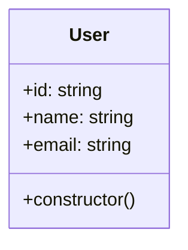

# Prisma Provider

ExpressoTS Prisma Provider is a [Prisma](https://www.prisma.io/) wrapper for ExpressoTS. It provides a simple way to use Prisma with ExpressoTS.

## How To Install

```bash
expressots add prisma

- Type the prisma client version (default=latest): (latest)
- Type the schema name (default=schema): (schema)
- Where do you want to save your prisma schema (default=./): (.)
- Select your database:
> CockroachDB
  Microsoft SQL Server
  MongoDB
  MySQL
  PostgreSQL
  SQLite
- Do you want to install the latest recommended database driver for SQLite? (Y/n)
- Do you want to add BaseRepository Pattern in this project? this will replace the existing BaseRepository and BaseRepositoryInterface if it exists. (Y/n)
```

## Using ExpressoTS Prisma Decorators

We designed decorators to make it easier to use Prisma with ExpressoTS. You can use the decorators with Entities, enums and types to generate the Prisma schema automatically.

## Decorators

| Decorator       | Description                                    | Options                                                               |
| --------------- | ---------------------------------------------- | --------------------------------------------------------------------- |
| @prismaModel    | Decorate a class as a Prisma model             | map                                                                   |
| @prismaField    | Decorate a property with specific db attribute | attr, isId, isOptional, type, isUnique, prismaDefault, mapField, name |
| @prismaRelation | Decorate a property as a Prisma relation       | relation, name, model, refs, fields, onDelete, onUpdate, isRequired   |
| @prismaIndex    | Decorate a property as a Prisma index          | name, fields, map, type                                               |

### PrismaModel

The `@prismaModel()` decorator is used to decorate a class as a Prisma model. It will generate the Prisma schema automatically.

Options:

- `map`: You can use the `map` option to map the class name to a different name in the Prisma schema. For more information about the `map` option, please check the [Prisma documentation](https://www.prisma.io/docs/reference/api-reference/prisma-schema-reference#map).

Lest take the following table as an example:



Your typescript class will look like this:

```typescript
@prismaModel({ map: "users" })
class User {
  id: string;
  name: string;
  email: string;

  constructor() {}
}
```

Your Prisma schema will look like this after running `npm run prisma`:

```typescript
model User {

  @@map("users")
}
```

:::note
In order to generate the Prisma model `@prismaModel()` decorator must be used. All entities must be decorated with `@prismaModel()`.
:::

### PrismaField

The `@prismaField()` decorator is used to decorate a property with specific prisma attributes available in the [Prisma documentation](https://www.prisma.io/docs/reference/api-reference/prisma-schema-reference#model-fields).

Options:

- `attr`: You can use the `attr` option to add specific attributes to the field per database. For more information about the `attr` option, please check the [Prisma documentation](https://www.prisma.io/docs/reference/api-reference/prisma-schema-reference#model-fields).

```typescript
@prismaModel()
class Product {
  @prismaField({ attr: db.SQLite.Decimal })
  price: number;

  constructor() {}
}
```

:::note
`db` is a namespace that contains all the available attributes per database.
:::

---

## Support the Project

ExpressoTS is an MIT-licensed open source project. It's an independent project with ongoing development made possible thanks to your support. If you'd like to help, please consider:

- Become a **[sponsor on GitHub](https://github.com/sponsors/expressots)**
- Follow the **[organization](https://github.com/expressots)** on GitHub and Star ⭐ the project
- Subscribe to the Twitch channel: **[Richard Zampieri](https://www.twitch.tv/richardzampieri)**
- Join our **[Discord](https://discord.com/invite/PyPJfGK)**
- Contribute submitting **[issues and pull requests](https://github.com/expressots/expressots/issues/new/choose)**
- Share the project with your friends and colleagues
