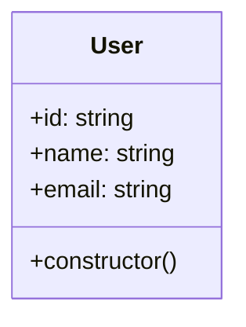

import Tabs from '@theme/Tabs';
import TabItem from '@theme/TabItem';

# Prisma Provider

The ExpressoTS Prisma Provider encapsulates the robust [Prisma](https://www.prisma.io/) ORM (Object-Relational Mapper) within the ExpressoTS framework, crafting a seamless interface for data operations. Prisma facilitates a sturdy, type-safe, and streamlined access to your database, ensuring that the data interactions within your applications are precise and efficient. Its robust query engine vastly simplifies database access and mitigates common bugs associated with data retrieval and manipulation.

## How To Install

Harnessing the capabilities of Prisma within your ExpressoTS framework is streamlined with the help of the [ExpressoTS CLI](https://github.com/expressots/expressots-cli). The CLI provides a dedicated helper to simplify the setup of Prisma, ensuring a hassle-free integration.

```bash title="terminal"
expressots add prisma

- Type the prisma client version (default=latest): (latest)
- Type the schema name (default=schema): (schema)
- Where do you want to save your prisma schema (default=./): (.)
- Select your database:
> CockroachDB
  Microsoft SQL Server
  MongoDB
  MySQL
  PostgreSQL
  SQLite
- Do you want to install the latest recommended database driver for SQLite? (Y/n)
- Do you want to add BaseRepository Pattern in this project? this will replace the existing BaseRepository and BaseRepositoryInterface if it exists. (Y/n)
```

By following these prompts, ExpressoTS ensures a seamless installation and configuration of Prisma, tailored to your project’s needs.

### Config Update

Post installation, a new set of configurations pertaining to the Prisma provider are now available for you to fine-tune. These include schemaName, schemaPath, entitiesPath, and entityNamePattern. Customize these settings to align with your project’s architecture and naming conventions.

```ts title="expressots.config.ts"
import { ExpressoConfig, Pattern } from "@expressots/core";

const config: ExpressoConfig = {
  sourceRoot: "src",
  scaffoldPattern: Pattern.KEBAB_CASE,
  opinionated: true,
  providers: {
    // highlight-start
    prisma: {
      schemaName: "schema",
      schemaPath: "./prisma",
      entitiesPath: "entities",
      entityNamePattern: "entity",
    },
    // highlight-end
  },
};

export default config;
```

## Base Repository Extension

During the setup process, you will be prompted to extend your existing base repository or create a new one if none exists. This includes both the interface and implementation, allowing for a standardized way to interact with your database entities.

<Tabs>

  <TabItem label="Interface" value="interface">

```ts title="./src/repositories/base-repository.interface.ts"
import { Prisma, PrismaClient } from "@prisma/client";
import {
  CreateInput,
  ModelsOf,
  DeleteWhere,
  Select,
  PrismaAction,
} from "@expressots/prisma";

interface IBaseRepository<ModelName extends ModelsOf<PrismaClient>> {
  // highlight-start
  aggregate: (args: PrismaAction<ModelName, "aggregate">) => Promise<any>;
  count: (args: PrismaAction<ModelName, "count">) => Promise<number>;
  // highlight-end
  create: (
    data:
      | CreateInput<ModelName>["data"]
      | {
          data: CreateInput<ModelName>["data"];
          select?: Select<ModelName, "create">["select"];
        },
  ) => Promise<ModelName | never>;
  // ...
}
```

  </TabItem>

  <TabItem label="Implementation" value="implementation">

```ts title="./src/repositories/base-repository.ts"
import { PrismaClient, Prisma } from "@prisma/client";
import {
  CreateInput,
  ModelsOf,
  DeleteWhere,
  Select,
  PrismaAction,
} from "@expressots/prisma";
import { provide } from "inversify-binding-decorators";
import { IBaseRepository } from "./base-repository.interface";

@provide(BaseRepository)
class BaseRepository<ModelName extends ModelsOf<PrismaClient>>
  implements IBaseRepository<ModelName>
{
  protected prismaModel: any;
  protected prismaClient: PrismaClient;
  constructor(modelName: keyof PrismaClient) {
    this.prismaClient = new PrismaClient();
    this.prismaModel = this.prismaClient[modelName];
  }

  // highlight-start
  async aggregate(args: PrismaAction<ModelName, "aggregate">): Promise<any> {
    return await this.prismaModel.aggregate(args);
  }
  // highlight-end

  // highlight-start
  async count(args: PrismaAction<ModelName, "count">): Promise<number> {
    return await this.prismaModel.count(args);
  }
  // highlight-end
```

  </TabItem>

</Tabs>

## Utilizing ExpressoTS Prisma Decorators

We designed decorators to make it easier to use Prisma with ExpressoTS. You can use the decorators with Entities, enums and types to generate the Prisma schema automatically.

### Decorators

| Decorator       | Description                                    | Options                                                               |
| --------------- | ---------------------------------------------- | --------------------------------------------------------------------- |
| @prismaModel    | Decorate a class as a Prisma model             | map                                                                   |
| @prismaField    | Decorate a property with specific db attribute | attr, isId, isOptional, type, isUnique, prismaDefault, mapField, name |
| @prismaRelation | Decorate a property as a Prisma relation       | relation, name, model, refs, fields, onDelete, onUpdate, isRequired   |
| @prismaIndex    | Decorate a property as a Prisma index          | name, fields, map, type                                               |

### PrismaModel Decorator

The @prismaModel() decorator is instrumental in designating a class as a Prisma model, which in turn triggers the automatic generation of the corresponding Prisma schema.

Options:

- `map`:  The map option is available to map the class name to a different name in the Prisma schema, granting you the flexibility to adhere to naming conventions or requirements. For an in-depth understanding of the map option, refer to the Prisma documentation.

Let’s illustrate this with an example drawn from the Opinionated template. Initially, the entity is structured as follows:

<div style={{ display: 'flex', justifyContent: 'center', alignItems: 'center' }}>

<div style={{ display: 'flex', justifyContent: 'center', alignItems: 'center' }}>



</div>

<div style={{ flex: 1 }}>

```ts title="./src/entities/user.entity.ts"
import { provide } from "inversify-binding-decorators";
import { randomUUID } from "node:crypto";
import { IEntity } from "./base.entity";

// highlight-start
@provide(User)
export class User implements IEntity {
  id: string;
  name!: string;
  email!: string;

  constructor() {
    this.id = randomUUID();
  }
}
// highlight-end
```

</div>

</div>

The sole addition needed to begin is the `@prismaModel()` decorator to the class:

<Tabs>

<TabItem label="Entity" value="entity">

```ts title="./src/entities/user.entity.ts"
import { provide } from "inversify-binding-decorators";
import { randomUUID } from "node:crypto";
import { IEntity } from "./base.entity";
// highlight-start
import { prismaModel } from "@expressots/prisma";
// highlight-end

@provide(User)
// highlight-start
@prismaModel({ map: "user" })
// highlight-end
export class User implements IEntity {
  id: string;
  name!: string;
  email!: string;

  constructor() {
    this.id = randomUUID();
  }
}
```

</TabItem>

<TabItem label="Prisma Schema" value="prisma-schema">

```typescript title="./prisma/schema.prisma"
model User {

  @@map("users")
}
```

</TabItem>
</Tabs>

Upon executing this, you might encounter an error message as shown below. This is anticipated behavior as Prisma mandates at least one unique criterion per model and we have not provided any through the decorators.

```ansii
error: Error validating model "User": Each model must have at least one unique criteria that has only required fields. Either mark a single field with `@id`, `@unique` or add a multi field criterion with `@@id([])` or `@@unique([])` to the model.
  -->  schema.prisma:13
   |
12 |
13 | model User {
14 |
15 |   @@map("users")
16 | }
   |
```

:::note
In order to generate the Prisma model `@prismaModel()` decorator must be used. All entities must be decorated with `@prismaModel()`.
:::

### PrismaField Decorator

The `@prismaField()` decorator is used to decorate a property with specific prisma attributes available in the [Prisma documentation](https://www.prisma.io/docs/reference/api-reference/prisma-schema-reference#model-fields).

Options:

- `attr`: You can use the `attr` option to add specific attributes to the field per database. For more information about the `attr` option, please check the [Prisma documentation](https://www.prisma.io/docs/reference/api-reference/prisma-schema-reference#model-fields).


<Tabs>

<TabItem label="Entity" value="entity">

```ts title="./src/entities/user.entity.ts"
import { provide } from "inversify-binding-decorators";
import { randomUUID } from "node:crypto";
import { IEntity } from "./base.entity";
import { prismaModel, prismaField, db } from "@expressots/prisma";

@provide(User)
@prismaModel({ map: "users" })
export class User implements IEntity {
  @prismaField({ attr: db.SQLite.Uuid })
  id: string;

  @prismaField({ attr: db.SQLite.Char(36) })
  name!: string;

  @prismaField({ attr: db.SQLite.Char(36) })
  email!: string;

  constructor() {
    this.id = randomUUID();
  }
}
```

</TabItem>

<TabItem label="Prisma Schema" value="prisma-schema">

```typescript title="./prisma/schema.prisma"
// TODO: ...
```

</TabItem>
</Tabs>

:::note
`db` is a namespace that contains all the available attributes per database.
:::

---

## Support the Project

ExpressoTS is an MIT-licensed open source project. It's an independent project with ongoing development made possible thanks to your support. If you'd like to help, please consider:

- Become a **[sponsor on GitHub](https://github.com/sponsors/expressots)**
- Follow the **[organization](https://github.com/expressots)** on GitHub and Star ⭐ the project
- Subscribe to the Twitch channel: **[Richard Zampieri](https://www.twitch.tv/richardzampieri)**
- Join our **[Discord](https://discord.com/invite/PyPJfGK)**
- Contribute submitting **[issues and pull requests](https://github.com/expressots/expressots/issues/new/choose)**
- Share the project with your friends and colleagues
