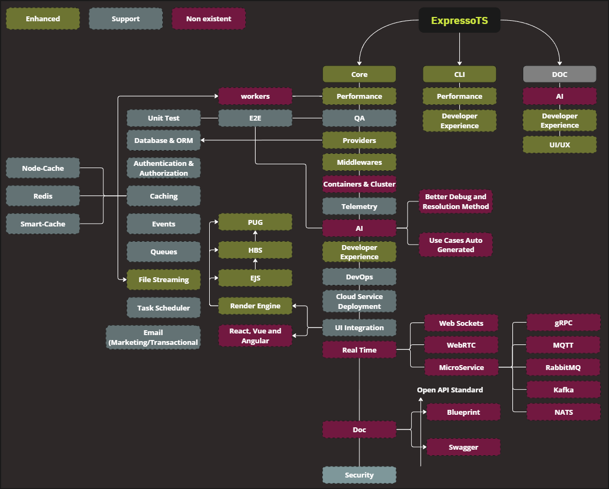

# Roadmap

The roadmap is a high-level overview of the upcoming features and improvements we plan to make to ExpressoTS. It is a living document and will be updated as we complete work and plan for future releases.

There are also many features and improvements that are not listed here because they are either too small to mention or we have not yet decided when they will be exposed to the public.

## Working packages

Working packages are a way to group related tasks together. They are a way to organize the work that needs to be done and to help us prioritize what to work on next.

> -   **Enhanced:** ExpressoTS streamlined workflow and improved the developer experience.

> -   **Support:** ExpressoTS supports the feature and provides the necessary tools to use it.

> -   **Non existent:** The feature is not yet available in ExpressoTS but maybe is in development or planned.

## Timeline

The timeline is a rough estimate of when we expect to complete the work. It is not a guarantee, and the actual timeline may vary.

-   Q1: January - March
-   Q2: April - June
-   Q3: July - September
-   Q4: October - December

---

**2024/Q3**

| Feature              | Description                                                                                                    |
| -------------------- | -------------------------------------------------------------------------------------------------------------- |
| Documentation update | Update the documentation to reflect the latest changes in ExpressoTS and streamlight the developer experience. |
| Improved CLI         | Enhance the CLI performance and supply scaffold resource tools.                                                |
| Core improvements    | Improve the core of ExpressoTS to provide better performance and stability.                                    |
| Provider store       | Implement a provider store to allow better ExpressoTS providers management.                                    |
| Study of AI          | Study the implementation of AI in ExpressoTS.                                                                  |
| Continue marketing   | Continue marketing efforts to increase the ExpressoTS community.                                               |
| UBC Presentation     | Present ExpressoTS at the University of British Columbia.                                                      |

---

**2024/Q4**

| Feature                    | Description                                                      |
| -------------------------- | ---------------------------------------------------------------- |
| QA Framework               | Implement a QA framework to facilitate the testing process.      |
| Real time                  | Implement real-time features in ExpressoTS.                      |
| API Doc                    | Implement an API documentation tool and Open API standards       |
| QA Training and Onboarding | Discuss and build QA Team to implement the QA Framework.         |
| New Contributors           | Onboard new contributors to the ExpressoTS project.              |
| Continue marketing         | Continue marketing efforts to increase the ExpressoTS community. |

---

## Support us ❤️

ExpressoTS is an MIT-licensed open source project. It's an independent project with ongoing development made possible thanks to your support.
If you'd like to help, please read our **[support guide](./support-us.mdx)**.
