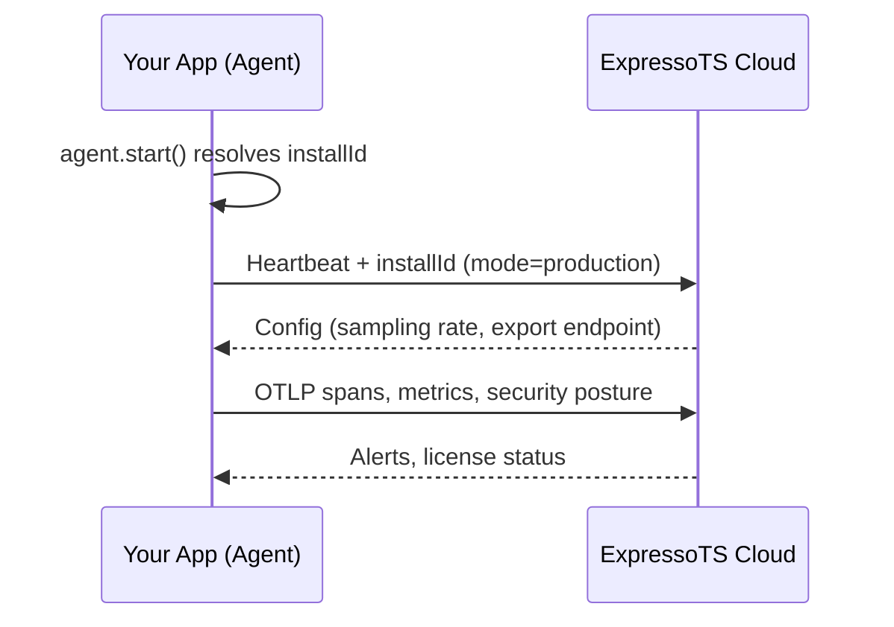

import Tabs from "@theme/Tabs";
import TabItem from "@theme/TabItem";

# Production & Telemetry

Starting with v4.0.0, Studio Agent ships two foundational configuration fields — `mode` and `installId` — that prepare your application for production monitoring, anonymous telemetry collection, and future enterprise cloud services without requiring a breaking API change.

## Configuration Fields

### `mode`

Controls the agent's operating personality.

| Value         | Behaviour (today)                               | Future behaviour                                                                                       |
| ------------- | ----------------------------------------------- | ------------------------------------------------------------------------------------------------------ |
| `development` | Full local instrumentation — SQLite, Socket.IO, file watchers. Default. | Unchanged.                                                                                             |
| `production`  | Accepted, behaves identically to `development`. | Disables SQLite & Socket.IO. Enables OTLP trace export to a remote endpoint. Activates usage telemetry. |

Setting `mode: 'production'` today is a no-op, but it **reserves your intent** so that future agent upgrades activate production behaviour without a config change on your side.

```typescript
import { StudioAgent } from '@expressots/studio-agent';

const agent = new StudioAgent({
  mode: process.env.NODE_ENV === 'production' ? 'production' : 'development',
});
```

### `installId`

A stable anonymous UUIDv4 that identifies this install across restarts, deployments, and environments.

| Scenario                | What happens                                                                                   |
| ----------------------- | ---------------------------------------------------------------------------------------------- |
| First agent start       | A new UUIDv4 is generated and persisted to `.studio/config.json`.                              |
| Subsequent starts       | The existing id is read from `.studio/config.json`.                                            |
| Explicit override       | Pass `installId: 'your-team-id'` to share a single identity across team members or services.  |
| Read-only filesystem    | Falls back to an in-memory id for the session (no crash, no data loss).                       |

```typescript
const agent = new StudioAgent({
  // Optional: override the auto-generated id for team-wide correlation
  installId: process.env.EXPRESSOTS_INSTALL_ID,
});
```

The file structure is:

```
.studio/
├── config.json   ← { "installId": "xxxxxxxx-...", "createdAt": "..." }
└── studio.db     ← SQLite recording database (development mode)
```

:::tip
Add `.studio/config.json` to your `.gitignore`. The install id should be unique per environment/machine.
:::

## What This Enables (Roadmap)

These two fields are the non-breaking hooks for every planned enterprise capability:

| Feature                          | Uses `installId` | Uses `mode`    | Status          |
| -------------------------------- | :--------------: | :------------: | --------------- |
| Anonymous usage telemetry        | ✓                | production     | Planned         |
| OTLP trace export to cloud       | ✓                | production     | Planned         |
| License verification             | ✓                | both           | Planned         |
| Multi-tenant cloud dashboard     | ✓                | production     | Planned         |
| "Publish" one-click deploy       | ✓                | production     | Planned         |
| Feature-usage analytics          | ✓                | both           | Planned         |
| Security posture alerts (cloud)  | ✓                | production     | Planned         |
| Performance monitoring (cloud)   | ✓                | production     | Planned         |

### How it will work (high-level)



In `development` mode the agent never contacts any remote endpoint — it stays fully local as it does today.

## Backward Compatibility

Both fields are **fully optional** in the `Partial<AgentConfig>` constructor:

```typescript
// This still works exactly as before — zero changes needed
const agent = new StudioAgent();

// mode defaults to 'development', installId is auto-generated
```

Existing applications that do not set these fields will continue working identically. No existing behaviour, API, or data format has changed.

## Best Practices

1. **Set `mode` early** — even if it's a no-op today, it documents your intent and will activate production features automatically when they ship.

2. **Don't commit `.studio/config.json`** — each environment should have its own identity for accurate telemetry.

3. **Override `installId` for shared environments** — CI, staging, and production clusters can share a team-level id so you can correlate data across nodes:

   ```typescript
   const agent = new StudioAgent({
     mode: 'production',
     installId: process.env.TEAM_INSTALL_ID,
   });
   ```

4. **Feature-gate in adapters** — `@expressots/adapter-express` only loads the agent when `NODE_ENV=development` by default. For production monitoring, explicitly import and configure the agent in your bootstrap.
