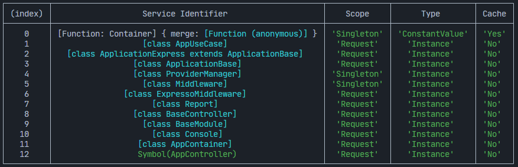

# App Container

O ExpressoTS utiliza o **[InversifyJS](https://inversify.io/)** para suas capacidades de contêiner de Inversão de Controle (IoC), fornecendo um sistema robusto para injeção de dependências. Este contêiner consciente de tipos facilita a instanciação de objetos, resolução e gestão de ciclo de vida, possibilitando a criação de dependências complexas com código mínimo.

O encapsulador AppContainer simplifica a integração, permitindo um registro direto de controladores, casos de uso e provedores dentro da aplicação.

## Configurando o contêiner

O contêiner da aplicação pode ser personalizado com escopos padrões para a vinculação de dependências e opções para pular verificações de classes base, aumentando a flexibilidade na gestão de dependências.

-   **defaultScope**: O escopo padrão, `RequestScope`, cria uma nova instância de uma dependência para cada solicitação, enquanto `SingletonScope` cria uma única instância compartilhada por todas as solicitações. O `TransientScope` cria uma nova instância cada vez que a dependência é solicitada.
-   **skipBaseClassChecks**: Quando definido como `true`, o contêiner irá pular as verificações de classes base ao trabalhar com classes derivadas.
-   **autoBindInjectable**: Quando definido como `true`, o contêiner irá injetar automaticamente classes que não estão explicitamente vinculadas.

Aqui está a definição das opções de interface:

```typescript
interface ContainerOptions {
    /**
     * O escopo padrão para as ligações no contêiner.
     * Pode ser definido como Request (padrão), Singleton ou Transient.
     */
    defaultScope?: interfaces.BindingScope;

    /**
     * Permite ignorar as verificações da classe base ao trabalhar com classes derivadas.
     */
    skipBaseClassChecks?: boolean;

    /**
     * Permite a injeção automática de classes que não estão explicitamente vinculadas ao contêiner.
     */
    autoBindInjectable: false;
}
```

Criando o container:

```typescript
// Adicionando opções ao contêiner
export const appContainer: AppContainer = new AppContainer({
    defaultScope: BindingScopeEnum.Singleton,
    skipBaseClassChecks: true,
    autoBindInjectable: false,
});

// Criando um gerenciador de módulos de contêiner
const container = appContainer.create([
    // Adicione seus módulos aqui
    AppModule,
]);

export { container };
```

## Definindo o escopo do container

Como mencionado acima, se o `defaultScope` não for fornecido, o padrão é definido como `RequestScope`. No entanto, é possível alterar o escopo padrão passando o `defaultScope` como uma opção no construtor do contêiner. O `BindingScopeEnum` contém os seguintes valores:

- `BindingScopeEnum.Singleton` - A dependência será criada uma vez e será compartilhada entre todas as solicitações.
- `BindingScopeEnum.Request` - A dependência será criada uma vez por solicitação.
- `BindingScopeEnum.Transient` - A dependência será criada toda vez que for solicitada.

## Visualizando as vinculações do contêiner

O contêiner pode ser usado para visualizar todas as vinculações que foram registradas. Isso pode ser útil para fins de depuração ou para entender as dependências que foram registradas.

```typescript
appContainer.viewContainerBindings();
```


## Registrando modulos

O `appContainer` facilita o registro de módulos por meio de seu método `create([])`, que aceita um array de módulos. Esta abordagem simplificada reduz a complexidade da configuração e alinha-se com o objetivo do ExpressoTS de simplificar a arquitetura da aplicação:

```typescript
// Cria novo container
const appContainer: AppContainer = new AppContainer();

const container: Container = appContainer.create([
    // Registrar todos os módulos
    UserModule,
    PaymentModule,
    ProductModule,
]);
```

O uso do `appContainer` abstrai as complexidades do uso direto do InversifyJS, proporcionando um caminho direto para integrar e gerenciar módulos dentro das aplicações ExpressoTS.

---

## Apoie o projeto

ExpressoTS é um projeto de código aberto licenciado sob o MIT. É um projeto independente com desenvolvimento contínuo possibilitado graças ao seu suporte. Se você deseja ajudar, por favor considere:

- Se tornar um **[Sponsor no GitHub](https://github.com/sponsors/expressots)**
- Siga a **[organização](https://github.com/expressots)** no GitHub e de um Star ⭐ no projeto
- Subscreva no nosso canal na Twitch: **[Richard Zampieri](https://www.twitch.tv/richardzampieri)**
- Entre no nosso **[Discord](https://discord.com/invite/PyPJfGK)**
- Contribua submetendo **[issues e pull requests](https://github.com/expressots/expressots/issues/new/choose)**
- Compartilhe o projeto com seus amigos e colegas