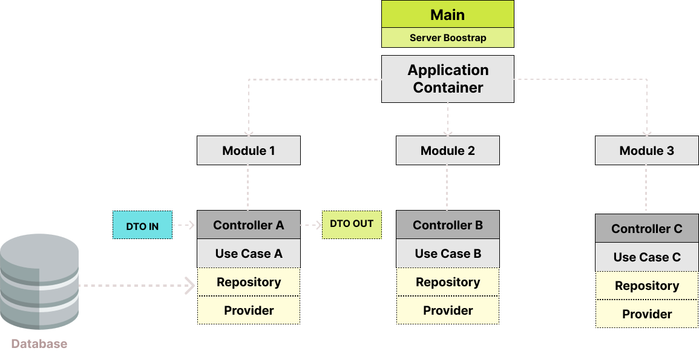
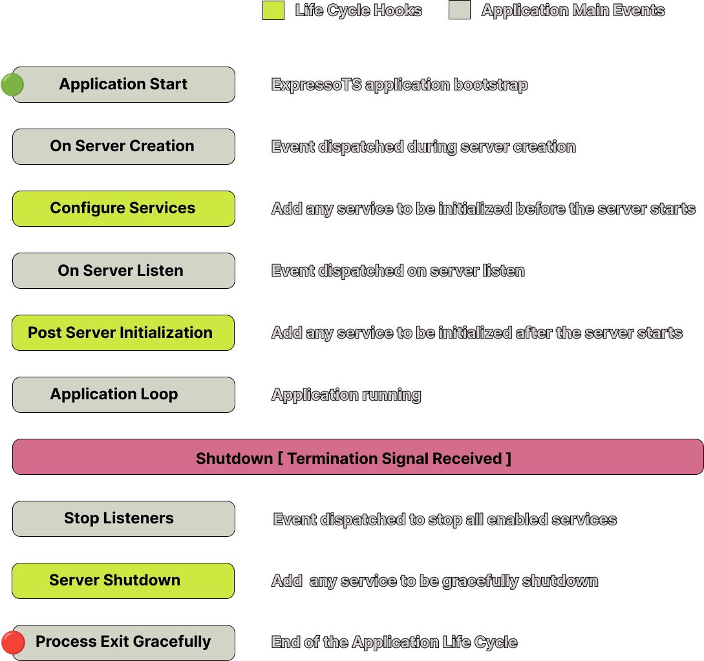

# Aplicação

A Visão Geral da Aplicação fornece uma demonstração abrangente dos principais componentes de uma aplicação ExpressoTS. No coração de uma aplicação ExpressoTS encontra-se a classe Application, que serve como base para criar e configurar o servidor. Além disso, a classe Application faz uso do container de aplicação do Inversify que carrega todos os módulos, incluindo suas respectivas rotas [controllers]. Isso garante um processo simplificado e eficiente para lidar com as solicitações de entrada e fornecer as respostas apropriadas.



ExpressoTS é um framework para aplicações web que fornece uma camada simples de abstração em torno de servidores HTTP populares como **[Express](https://expressjs.com)**, **[Fastify](https://www.fastify.io/)**, ou **[Koa](https://koajs.com/)**.

:::info
Atualmente, o ExpressoTS suporta apenas o Express, pois testamos minuciosamente essa integração.
:::

A arquitetura de uma aplicação ExpressoTS é baseado no **[Inversify's](https://inversify.io/)** Container IoC, que é usado para identificar e injetar dependências nos construtores de classes. Essa abordagem permite que o contêiner IoC carregue todos os módulos necessários, incluindo suas rotas (controladores) respectivas. Ao usar casos de uso e provedores conforme necessário, os roteadores podem lidar com solicitações recebidas.

Ao aproveitar o poder do Inversify, o ExpressoTS fornece uma arquitetura escalável e modular que ajuda a desacoplar componentes e melhorar a manutenção do código. Isso permite que os desenvolvedores se concentrem em escrever um código limpo e fácil de manter, em vez de se preocupar com a gestão de dependências.

## Detalhe dos componentes da aplicação

| Componente             | Descrição                                                                                                                                                                                                                                                                                                                                                      |
| --------------------- | ---------------------------------------------------------------------------------------------------------------------------------------------------------------------------------------------------------------------------------------------------------------------------------------------------------------------------------------------------------------- |
| DTO IN / OUT          | Objeto de transferência de dados que define o formato do payload de entrada e saída da aplicação.                                                                                                                                                                                                                                                           |
| Controller            | Componente responsável por processar solicitações e respostas com base na URL e no método HTTP. Ele também valida a conformidade dos dados recebidos.                                                                                                                                                                                      |
| Use Case              | Componente responsável por implementar a lógica necessária para manipular as solicitações recebidas do controlador. Quando o controlador recebe uma solicitação HTTP e valida os dados recebidos, ele aciona o caso de uso relevante, passando os dados validados para processamento. O caso de uso executa as operações necessárias com base na solicitação e retorna a resposta apropriada ao controlador, que envia a resposta de volta ao cliente. |
| Provider | Componente responsável por fornecer funcionalidades externas à aplicação. |
| Repository | Componente responsável por fornecer acesso ao banco de dados. |

:::info
Provedores e repositórios são componentes opcionais. Você pode usá-los se precisar fornecer funcionalidade externa ou acesso ao banco de dados.
:::

## Fluxo de Trabalho

O fluxo de trabalho de uma aplicação ExpressoTS é direto, conforme mostrado no diagrama acima. 

1. Após inicializar a aplicação com todos os seus componentes, incluindo o contêiner, módulos e controladores, o servidor começa a ouvir as solicitações recebidas. 
2. Quando uma solicitação é recebida, o servidor procura a rota correspondente e executa o controlador associado, que geralmente expõe endpoints. 
3. O controlador então chama o caso de uso relevante, que por sua vez chama o provedor apropriado quando necessário. Os provedores são componentes externos que oferecem funcionalidade adicional à aplicação.

:::warning Inicialização da aplicação sem controladores
O ExpressoTS irá impedir que você faça isso, pois não há ouvintes para lidar com as solicitações recebidas. Você verá a seguinte mensagem no console:
**_Nenhum controlador foi encontrado! Por favor, certifique-se de registrar pelo menos um controlador._**
:::

## Classe Aplication

A classe Application oferece uma forma de criar e configurar o servidor, passando **[Expressjs middlewares](https://expressjs.com/en/guide/writing-middleware.html)** ou outro middlewares durante a criação do servidor.

Definição da classe Aplication

```typescript
class Application {
  /**
   * Configure os serviços que devem ser inicializados antes que o servidor seja iniciado.
   */
  protected configureServices(): void {}

  /**
   * Configurar serviços que devem ser executados após a inicialização do servidor.
   */
  protected postServerInitialization(): void {}

  /**
   * Execute ações ou limpeza após o desligamento do servidor.
   */
  protected serverShutdown(): void {
    process.exit(0);
  }

  public create(
    container: Container,
    middlewares: express.RequestHandler[] = []
  ): Application {}

  public listen(
    port: number,
    environment: ServerEnvironment,
    consoleMessage?: IApplicationMessageToConsole
  ) {}
}
```

:::info
Também fornecemos uma instância da classe Application chamada **AppInstance**, que expõe apenas os métodos create e listen para o desenvolvedor. Isso é benéfico quando você precisa criar rapidamente um servidor sem ter que criar uma nova classe que estenda a classe Application e acessar seus métodos de ciclo de vida.
:::

### Método create da aplicação

O método Create permite que os desenvolvedores passem o contêiner e os middlewares para o servidor. Para passar middlewares não é necessário usar `app.use()`, basta passar o middleware e sua configuração conforme demonstrado abaixo:

```typescript
async function Bootstrap() {
  App.create(container, [
    express.json(),
    express.urlencoded({ extended: true }),
    cors({
      origin: "*",
    }),
  ]);
}
```

### Método listen da aplicação

O método listen inicia o servidor e escuta as solicitações recebidas. No método listen, os desenvolvedores podem definir não apenas o número da porta, mas também o ambiente do servidor, que pode ser de desenvolvimento, preparação ou produção. Assim como os desenvolvedores podem definir o nome e a versão do aplicativo a ser exibido no console quando o servidor for iniciado, conforme exemplo a seguir:

```typescript
// App listen method
app.listen(3000, ServerEnvironment.Development, {
    appName: "Your App Name",
    appVersion: "v1.0.0"
})
```

:::tip
O nome e a versão do seu aplicativo podem ser configurados por meio do arquivo .env ou do arquivo package.json. No modelo opinativo, usamos o arquivo package.json para recuperar o nome e a versão do aplicativo.
:::

### Enum Server Environment da aplicação

Por enquanto, essa funcionalidade é um trabalho em progresso. O que ela faz é exibir o ambiente no console quando o servidor é iniciado. A mensagem colorida no console ajuda os desenvolvedores a identificar rapidamente o ambiente em que o servidor está sendo executado.

Aqui está o enum disponível do ambiente do servidor:

```typescript
ServerEnvironment.Development;
ServerEnvironment.Staging;
ServerEnvironment.Production;
```

:::caution AVISO DE SPOILER
O objetivo dessa funcionalidade é permitir que os desenvolvedores carreguem variáveis de ambiente com base no ambiente em que o servidor está sendo executado. Por exemplo, se o servidor estiver rodando em desenvolvimento, carregue o arquivo .env.dev, se o servidor estiver rodando em staging, carregue o arquivo .env.stg, e se o servidor estiver rodando em produção, carregue o .env.prod arquivo. Além disso, estamos planejando carregar variáveis de ambiente de fontes remotas, como AWS Parameter Store, AWS Secrets Manager, Azure Key, Vault, etc.
:::

## Hooks de ciclo de vida da aplicação

Outro aspecto importante da classe Application são os life cycle hooks. Esses hooks permitem que os desenvolvedores executem código antes, depois e no desligamento do servidor. É importante observar que, para aproveitar esses hooks, os desenvolvedores devem criar uma classe App estendendo a classe Application e substituir os métodos conforme necessário. O exemplo a seguir mostra os life cycle hooks disponíveis no momento:

```typescript
    /* Execute serviços antes do servidor iniciar */
    protected configureServices(): void { }

    /* Execute serviços depois do servidor iniciar */
    protected postServerInitialization(): void { }

    /* Execute serviços ao servidor ser desligado */
    protected serverShutdown(): void {
        process.exit(0);
     }
```

### Ordem de execução dos Hooks



## Scripts da aplicação

Por favor, veja abaixo todos os scripts disponíveis que você pode usar para executar, construir e testar sua aplicação.
A coluna de comando mostra NPM como gerenciador de pacotes, mas você pode usar Yarn ou qualquer outro gerenciador de pacotes de sua escolha.

| Script      | Descrição                                            | Comando                      |
| ----------- | ---------------------------------------------------- | ---------------------------- |
| build       | Constrói o pacote de produção na pasta ./dist.        | npm run build                |
| dev         | Executa em modo de desenvolvimento com observação.    | npm run dev                  |
| prod        | Executa em modo de produção com base no pacote built. | npm run prod                 |
| test        | Executa os testes localizados na pasta test.          | npm run test                 |
| test:watch  | Executa os testes em modo de observação e interativo. | npm run test:watch           |
| test:cov    | Gera relatorio de cobertura de testes.                | npm run test:cov             |
| format      | Formatar código usando prettier.                      | npm run format               |
| lint        | Lint código usando eslint.                            | npm run lint                 |

## Executando a aplicação

```bash
npm run dev
```

Dependendo do ambiente em que está executando a aplicação, você verá a seguinte mensagem no console:

`expressots-demo version 1.0.0 is running on port 3000 - Environment: development`

---

## Apoie o projeto

ExpressoTS é um projeto de código aberto licenciado sob o MIT. É um projeto independente com desenvolvimento contínuo possibilitado graças ao seu suporte. Se você deseja ajudar, por favor considere:

- Se tornar um **[Sponsor no GitHub](https://github.com/sponsors/expressots)**
- Siga a **[organização](https://github.com/expressots)** no GitHub e de um Star ⭐ no projeto
- Subscreva no nosso canal na Twitch: **[Richard Zampieri](https://www.twitch.tv/richardzampieri)**
- Entre no nosso **[Discord](https://discord.com/invite/PyPJfGK)**
- Contribua submetendo **[issues e pull requests](https://github.com/expressots/expressots/issues/new/choose)**
- Compartilhe o projeto com seus amigos e colegas