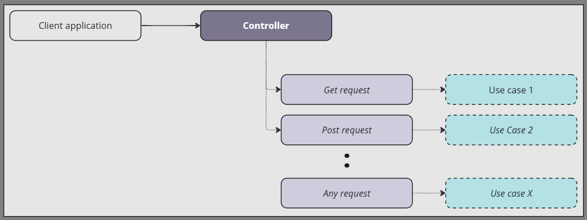
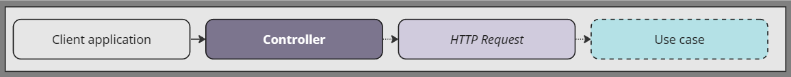

# Controladores

Os Controladores atuam como a principal interface entre o cliente e o servidor em aplicações Node.js. Eles lidam com as requisições recebidas, validam os dados conforme o DTO de entrada, e retornam as respostas no formato DTO. Em essência, os controllers atuam como a ponte entre os clientes e as camadas de serviço, também conhecidas como casos de uso.

**Exemplo de Controler Padrão MVC**



**Exemplo de Controler Padrão de Responsabilidade Única**



Para criar um controlador básico, criamos uma classe e usamos o decorador `@controller()` para definir a rota do controlador. Em seguida, criamos um método e usamos os decoradores `http Methods` para definir a rota e o método HTTP para o método.

## Classe Controler

### Padrão MVC

Múltiplas rotas em um único controlador.

```typescript
@controller("/user")
export class UserController {
    @Post("/")
    create(@response() res: Response) {
        return res.send("User created");
    }

    @Get("/")
    getUser(@response() res: Response) {
        return res.send("User listed");
    }
}
```

### Padrão de Responsabilidade Única

Um controlador, um método de execução e um caso de uso.

```typescript
@controller("/user/create")
export class UserCreateController {
    @Post("/")
    execute(@response() res: Response) {
        return res.send("User created");
    }
}
```

:::tip
Tanto os decoradores `@controller()` quanto `http methods` funcionam em combinação para definir a rota e os middlewares a serem usados no endpoint.
:::

## Escopo do controller

O escopo padrão de um controlador é `Request`, pois é herdado do `AppContainer` e do escopo de classe padrão `Module`. No entanto, você pode substituir o escopo de um controlador usando o decorador `@scope()`. Este decorador aceita os mesmos valores de enumeração BindingScopeEnum.

:::info
Se você definir o escopo do módulo, não poderá substituí-lo em um controlador específico usando o decorador `@scope`.
O decorador `@scope` só pode ser usado em controladores específicos se o escopo do módulo não estiver definido.
:::

Aqui está um exemplo de uso:

```typescript
@scope(BindingScopeEnum.Singleton)
@controller("/")
class CreateUserController extends BaseController {}
```

O controlador acima terá o escopo de `Singleton` e será compartilhado entre todas as solicitações.

## Classe BaseController

A classe `BaseController` é utilizada como base para as classes de controller, oferecendo no construtor um parâmetro que o desenvolvedor pode indicar qual serviço ou domínio ele está atualmente construindo. Isso ajuda o sistema de log a lançar erros com mais informações sobre o contexto do erro e onde o erro ocorreu.

Outra vantagem de usar a classe `BaseController` é que ela oferece um método em duas versões diferentes, assíncrona e síncrona, que é o `callUseCase()` ou `callUseCaseAsync()`.

Esses métodos reforçam a ideia de um caso de uso por controller e são responsáveis por chamar o caso de uso que irá implementar a lógica de negócio do controller.

:::tip
Os métodos callUseCase, disponíveis nas versões síncrona e assíncrona, são adequados para retornar status e respostas JSON aos clientes, pois os usuários precisam apenas passar o retorno do useCase, res: Response e o código de status.
:::

Esta é a assinatura do método `callUseCase`:

```typescript
callUseCase(useCase: any, res: any, successStatusCode: number);
```

-   `useCase`: O caso de uso a ser chamado. O caso de uso é injetado no construtor do controler.
-   `res`: O objeto resposta do tipe express Response.
-   `successStatusCode`: O código de status indica o resultado da solicitação HTTP e é enviado ao cliente quando o caso de uso é executado com êxito. Para mais informações sobre Status code visite **[Http Status Code](./status-code.md)**.

Resposta padrão:

```typescript
return res.status(successStatusCode).json(dataReturn);
```

Um exemplo mais completo de uma classe de controlador que herda da classe BaseController é mostrado abaixo:

```typescript
@controller("/")
class AppController extends BaseController {
    constructor(private appUseCase: AppUseCase) {
        super("app-controller");
    }

    @httpGet("/")
    execute(@response() res: any): IAppResponseDTO {
        return this.callUseCase(this.appUseCase.execute(), res, StatusCode.OK);
    }
}
```

## Decoradores do controlador

Os decoradores de métodos HTTP e parâmetros são um conjunto de anotações usadas em aplicações ExpressoTS para definir o roteamento e o tratamento de solicitações HTTP. O uso desses decoradores pode simplificar o roteamento e o tratamento de solicitações HTTP em aplicações Node.js e tornar o código mais legível e fácil de manter.

### Decoradores de métodos HTTP

Aqui está uma lista de todos os decoradores `@httpMethods()` disponíveis no ExpressoTS, juntamente com sua descrição e uso:

| Decorador   | Descrição                                                      | Uso                      |
| ----------- | -------------------------------------------------------------- | ------------------------ |
| @Get        | Vincula um método de controlador a um verbo HTTP GET.          | @Get("/path")            |
| @Post       | Vincula um método de controlador a um verbo HTTP POST.         | @Post("/path")           |
| @Put        | Vincula um método de controlador a um verbo HTTP PUT.          | @Put("/path")            |
| @Patch      | Vincula um método de controlador a um verbo HTTP PATCH.        | @Patch("/path")          |
| @Head       | Vincula um método de controlador a um verbo HTTP HEAD.         | @Head("/path")           |
| @Delete     | Vincula um método de controlador a um verbo HTTP DELETE.       | @Delete("/path")         |
| @Method     | Vincula um método de controlador a um verbo HTTP especificado. | @Method("verb", "/path") |

### Decoradores de parâmetros

Aqui está uma lista de todos os decoradores de parâmetros disponíveis no ExpressoTS, juntamente com sua descrição e uso:

| Decorator                            | Descrição                                                        | Uso                                                    |
| ------------------------------------ | ---------------------------------------------------------------- | ------------------------------------------------------ |
| @request()                           | Injeta objeto Express Request.                                   | execute(@request() req: Request)                       |
| @response()                          | Injeta objeto Express Response.                                  | execute(@response() res: Response)                     |
| @requestParam(paramName?: string)    | Injeta um parâmetro da URL da solicitação.                       | execute(@requestParam('id') id: string)                |
| @queryParam(paramName?: string)      | Injeta um parâmetro da string de consulta da URL da solicitação. | execute(@queryParam('searchTerm') searchTerm: string)  |
| @requestBody()                       | Injeta a carga útil do corpo da solicitação.                     | execute(@requestBody() body: MyDTO)                    |
| @requestHeaders(headerName?: string) | Injeta um cabeçalho dos cabeçalhos da solicitação.               | execute(@requestHeaders('authorization') auth: string) |
| @cookies(cookieName?: string)        | Injeta um cookie dos cookies da solicitação.                     | execute(@cookies('session') session: string)           |
| @next()                              | Injeta o objeto NextFunction do Express.                         | execute(@next() next: NextFunction)                    |

## Padrão DTO

O Data Transfer Object (DTO) é um padrão de design comumente usado em aplicações Node.js que padroniza os formatos de dados para a comunicação entre diferentes camadas da aplicação, incluindo cliente-servidor ou módulos de servidor. O DTO serve como uma interface para a troca de dados, garantindo estruturas claras e padronizadas para os dados de entrada e saída. Ao separar a lógica de negócios da lógica de comunicação, ajuda a reduzir a complexidade da aplicação e desacoplar diferentes camadas.

O uso de DTOs pode melhorar o desempenho e a escalabilidade da aplicação, reduzindo a transferência de dados entre o cliente e o servidor e fornecendo maneiras mais eficientes de processar e manipular dados dentro da aplicação.

### Exemplo de DTO

Por exemplo, imagine um cenário de registro de usuário em que são coletados nome, e-mail e senha, e o ID é gerado automaticamente. O objeto DTO de usuário para entrada e resposta pode ter possíveis formatos, como mostrado abaixo:

```typescript
// UserCreateInputDTO
interface UserCreateInputDTO {
  name: string;
  email: string;
  password: string;
}

// UserCreateResponseDTO
interface UserCreateResponseDTO {
  id: string;
  name: string;
  status: string;
}

// Payload json formato
{
  "name": string,
  "email": string,
  "password": string
}
```

Ter dois formatos diferentes de DTO é essencial nesse caso, porque ao registrar um usuário, não queremos retornar a senha para o cliente por motivos de segurança. Portanto, criamos um DTO diferente para a resposta, adicionando um campo complementar chamado status, onde é enviada uma mensagem ao cliente, indicando que o usuário foi criado com sucesso.

Como resultado, os DTOs ajudam a segregar e filtrar os dados enviados ao cliente, reduzindo a quantidade de dados processados pela aplicação.

---

## Apoie o projeto

ExpressoTS é um projeto de código aberto licenciado sob o MIT. É um projeto independente com desenvolvimento contínuo possibilitado graças ao seu suporte. Se você deseja ajudar, por favor considere:

-   Se tornar um **[Sponsor no GitHub](https://github.com/sponsors/expressots)**
-   Siga a **[organização](https://github.com/expressots)** no GitHub e de um Star ⭐ no projeto
-   Subscreva no nosso canal na Twitch: **[Richard Zampieri](https://www.twitch.tv/richardzampieri)**
-   Entre no nosso **[Discord](https://discord.com/invite/PyPJfGK)**
-   Contribua submetendo **[issues e pull requests](https://github.com/expressots/expressots/issues/new/choose)**
-   Compartilhe o projeto com seus amigos e colegas
