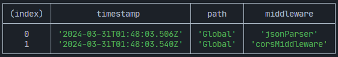

# Middleware

Funções de middleware são fundamentais no ciclo de request-response (solicitação-resposta) de uma aplicação ExpressoTS, fornecendo a capacidade de executar código, modificar objetos de request-response, encerrar o ciclo de request-response ou chamar o próximo middleware na pilha. É essencial chamar `next()` para evitar timeouts de solicitação, a menos que seu middleware conclua o ciclo.

O ExpressoTS integra-se perfeitamente com o middleware do Express, permitindo o uso de seu extenso ecossistema para aprimorar sua aplicação.

:::info
O ExpressoTS suporta totalmente o middleware do [Express](https://expressjs.com/en/resources/middleware.html).
:::

## Lista de middlewares disponíveis

Middlewares do Expressjs suportados pelo ExpressoTS:

| Nome do Middleware | Descrição                                                |
| ------------------ | -------------------------------------------------------- |
| addBodyParser      | Adiciona o middleware body parser à aplicação.           |
| addCompression     | Adiciona o middleware de compressão à aplicação.         |
| addCors            | Adiciona o middleware cors à aplicação.                  |
| addHelmet          | Adiciona o middleware cors à aplicação.                  |
| addCookieParser    | Adiciona o middleware de parser de cookies à aplicação.  |
| addCookieSession   | Adiciona o middleware de sessão de cookies à aplicação.  |
| addSession         | Adiciona o middleware de sessão à aplicação.             |
| addServerStatic    | Adiciona o middleware estático à aplicação.              |
| addRateLimit       | Adiciona o middleware de limite de taxa à aplicação.     |
| addMorgan          | Adiciona o middleware morgan à aplicação.                |
| addPassport        | Adiciona o middleware passport à aplicação.              |
| setMulter          | Adiciona o middleware multer à aplicação.                |
| addServeFavicon    | Adiciona o middleware de favicon à aplicação.            |
| setErrorHandler    | Adiciona o middleware de tratamento de erro à aplicação. |

## Adicionando middleware

A aplicação ExpressoTS suporta a adição de middleware globalmente à aplicação, bem como por rota. Oferece todos os [middlewares suportados pela equipe do Express](https://expressjs.com/en/resources/middleware.html) prontamente através do uso da propriedade `this.middleware`.

```typescript
@provide(App)
export class App extends AppExpress {
    private middleware: IMiddleware;

    constructor() {
        super();
        this.middleware = container.get<IMiddleware>(Middleware);
    }

    protected configureServices(): void {
        this.middleware.addBodyParser();
        this.middleware.addCors();
        this.middleware.addHelmet();
    }
}
```

:::caution
Se você adicionar um middleware que não está instalado como dependência, a aplicação exibirá uma mensagem de aviso e continuará a funcionar.
:::

## Adicionando middleware global
Middlewares podem ser adicionados globalmente usando a classe `App` através da propriedade `this.middleware`, usando a lista de middlewares fornecida pela equipe do Express:

```typescript
protected configureServices(): void {
        this.middleware.addBodyParser();
        this.middleware.addCors();
        this.middleware.addHelmet();
    }
```
## Usando o método `addMiddleware`

Para qualquer outro middleware ou um middleware personalizado, você pode adicioná-lo usando o método `this.middleware.addMiddleware()`. Com o método `addMiddleware`, você pode adicionar qualquer middleware do Registro NPM, middleware personalizado do Expressjs ou um middleware personalizado.

Middleware do Registro NPM:
```typescript
this.middleware.addMiddleware(cors());
```

### Criando middleware expressjs

```typescript
function myMiddleware(req: Request, res: Response, next: NextFunction) {
    // Do something
    next();
}
```

```typescript
this.middleware.addMiddleware(myMiddleware);
```

### Criando middleware expressots

Middleware personalizado do ExpressoTS:

```typescript
class CustomMiddleware extends ExpressoMiddleware {
    use(req: Request, res: Response, next: NextFunction): void | Promise<void> {
        // Do something
        next();
    }
}
```

```typescript
this.middleware.addMiddleware(new CustomMiddleware());
```
## Middleware de Rota

Middlewares podem ser adicionados por rota na classe `App` através do método `this.middleware.addMiddleware()`. Você pode adicionar qualquer middleware do Registro NPM, middleware personalizado do Expressjs ou um middleware personalizado.

```typescript
this.middleware.addMiddleware({ path: "/api", middlewares: [] });
```

:::info
Cada rota pode ter múltiplos middlewares.
:::

### Adicionando middleware a uma rota específica

Ou você adiciona um middleware a uma rota específica na classe `Controller` através dos decoradores `@controller()` e/ou dos métodos `HTTP`.

```typescript
@controller("/")
export class AppController {
    @Post("", express.json())
    execute() {
        return "Hello World";
    }
}
```

### Adicionando middleware a todas as rotas em um controlador
Se você quiser aplicar um middleware a todas as rotas sob um controlador específico, você pode adicioná-lo ao decorador `@controller()`.

```typescript
@controller("/app", express.json())
export class AppController {
    @Post("/create")
    createApp() {
        return "Create App";
    }

    @Patch("/update")
    updateApp() {
        return "Update App";
    }
}
```

## Exemplo de middleware personalizado expressoTS

Para criar um middleware personalizado, você precisa estender a classe `ExpressoMiddleware` e implementar o método `use`.

```typescript
class CustomMiddleware extends ExpressoMiddleware {
    private isOn: boolean;

    constructor(isOn: boolean) {
        super();
        this.isOn = isOn;
    }

    use(req: Request, res: Response, next: NextFunction): void | Promise<void> {
        // Do something
        if (this.isOn) {
            next();
        } else {
            res.status(403).send("Forbidden");
        }
    }
}
```

Middleware personalizado permite que você passe parâmetros para o construtor e os use como opções no método `use` do seu middleware.

## Visualizar toda a pipeline de middlewares

Você pode visualizar todos os middlewares adicionados à aplicação usando o método `this.middleware.viewMiddlewarePipeline()`.



:::tip Use o CLI do ExpressoTS para gerar um middleware personalizado.
:::

Comando CLI para gerar um middleware personalizado:

```bash
expressots g mi <<nome-do-middleware>>
```

---

## Apoie o projeto

ExpressoTS é um projeto de código aberto licenciado sob o MIT. É um projeto independente com desenvolvimento contínuo possibilitado graças ao seu suporte. Se você deseja ajudar, por favor considere:

-   Se tornar um **[Sponsor no GitHub](https://github.com/sponsors/expressots)**
-   Siga a **[organização](https://github.com/expressots)** no GitHub e de um Star ⭐ no projeto
-   Subscreva no nosso canal na Twitch: **[Richard Zampieri](https://www.twitch.tv/richardzampieri)**
-   Entre no nosso **[Discord](https://discord.com/invite/PyPJfGK)**
-   Contribua submetendo **[issues e pull requests](https://github.com/expressots/expressots/issues/new/choose)**
-   Compartilhe o projeto com seus amigos e colegas
