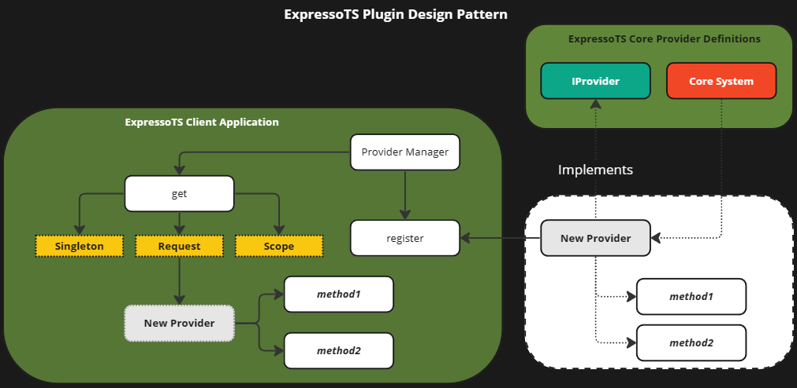

# Provedores

No ExpressoTS, provedores servem como melhorias modulares para uma aplicação, encapsulando funcionalidades específicas, como serviços de email, mecanismos de autenticação ou conexões de banco de dados. Essa encapsulação é essencial para preservar uma arquitetura fracamente acoplada, permitindo a troca ou atualização dessas funcionalidades sem afetar o sistema geral.

## O papel dos provedores

Provedores encapsulam as operações de componentes de infraestrutura, como bancos de dados, serviços web e sistemas de arquivos, apresentando uma interface unificada para a aplicação. Essa configuração não apenas simplifica a base de código, mas também melhora sua testabilidade, manutenibilidade e escalabilidade.

### Vantagens chave

-   Promover o desacoplamento entre as camadas da aplicação.
-   Simplificar o processo de teste ao desacoplar a lógica de implementações específicas.
-   Melhorar a manutenibilidade e flexibilidade do código, suportando trocas fáceis de serviços subjacentes.

:::info
O ExpressoTS utiliza provedores para aumentar as capacidades da aplicação, facilitando funcionalidades como envio de emails, armazenamento de dados e mais, sem vincular a lógica da aplicação a implementações específicas.
:::

## Implementando um provedor: Um exemplo de serviço de email

Considere uma aplicação que precisa enviar emails sob várias circunstâncias, como registro de usuário ou recuperação de senha. Implementando um provedor de email, o ExpressoTS pode enviar emails sem interagir diretamente com o serviço de envio de emails na lógica de negócios.

### Configurando o provedor

Primeiro, execute o comando CLI para criar um novo provedor no seu projeto ExpressoTS:

```bash
expressots g p mailtrap
```
O CLI adicionará o sufixo `Provider` ao nome do provedor, criando um novo arquivo no diretório `providers`. Esse arquivo conterá a classe do provedor, que você pode personalizar de acordo com as necessidades da sua aplicação.

Aqui está o arquivo padrão do provedor gerado pelo CLI:

```typescript
import { provide } from "inversify-binding-decorators";

@provide(MailTrapProvider)
class MailTrapProvider {}
```

### Implementando o provedor


```typescript
import nodemailer from "nodemailer";
import Mail from "nodemailer/lib/mailer";

const enum EmailType {
    Welcome = 0,
    CreateUser,
    ChangePassword,
    Login,
    RecoveryPassword,
}

@provide(MailTrapProvider)
class MailTrapProvider {
    private transporter: Mail;

    constructor() {
        this.transporter = nodemailer.createTransport({
            host: Env.Mailtrap.HOST,
            port: Env.Mailtrap.PORT,
            auth: {
                user: Env.Mailtrap.USERNAME,
                pass: Env.Mailtrap.PASSWORD,
            },
        });
    }

    private mailSender(message: IMessage): Promise<void> {
        await this.transporter.sendMail({
            to: {
                name: message.to.name,
                address: message.to.email,
            },
            from: {
                name: message.from.name,
                address: message.from.email,
            },
            subject: message.subject,
            html: message.body,
        });
    }

    sendEmail(emailType: EmailType): Promise<void> {
        switch (emailType) {
            case EmailType.Login:
                break;
            case EmailType.Welcome:
                break;
            case EmailType.RecoveryPassword:
                break;
            case EmailType.ChangePassword:
                break;
            case EmailType.CreateUser:
                this.MailSender({
                    to: {
                        name: "User",
                        email: Env.Mailtrap.INBOX_ALIAS,
                    },
                    from: {
                        name: "ExpressoTS",
                        email: "noreply@expresso-ts.com",
                    },
                    subject: "Successfully logged in!",
                    body: "<h1>Welcome to the system!</h1>",
                });
                break;
        }
    }
}

export { MailTrapProvider, EmailType };
```

Este `MailTrapProvider` abstrai a complexidade de configurar e usar o nodemailer para operações de email, fornecendo um método simples sendEmail para enviar diferentes tipos de emails.

### Consumindo o provedor em um caso de uso

Aqui está a implementação do caso de uso fazendo uso do provedor mailtrap:

```typescript
@provide(LoginUserUseCase)
class LoginUserUseCase {
    constructor(private mailTrapProvider?: MailTrapProvider) {}

    execute(payload: ILoginUserRequestDTO): boolean {
        const { email, password } = payload;

        if (isAuthenticated(email, password)) {
            return true;
        }

        // Implementation of the use case logic
        mailTrapProvider?.sendEmail(EmailType.Login);

        return false;
    }
}

export { LoginUserUseCase };
```

Neste caso de uso, o `MailTrapProvider` é injetado através do construtor, aproveitando a injeção de dependência do ExpressoTS. Isso desacopla o processo de envio de email da lógica de autenticação, ilustrando o papel do provedor em manter um código limpo e manutenível.

## Provedores disponíveis no ExpressoTS

O ExpressoTS oferece provedores integrados para funcionalidades comuns, estendendo ainda mais as capacidades da aplicação:

| Nome do Provedor | Descrição                        |
| ---------------- | -------------------------------- |
| envValidator     | Valida as variáveis de ambiente. |
| logger           | Adiciona logger à aplicação.     |

Provedores são essenciais para construir aplicações escaláveis, manuteníveis com o ExpressoTS, enfatizando uma arquitetura limpa e separação de preocupações.

## Registro automático com decoradores fluentes

O ExpressoTS facilita o registro de provedores em seu sistema de injeção de dependência por meio do uso de decoradores fluentes:

-   @provide
-   @provideSingleton
-   @provideTransient

Esses decoradores garantem que os provedores sejam automaticamente registrados, simplificando sua integração e reduzindo o código repetitivo.

## Criando e registrando um provedor externo

O ExpressoTS incentiva a extensibilidade por meio do uso de provedores externos. Desenvolvedores podem criar pacotes reutilizáveis, seguindo o padrão de design de plugin, para introduzir novas funcionalidades em uma aplicação ExpressoTS. Isso é particularmente útil para recursos que precisam ser compartilhados entre vários projetos ou para integrar serviços de terceiros.

### Criando um provedor externo

Um provedor externo deve ser um pacote CommonJS implementando a interface IProvider:

```typescript
import { IProvider } from "expressots";

@injectable()
class Logger implements IProvider {
    log(message: string): void {
        console.log(message);
    }
}
```

Interface `IProvider`:

```typescript
export interface IProvider {
    name: string;
    version: string;
    author: string;
    repo: string;
}
```

Uma vez que o pacote é desenvolvido e publicado no registro npm, ele pode ser facilmente integrado em qualquer aplicação ExpressoTS.

### Registrando provedores em tempo de execução

Provedores são registrados na classe `App` de uma aplicação ExpressoTS usando o `ProviderManager`. O decorador `@injectable` do InversifyJS torna o provedor disponível para registro e resolução dentro do sistema de injeção de dependência do aplicativo.

```typescript
@provide(App)
export class App extends AppExpress {
    private provider: ProviderManager;

    constructor() {
        super();
        this.provider = container.get(ProviderManager);
    }

    protected configureServices(): void {
        // Registrando provedores core e externos
        this.provider.register(Logger);
    }

    protected postServerInitialization(): void {}

    protected serverShutdown(): void {}
}
```

:::info
Por padrão, o registro do provedor vincula o provedor como escopo de solicitação. Para alterar o escopo, use o `BindingScopeEnum`.
:::

Exemplo de registro de um provedor como singleton:

```typescript
this.provider.register(Logger, BindingScopeEnum.Singleton);
```

Este processo concede flexibilidade para melhorar a aplicação em tempo de execução integrando provedores adicionais, permitindo a escala dinâmica e extensão das capacidades da aplicação.

## Visualizando o padrão de design de plugin

O diagrama ilustra o padrão de design de plugin do ExpressoTS, demonstrando como os provedores externos são integrados de maneira transparente à aplicação cliente através do Gerenciador de Provedores. Ele destaca o processo de registrar novos provedores e seus respectivos escopos de ciclo de vida, que podem ser singleton, request ou scoped.



## Recomendações para usar provedores externos

Ao desenvolver provedores externos para o ExpressoTS, considere as seguintes melhores práticas:

-   **Implementação de Interface**: Garanta que os provedores externos estejam em conformidade com a interface IProvider para consistência.
-   **Gerenciamento de Ciclo de Vida**: Escolha o escopo apropriado para o provedor com base em seu padrão de uso pretendido.
-   **Testes**: Teste os provedores minuciosamente de forma isolada antes de integrá-los à aplicação principal.
-   **Documentação**: Forneça instruções de uso detalhadas e opções de configuração para o provedor externo.

Ao aderir a essas práticas, os desenvolvedores podem garantir que seus provedores externos sejam robustos, mantíveis e facilmente integrados a qualquer aplicação ExpressoTS.

---

## Apoie o projeto

ExpressoTS é um projeto de código aberto licenciado sob o MIT. É um projeto independente com desenvolvimento contínuo possibilitado graças ao seu suporte. Se você deseja ajudar, por favor considere:

-   Se tornar um **[Sponsor no GitHub](https://github.com/sponsors/expressots)**
-   Siga a **[organização](https://github.com/expressots)** no GitHub e de um Star ⭐ no projeto
-   Subscreva no nosso canal na Twitch: **[Richard Zampieri](https://www.twitch.tv/richardzampieri)**
-   Entre no nosso **[Discord](https://discord.com/invite/PyPJfGK)**
-   Contribua submetendo **[issues e pull requests](https://github.com/expressots/expressots/issues/new/choose)**
-   Compartilhe o projeto com seus amigos e colegas
