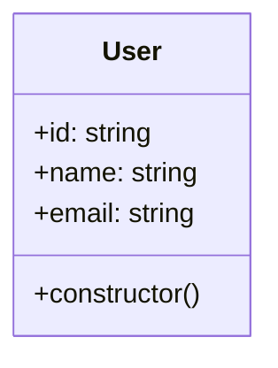
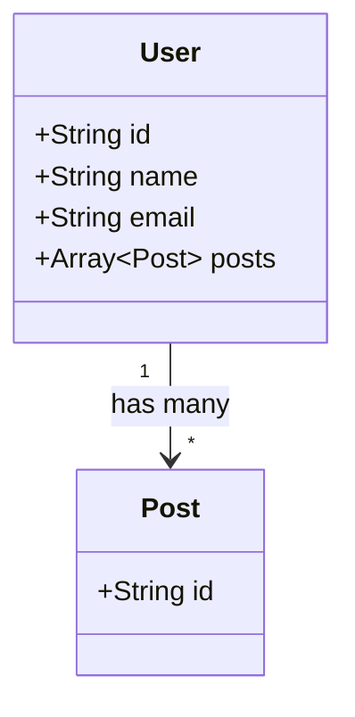

import Tabs from '@theme/Tabs';
import TabItem from '@theme/TabItem';

# Prisma Provider

O Provedor Prisma do ExpressoTS encapsula o robusto ORM (Object-Relational Mapper) [Prisma](https://www.prisma.io/) dentro do framework ExpressoTS, criando uma interface transparente para operações de dados. O Prisma facilita um acesso seguro, tipo-seguro e simplificado ao seu banco de dados, garantindo que as interações de dados dentro das suas aplicações sejam precisas e eficientes. Seu potente motor de consulta simplifica significativamente o acesso ao banco de dados e mitiga bugs comuns associados à recuperação e manipulação de dados.

## Como Instalar

Aproveitar as capacidades do Prisma dentro do seu framework ExpressoTS é simplificado com a ajuda do [ExpressoTS CLI](https://github.com/expressots/expressots-cli). O CLI fornece um assistente dedicado para simplificar a configuração do Prisma, garantindo uma integração sem complicações.

```bash title="terminal"
expressots add prisma

- Type the prisma client version (default=latest): (latest)
- Type the schema name (default=schema): (schema)
- Where do you want to save your prisma schema (default=./): (.)
- Select your database:
  CockroachDB
  Microsoft SQL Server
  MongoDB
  MySQL
> PostgreSQL
  SQLite
- Do you want to install the latest recommended database driver for PostgreSQL? (Y/n)
- Do you want to add BaseRepository Pattern in this project? this will replace the existing BaseRepository and BaseRepositoryInterface if it exists. (Y/n)
```

Ao seguir estas instruções, o ExpressoTS garante uma instalação e configuração sem problemas do Prisma, adaptadas às necessidades do seu projeto.

## Atualização de Configuração

Após a instalação, um novo conjunto de configurações referentes ao provedor Prisma está disponível para você ajustar. Isso inclui schemaName, schemaPath, entitiesPath e entityNamePattern. Personalize essas configurações para se alinhar com a arquitetura e convenções de nomenclatura do seu projeto.

```ts title="expressots.config.ts"
import { ExpressoConfig, Pattern } from "@expressots/core";

const config: ExpressoConfig = {
  sourceRoot: "src",
  scaffoldPattern: Pattern.KEBAB_CASE,
  opinionated: true,
  providers: {
    // highlight-start
    prisma: {
      schemaName: "schema",
      schemaPath: "./prisma",
      entitiesPath: "entities",
      entityNamePattern: "entity",
    },
    // highlight-end
  },
};

export default config;
```

## Extensão do Repositório Base
Durante o processo de configuração, será solicitado a você estender o seu repositório base existente ou criar um novo, caso nenhum exista. Isso inclui tanto a interface quanto a implementação, permitindo uma maneira padronizada de interagir com suas entidades de banco de dados.

<Tabs>

  <TabItem label="Interface" value="interface">

```ts title="./src/repositories/base-repository.interface.ts"
import { Prisma, PrismaClient } from "@prisma/client";
import {
  CreateInput,
  ModelsOf,
  DeleteWhere,
  Select,
  PrismaAction,
} from "@expressots/prisma";

interface IBaseRepository<ModelName extends ModelsOf<PrismaClient>> {
  // highlight-start
  aggregate: (args: PrismaAction<ModelName, "aggregate">) => Promise<any>;
  count: (args: PrismaAction<ModelName, "count">) => Promise<number>;
  // highlight-end
  create: (
    data:
      | CreateInput<ModelName>["data"]
      | {
          data: CreateInput<ModelName>["data"];
          select?: Select<ModelName, "create">["select"];
        },
  ) => Promise<ModelName | never>;
  // ...
}
```

  </TabItem>

  <TabItem label="Implementation" value="implementation">

```ts title="./src/repositories/base-repository.ts"
import { PrismaClient, Prisma } from "@prisma/client";
import {
  CreateInput,
  ModelsOf,
  DeleteWhere,
  Select,
  PrismaAction,
} from "@expressots/prisma";
import { provide } from "inversify-binding-decorators";
import { IBaseRepository } from "./base-repository.interface";

@provide(BaseRepository)
class BaseRepository<ModelName extends ModelsOf<PrismaClient>>
  implements IBaseRepository<ModelName>
{
  protected prismaModel: any;
  protected prismaClient: PrismaClient;
  constructor(modelName: keyof PrismaClient) {
    this.prismaClient = new PrismaClient();
    this.prismaModel = this.prismaClient[modelName];
  }

  // highlight-start
  async aggregate(args: PrismaAction<ModelName, "aggregate">): Promise<any> {
    return await this.prismaModel.aggregate(args);
  }
  // highlight-end

  // highlight-start
  async count(args: PrismaAction<ModelName, "count">): Promise<number> {
    return await this.prismaModel.count(args);
  }
  // highlight-end
```

  </TabItem>

</Tabs>

## Utilizando Decoradores Prisma do ExpressoTS

Desenvolvemos decoradores para facilitar o uso do Prisma com o ExpressoTS. Você pode usar os decoradores com Entidades, enums e tipos para gerar o esquema Prisma automaticamente.

### Decoradores
| Decorador	| Descrição	| Opções | 
| --- | --- | --- |
| @prismaModel	| Decora uma classe como um modelo Prisma	| map |
| @prismaField	| Decora uma propriedade com atributo específico do banco de dados	| attr, isId, isOptional, type, isUnique, prismaDefault, mapField, name |
| @prismaRelation	| Decora uma propriedade como uma relação Prisma	| relation, name, model, refs, fields, onDelete, onUpdate, isRequired |
| @prismaIndex |	Decora uma propriedade como um índice Prisma	| name, fields, map, type |

### Decorador PrismaModel
O decorador @prismaModel() é essencial para designar uma classe como um modelo Prisma, o que por sua vez desencadeia a geração automática do esquema Prisma correspondente.

Opções:
- `map`: A opção map está disponível para mapear o nome da classe para um nome diferente no esquema Prisma, garantindo a flexibilidade de aderir às convenções ou requisitos de nomenclatura. Para uma compreensão aprofundada da opção de mapa, consulte a documentação do Prisma.

Vamos ilustrar isso com um exemplo extraído do modelo Opinativo. Inicialmente, a entidade está estruturada da seguinte forma:

<div style={{ display: 'flex', justifyContent: 'center', alignItems: 'center' }}>

<div style={{ display: 'flex', justifyContent: 'center', alignItems: 'center' }}>



</div>

<div style={{ flex: 1 }}>

```ts title="./src/entities/user.entity.ts"
import { provide } from "inversify-binding-decorators";
import { randomUUID } from "node:crypto";
import { IEntity } from "./base.entity";

// highlight-start
@provide(User)
export class User implements IEntity {
  id: string;
  name!: string;
  email!: string;

  constructor() {
    this.id = randomUUID();
  }
}
// highlight-end
```

</div>

</div>

A única adição necessária para começar é o decorador `@prismaModel()` à classe:

<Tabs>

<TabItem label="Entity" value="entity">

```ts title="./src/entities/user.entity.ts"
import { provide } from "inversify-binding-decorators";
import { randomUUID } from "node:crypto";
import { IEntity } from "./base.entity";
// highlight-start
import { prismaModel } from "@expressots/prisma";
// highlight-end

@provide(User)
// highlight-start
@prismaModel({ map: "user" })
// highlight-end
export class User implements IEntity {
  id: string;
  name!: string;
  email!: string;

  constructor() {
    this.id = randomUUID();
  }
}
```

</TabItem>


<TabItem label="Terminal" value="terminal">

```bash title="Terminal"
npm run prisma
```

</TabItem>

<TabItem label="Prisma Schema" value="prisma-schema">

```typescript title="./prisma/schema.prisma"
model User {

  @@map("users")
}
```

</TabItem>
</Tabs>

---

Ao executar isso, você poderá encontrar uma mensagem de erro conforme mostrado abaixo. Este é um comportamento previsto, pois o Prisma exige pelo menos um critério exclusivo por modelo e não fornecemos nenhum por meio dos decoradores.

```ansii
error: Error validating model "User": Each model must have at least one unique criteria that has only required fields. Either mark a single field with `@id`, `@unique` or add a multi field criterion with `@@id([])` or `@@unique([])` to the model.
  -->  schema.prisma:13
   |
12 |
13 | model User {
14 |
15 |   @@map("users")
16 | }
   |
```

:::note
Para gerar o modelo Prisma, `@prismaModel()` deve ser usado o decorador. Todas as entidades devem ser decoradas com `@prismaModel()`.
:::

### Decorador PrismaField

O decorador `@prismaField()` é usado para decorar uma propriedade com atributos específicos do prisma disponíveis na [documentação do Prisma](https://www.prisma.io/docs/reference/api-reference/prisma-schema-reference# campos do modelo).

Opções:

- `attr`: Você pode usar a opção `attr` para adicionar atributos específicos ao campo por banco de dados. Para obter mais informações sobre a opção `attr`, consulte a [documentação do Prisma](https://www.prisma.io/docs/reference/api-reference/prisma-schema-reference#model-fields).


<Tabs>

<TabItem label="Entity" value="entity">

```ts title="./src/entities/user.entity.ts"
import { provide } from "inversify-binding-decorators";
import { randomUUID } from "node:crypto";
import { IEntity } from "./base.entity";
import { prismaModel, prismaField, db } from "@expressots/prisma";

@provide(User)
@prismaModel({ map: "users" })
export class User implements IEntity {
  @prismaField({ attr: db.Postgres.Uuid, isUnique: true, isId: true })
  id: string;

  @prismaField({ attr: db.Postgres.Char(36) })
  name!: string;

  @prismaField({ attr: db.Postgres.Char(36) })
  email!: string;

  constructor() {
    this.id = randomUUID();
  }
}
```

</TabItem>

<TabItem label="Terminal" value="terminal">

```bash title="Terminal"
npm run prisma
```

</TabItem>


<TabItem label="Prisma Schema" value="prisma-schema">

```typescript title="./prisma/schema.prisma"
model User {
  // highlight-start
  id    String @id @unique @db.Uuid
  name  String @db.Char(36)
  email String @db.Char(36)
  // highlight-end

  @@map("user")
}
```

</TabItem>
</Tabs>

:::note
`db` é um namespace que contém todos os atributos disponíveis por banco de dados.
:::

### Decorador de Relação Prisma

O decorador `@prismaRelation()` é um recurso poderoso que agiliza a criação de relacionamentos entre modelos Prisma. Simplifica o processo ao permitir a definição de relações a partir da perspectiva do modelo onde o relacionamento é iniciado de forma mais lógica. Isso significa que em vez de definir uma chave estrangeira em um modelo filho, você pode declarar o relacionamento no modelo pai, o que pode ser mais intuitivo, especialmente ao lidar com relacionamentos um-para-muitos (1-M).

As opções para `@prismaRelation()` incluem:

- `model`: Especifica o modelo Prisma relacionado.
- `relação`: Define o tipo de relacionamento, como um para muitos, um para um, etc.
- `refs`: Uma matriz que denota o(s) campo(s) aos quais o relacionamento está referenciando.
- `fields`: Especifica o(s) campo(s) no modelo que são usados para a relação.
- `onDelete` e `onUpdate`: Definem as ações referenciais nas operações de exclusão e atualização.
- `isRequired`: Determina se o campo relacionado é obrigatório.

Agora, vamos aplicar isso a um exemplo específico para melhor compreensão.

#### Exemplo: relacionamento User-Post


<div style={{ display: 'flex', justifyContent: 'center', gap: '2rem' }}>

<div style={{ display: "flex", width: "50%" }}>



</div>

<div>

Considere uma plataforma de blog onde um usuário pode criar várias postagens. Queremos definir um relacionamento um-para-muitos dos modelos `User` para `Post`. Do ponto de vista do desenvolvimento de aplicações, é mais natural expressar que um usuário “tem muitas” postagens do que dizer que uma postagem “pertence a” um usuário. Com o decorador `@prismaRelation()`, podemos declarar diretamente esse relacionamento no modelo `User`.

</div>

</div>

Veja como podemos usar o decorador `@prismaRelation()` no contexto:

<Tabs>

<TabItem label="User Entity" value="user-entity">

```ts title="./src/entities/user.entity.ts"
import { provide } from "inversify-binding-decorators";
import { randomUUID } from "node:crypto";
import { IEntity } from "./base.entity";
import {
  prismaModel,
  prismaField,
  // highlight-start
  prismaRelation,
  Relation,
  // highlight-end
  db,
} from "@expressots/prisma";
import { Post } from "./post.entity";

@provide(User)
@prismaModel({ map: "user" })
export class User implements IEntity {
  @prismaField({ attr: db.Postgres.Uuid, isUnique: true, isId: true })
  id: string;

  @prismaField({ attr: db.Postgres.Char(36) })
  name!: string;

  @prismaField({ attr: db.Postgres.Char(36) })
  email!: string;

  // highlight-start
  // Define the one-to-many relationship to Post.
  @prismaField({ type: Post })
  @prismaRelation({
    model: "Post",
    relation: Relation.OneToMany,
    refs: ["id"],
  })
  posts: Post[]; // This is where the User-Post relationship is expressed.
  // highlight-end

  constructor() {
    this.id = randomUUID();
  }
}
```

</TabItem>

<TabItem label="Post Entity" value="post-entity">

```ts title="./src/entities/post.entity.ts"
import { provide } from "inversify-binding-decorators";
import { prismaModel, prismaField } from "@expressots/prisma";
import { randomUUID } from "node:crypto";

@prismaModel({ map: "posts" })
@provide(Post)
export class Post {
    @prismaField({ isId: true })
    id: string;

    // highlight-next-line
    // No need to explicitly define the foreign key field here; it's handled by the provider. 🥳

    constructor() {
        this.id = randomUUID();
    }
}
```

</TabItem>

<TabItem label="Terminal" value="terminal">

```bash title="Terminal"
npm run prisma
```

</TabItem>


<TabItem label="Prisma Schema" value="prisma-schema">

```typescript title="./prisma/schema.prisma"
model User {
  id    String @id @unique @db.Uuid
  name  String @db.Char(36)
  email String @db.Char(36)
  // highlight-next-line
  posts Post[]

  @@map("user")
}

model Post {
  id     String  @id @unique @db.Uuid
  // highlight-start
  user   User?   @relation(fields: [userId], references: [id])
  userId String? @unique
  // highlight-end

  @@map("posts")
}
```

</TabItem>
</Tabs>

Neste exemplo, o modelo `User` usa o decorador `@prismaRelation()` para declarar sua conexão com múltiplas instâncias `Post`. O Prisma cuidará automaticamente da criação da chave estrangeira correspondente no modelo `Post`, tornando o relacionamento gerenciado de forma explícita e implícita, reduzindo assim o potencial de erro e confusão.

:::observação
A sintaxe declarativa do decorador `@prismaRelation()` se alinha estreitamente com a forma como os desenvolvedores conceituam os relacionamentos no aplicativo, fornecendo uma ponte entre o modelo de objeto e o esquema de banco de dados subjacente.
:::

### Decorador PrismaIndex

O decorador `@prismaIndex()` é essencial para otimizar consultas ao banco de dados, definindo índices em campos específicos de um modelo Prisma. Os índices são tabelas de pesquisa especiais que o mecanismo de pesquisa do banco de dados pode usar para acelerar a recuperação de dados. A indexação adequada de um banco de dados pode melhorar drasticamente o desempenho de um aplicativo.

Ao aplicar o decorador `@prismaIndex()` a um modelo, você fornece ao Prisma as informações necessárias para criar um índice no banco de dados subjacente. O decorador pega um objeto com diversas opções:

- `name`: Especifica um nome para o índice, permitindo fácil referência e gerenciamento.
- `fields`: Define um array de campos a serem incluídos no índice. Estas são as propriedades do modelo que você espera consultar com frequência.
- `type`: Dita o tipo de índice a ser utilizado, influenciando como o banco de dados organiza e recupera os dados.

#### Tipos de índice

O enum `IndexType` oferece uma seleção de tipos de índice adequados para diferentes tipos de dados e padrões de consulta:

- `Brin`: Índices de intervalo de blocos são adequados para tabelas grandes nas quais certas colunas têm uma correlação linear com sua localização física no disco.
- `Btree`: Os índices de árvore balanceada são os mais comuns e excelentes para uso geral. Eles suportam consultas de igualdade e intervalo de forma eficiente.
- `Gist`: índices de árvore de pesquisa generalizada suportam tipos complexos como dados geométricos e podem lidar com dados multidimensionais.
- `Gin`: Índices invertidos generalizados são otimizados para indexar valores compostos onde cada item indexado pode conter vários valores de componentes.
- `Hash`: Os índices hash fornecem recuperação rápida para pesquisas de igualdade, mas não suportam consultas de intervalo.
- `Spgist`: índices de árvore de pesquisa generalizada particionados em espaço são bons para dados que não se ajustam bem a uma estrutura de árvore B, como números de telefone ou endereços IP.

Cada tipo de índice vem com suas próprias características de desempenho e é otimizado para tipos específicos de consultas e padrões de dados. A escolha do tipo de índice correto é crucial para o desempenho das operações de leitura e, consequentemente, para o desempenho geral da aplicação.

#### Exemplo de uso

Abaixo está um exemplo de como usar o decorador `@prismaIndex()` para definir um índice hash no campo `email` de um modelo `User`, o que aceleraria consultas que procuram usuários por seus endereços de email:


<Tabs>

<TabItem label="Entity" value="entity">

```ts title="./src/entities/user.entity.ts"
import {
  prismaModel,
  prismaField,
  prismaRelation,
  // highlight-next-line
  prismaIndex,
  Relation,
  // highlight-next-line
  IndexType,
  db,
} from "@expressots/prisma";

@provide(User)
@prismaModel({ map: "user" })
// highlight-next-line
@prismaIndex({ name: "emailIndex", fields: ["email"], type: IndexType.Hash })
export class User implements IEntity {
  // ...

  // highlight-next-line
  @prismaField({ attr: db.Postgres.Char(36), isUnique: true })
  email!: string;
}
```

</TabItem>

<TabItem label="Terminal" value="terminal">

```bash title="Terminal"
npm run prisma
```

</TabItem>

<TabItem label="Prisma Schema" value="prisma-schema">

```prisma title="./prisma/schema.prisma"
model User {
  email String @db.Char(36)

  @@unique([id, email])
  @@index([email], name: "emailIndex", type: Hash)
  @@map("user")
}
```

</TabItem>
</Tabs>

:::note
Os índices são cruciais para otimizar seu banco de dados, mas devem ser usados criteriosamente, pois podem afetar o desempenho de gravação e consumir armazenamento adicional.
:::

---

## Apoie o projeto

ExpressoTS é um projeto de código aberto licenciado sob o MIT. É um projeto independente com desenvolvimento contínuo possibilitado graças ao seu suporte. Se você deseja ajudar, por favor considere:

- Se tornar um **[Sponsor no GitHub](https://github.com/sponsors/expressots)**
- Siga a **[organização](https://github.com/expressots)** no GitHub e de um Star ⭐ no projeto
- Subscreva no nosso canal na Twitch: **[Richard Zampieri](https://www.twitch.tv/richardzampieri)**
- Entre no nosso **[Discord](https://discord.com/invite/PyPJfGK)**
- Contribua submetendo **[issues e pull requests](https://github.com/expressots/expressots/issues/new/choose)**
- Compartilhe o projeto com seus amigos e colegas
