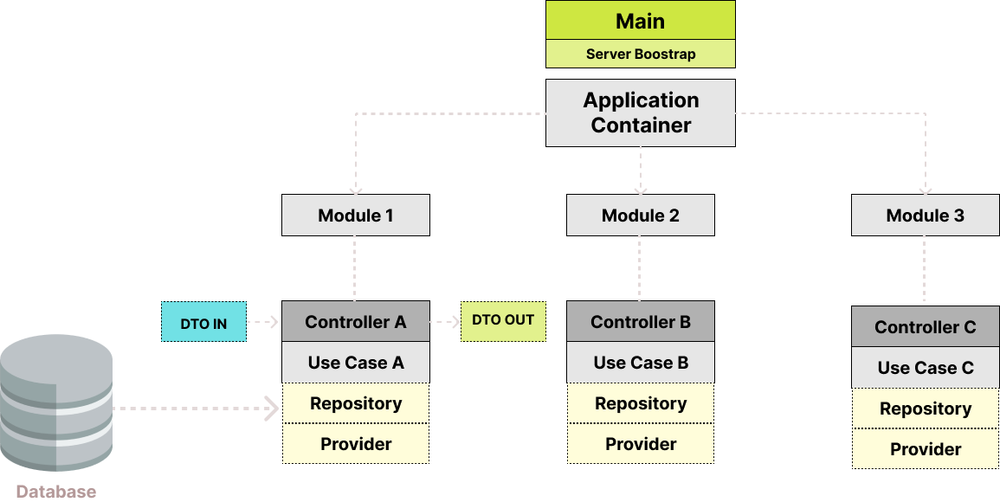

import Tabs from "@theme/Tabs";
import TabItem from "@theme/TabItem";

# First steps

Begin your journey with ExpressoTS! These guides will help you learn and get familiarized with the essential building blocks of ExpressoTS.

## Philosophy

ExpressoTS streamlines server-side development by emphasizing clear and structured code. Ideal
for both simple APIs and complex systems, ExpressoTS accelerates development and ensures timely, high-quality delivery.

ExpressoTS is a [TypeScript](https://www.typescriptlang.org/) framework fully integrated with the [Node.js](https://nodejs.org/en) and [Expressjs](https://expressjs.com/) ecosystem. While TypeScript is the primary language,
ExpressoTS is fully compatible with JavaScript.

In this tutorial, we’ll use TypeScript for most examples, but feel free to switch to vanilla JavaScript if that suits you better.

## Architecture

ExpressoTS architecture centers on the IoC container, which manages dependency injection in class constructors or in properties.
This setup ensures that all necessary modules, including routes (controllers), are loaded.
Routers then handle incoming requests using use-cases and providers as required.

Here’s an overview of an ExpressoTS application:



> -   **DTO IN/OUT**: Defines the structure for incoming and outgoing data.
> -   **Controller**: Manages request processing.
> -   **Use Case**: Executes specific logic for handling requests.
> -   **Provider**: Supplies external functionalities like database access.
> -   **Repository**: Handles direct communication with the database.

## Pre-requisites

Please make sure that [Node.js](https://nodejs.org) `version >= 20.18.0` is installed on your operating system.

## Setup

Install the **[ExpressoTS CLI](../cli/overview.mdx)** globally using NPM to get started with your project setup:

Setting up a new ExpressoTS project is quite simple with **[ExpressoTS CLI](../cli/overview.mdx)**. First install the CLI globally with `NPM`:

```bash
npm i -g @expressots/cli
```

Create a new project by running:

```bash
expressots new project-name
```

## Project templates

ExpressoTS provides two project templates to cater to different development needs:

-   **Non-opinionated**: Provides flexibility in project structure and resource scaffolding, with minimal setup.
-   **Opinionated**: Pre-configured for complex projects, enforcing a specific structure and scaffolding pattern.
-   **MicroAPI**: A minimalistic template for building micro api's.

<Tabs>
    <TabItem label="Non Opinionated" value="non-opinionated">

#### Non-opinionated project structure

```tree
project-name/
├── src/
│   ├── app.controller.ts
│   ├── app.ts
│   ├── main.ts
├── test/
│   ├── app.controller.spec.ts
```

| File Name                                               | Description                                        |
| ------------------------------------------------------- | -------------------------------------------------- |
| <span class="span-table"> app.controller.ts</span>      | A basic controller with a single route.            |
| <span class="span-table"> app.ts</span>                 | Application global configuration file.             |
| <span class="span-table"> main.ts</span>                | The main entry point of an ExpressoTS application. |
| <span class="span-table"> app.controller.spec.ts</span> | Unit test for the app.controller.                  |

    </TabItem>

    <TabItem label="Opinionated" value="opinionated">

#### Opinionated project structure

```tree
project-name/
├── src/
│   ├── useCases/
│   │   └── app/
│   │       └── app.controller.ts
│   │       └── app.module.ts
│   │       └── app.usecase.ts
│   ├── app.ts
│   ├── env.ts
│   ├── main.ts
├── test/
│   ├── app.usecase.spec.ts
```

| File Name                                            | Description                                                                     |
| ---------------------------------------------------- | ------------------------------------------------------------------------------- |
| <span class="span-table"> useCases/\*</span>         | The use case folder holds the implementation of operations for the application. |
| <span class="span-table"> app.ts</span>              | Application global configuration file.                                          |
| <span class="span-table"> env.ts</span>              | This is an utility resource that maps .env variables.                           |
| <span class="span-table"> main.ts</span>             | The main entry point of an ExpressoTS application.                              |
| <span class="span-table"> app.usecase.spec.ts</span> | A basic unit test for the app.usecase.                                          |

    </TabItem>

    <TabItem label="Micro API" value="micro">

#### Micro API project structure

```tree
project-name/
├── src/
│   ├── api.ts
├── test/
│   ├── api.controller.spec.ts
```

| File Name                                               | Description                                        |
| ------------------------------------------------------- | -------------------------------------------------- |
| <span class="span-table"> api.ts</span>                 | The main entry point of an ExpressoTS application. |
| <span class="span-table"> api.controller.spec.ts</span> | A basic unit test for the app controller.          |

    </TabItem>

</Tabs>
:::info
Opinionated projects have a different scaffold pattern in addition to the non-opinionated projects. They are pre-configured for complex projects, enforcing
a specific structure and name convention.
:::

## Main entry point

The main entry point `main.ts` or `api.ts` of an ExpressoTS application is where the application is initialized. This file is responsible for bootstrapping
the application and starting the server.

<Tabs>
    <TabItem label="Non Opinionated" value="non-opinionated">

```typescript
AppFactory.create(App).then((app) => app.listen(3000));
```

    </TabItem>

    <TabItem label="Opinionated" value="opinionated">

```typescript
AppFactory.create(App).then((app) =>
    app.listen(env.App.Port, {
        appName: env.App.appName,
        appVersion: env.App.appVersion,
    })
);
```

        </TabItem>

        <TabItem label="Micro API" value="micro">

    ```typescript
const microAPI = createMicroAPI();
microAPI.setGlobalRoutePrefix("/v1");

const app = microAPI.build();
app.Middleware.addBodyParser();

app.Route.get("/", (req: Request, res: Response) => {
    res.send("Hello from ExpressoTS!");
});

app.listen(3001);

    bootstrap();
    ```

        </TabItem>
    </Tabs>

The `AppFactory` class is responsible for creating the application instance. The `AppFactory` was designed to support multiple web servers like Express.js, Fastify, and more. Currently, it only supports Express.js.

- The `create` method accepts the application class as parameters (`app.ts`).
- The `listen` method starts the server on the specified port with default environment settings. You can also pass an object specifying the app's name and version.

The `App` class is the application root module, which is responsible for initializing the application and its dependencies.
All application configuration and setup are handled in the [App class](./app-provider.mdx) - (`app.ts`) file.

The application environment is defined by a method called `initEnvironment("development")`. You can also specify the .env file path as a parameter for each environment.

```typescript
initEnvironment("development", {
            env: {
                development: ".env.development",
                production: ".env.production",
            },
});
```

:::info
MicroAPI project have the entire application setup in the `api.ts` file. The `createMicroAPI` function is responsible for creating the application instance.
:::

## Running the application

With your application set up, you can start your development server, build your application, or run it in production mode.

Development mode

```bash
✔️ npm run dev
```

Build the application

```bash
✔️ npm run build
```

Production mode

```bash
✔️ npm run prod
```

Once the application is up and running, you can access it by navigating to <span class="span-table">http://localhost:3000/</span>.

You should see <span class="span-table">Hello from ExpressoTS!</span> displayed on the screen.

## Linter and formatter

ExpressoTS uses [ESLint](https://eslint.org/) and [Prettier](https://prettier.io/) to enforce code quality and consistency. You can run the following commands to lint and format your code:

```bash
✔️ npm run lint
```

```bash
✔️ npm run format
```

## Testing

ExpressoTS uses [Jest](https://jestjs.io/) as the testing framework. You can run the following command to execute your tests:

```bash
✔️ npm run test
```

---

## Support us ❤️

ExpressoTS is an MIT-licensed open source project. It's an independent project with ongoing development made possible thanks to your support.
If you'd like to help, please read our **[support guide](../support-us.mdx)**.
