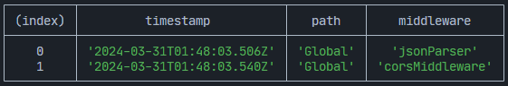

# Middleware

Middlewares play a crucial role in the request-response cycle of an ExpressoTS application. They allow you to execute code, modify request and response objects, end the cycle, or pass control to the next middleware in the stack. To prevent request timeouts, it's important to call `next()` unless your middleware completes the cycle.

ExpressoTS supports function and class-based middleware. Function-based middleware is the simplest form of middleware, while class-based middleware allows you to create reusable middleware with a constructor and methods.

ExpressoTS integrates smoothly with Express middleware, allowing you to leverage its extensive ecosystem to enhance your application.

:::note ExpressoTS fully supports [Express](https://expressjs.com/en/resources/middleware.html) middleware out-of-the-box.
:::

## Add middleware

ExpressoTS application supports adding middleware globally to the application as well as per route. It offers all the middleware supported by [Expressjs](https://expressjs.com/en/resources/middleware.html) team out-of-the-box.

In the `app.ts` file, you can add middleware to the application using the `this.Middleware` property. The `this.Middleware` property is
an instance of the `Middleware` class, which provides a list of out-of-the-box Expressjs middlewares supported by ExpressoTS.

```ts title="Adding middleware globally to the application in app.provider.ts"
@provide(App)
export class App extends AppExpress {
    protected configureServices(): void {
        this.Middleware.addBodyParser();
        this.Middleware.addCors();
        this.Middleware.addHelmet();
    }
}
```

In ExpressoTS, middleware options are available to be added as needed, but the actual middleware packages are not pre-installed to keep the application lightweight. When you choose to add one of the available out-of-the-box middleware options, such as CORS, the system checks if the necessary package is installed.

If the middleware package isn't installed, the application will warn you with a message, but will continue running.

```bash
🖥️ Middleware [cors] not installed. Please install it using your package manager.
```

Once you install the required middleware, the warning will disappear on hot reload, and the middleware will be ready for use with its interface integrated into your application.

## Out-of-the-box middleware

Expressjs middlewares supported by ExpressoTS:

| Middleware Name     | Description                                           |
| ------------------- | ----------------------------------------------------- |
| addBodyParser       | Add body parser middleware to the application.        |
| addCompression      | Add compression middleware to the application.        |
| addCookieParser     | Add cookie parser middleware to the application.      |
| addCookieSession    | Add cookie session middleware to the application.     |
| addCors             | Add cors middleware to the application.               |
| addHelmet           | Add helmet middleware to the application.             |
| addMorgan           | Add morgan middleware to the application.             |
| addRateLimiter      | Add rate limit middleware to the application.         |
| addServeFavicon     | Add serve favicon middleware to the application.      |
| addSession          | Add session middleware to the application.            |
| addUrlEncodedParser | Add url encoded parser middleware to the application. |
| serverStatic        | Add static middleware to the application.             |
| setupMulter         | Create a multer instance for file upload.             |
| setErrorHandler     | Add error handler middleware to the application.      |

:::caution
If you add a middleware that is not installed as dependency, the application will throw a warning message and continue to run.
:::

## Using `addMiddleware` method

For any other middleware, or a custom middleware, you can add it using the `this.middleware.addMiddleware()` method. Using the `addMiddleware` method, you can add any middleware from NPM Registry, custom Expressjs middleware or a ExpressoTS class-based middleware.

NPM Registry middleware:

```typescript title="Adding NPM Registry cors middleware"
this.Middleware.addMiddleware(cors());
```

Custom Expressjs middleware:

```typescript title="Adding custom expressjs middleware"
function myMiddleware(req: Request, res: Response, next: NextFunction) {
    next();
}

this.Middleware.addMiddleware(myMiddleware);
```

Custom ExpressoTS middleware:

```typescript title="Adding custom expressots middleware"
class CustomMiddleware extends ExpressoMiddleware {
    use(req: Request, res: Response, next: NextFunction): void | Promise<void> {
        next();
    }
}

this.Middleware.addMiddleware(new CustomMiddleware());
```

You can also add middleware to a specific route in the `App` class through the `this.middleware.addMiddleware()` method. You can add any middleware from NPM Registry, custom Expressjs middleware or a custom middleware.

```typescript title="Adding middleware to a specific route"
this.Middleware.addMiddleware({ path: "/api", middlewares: [] });
```

:::note Each route can have multiple middlewares.
:::

## Middleware in controller

If you want to apply a middleware to all routes under a specific controller, you can add it to the `@controller()` decorator. You can pass as many middlewares as you want to the `@controller()` decorator.

```typescript
@controller("/app", express.json())
export class AppController {
    @Post("/create")
    createApp() {
        return "Create App";
    }

    @Patch("/update")
    updateApp() {
        return "Update App";
    }
}
```

## Middleware in http method

Or you add a middleware to a specific route in the controller class through the `http Method` decorators.

```typescript
@controller("/")
export class AppController {
    @Post("", express.json())
    execute() {
        return "Hello World";
    }
}
```

## Create expressoTS middleware

To create a custom class-based middleware, you need to extend the `ExpressoMiddleware` class and implement the `use` method. The `use`
method is the entry point of the middleware, and it receives the `Request`, `Response`, and `NextFunction` objects.

Use the CLI to create a new middleware class:

```bash
expressots g mi middleware-name
```

```ts title="Scaffold output"
import { ExpressoMiddleware, provide } from "@expressots/core";
import { NextFunction, Request, Response } from "express";

@provide(ExampleMiddleware)
export class ExampleMiddleware extends ExpressoMiddleware {
    use(req: Request, res: Response, next: NextFunction): void | Promise<void> {
        throw new Error("Method not implemented.");
    }
}
```

An example of a custom class-based middleware implementation:

```typescript title="Creating a custom class-base middleware"
class CustomMiddleware extends ExpressoMiddleware {
    private isOn: boolean;

    constructor(isOn: boolean) {
        super();
        this.isOn = isOn;
    }

    use(req: Request, res: Response, next: NextFunction): void | Promise<void> {
        // Do something
        if (this.isOn) {
            next();
        } else {
            res.status(403).send("Forbidden");
        }
    }
}
```

Custom middleware allows you to pass parameters to the constructor and use them as options in the `use` method of your middleware. This way, you can
create reusable middleware with different configurations.

## View middleware pipeline

You can view all the middlewares added to the application using the `this.middleware.viewMiddlewarePipeline()` method.
The goal of the `viewMiddlewarePipeline` method is to provide a visual representation of the middleware pipeline in the application.

:::info
We are working on adding execution time for each middleware in the pipeline. This will allow you to identify bottlenecks in the middleware pipeline.
:::

Here is the output of the `viewMiddlewarePipeline` method:



---

## Support us ❤️

ExpressoTS is an MIT-licensed open source project. It's an independent project with ongoing development made possible thanks to your support.
If you'd like to help, please read our **[support guide](../support-us.mdx)**.
