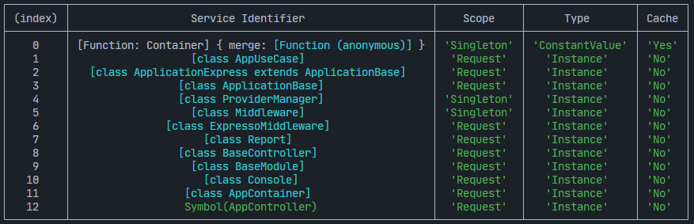

# Container

ExpressoTS uses an IoC Container for dependency injection, making it easy to manage object creation, resolution, and lifecycle.

## Configuration Options

### Interface Definition

```typescript
interface ContainerOptions {
    defaultScope?: "Request" | "Singleton" | "Transient";
    skipBaseClassChecks?: boolean;
    autoBindInjectable?: boolean;
}
```

### Default Values

-   `defaultScope`: `"Request"` (creates new instance per HTTP request)
-   `autoBindInjectable`: `true` (automatically binds @injectable classes)
-   `skipBaseClassChecks`: `false` (validates class inheritance)

### Options Reference

#### `defaultScope`

Controls the default lifecycle for all bindings in the container.

| Scope         | Lifecycle           | Performance | Use Case                     | Memory  |
| ------------- | ------------------- | ----------- | ---------------------------- | ------- |
| **Request**   | New per request     | Fast        | Stateless services (default) | Low     |
| **Singleton** | Single instance     | Fastest     | DB connections, config       | High    |
| **Transient** | New every injection | Slowest     | Pure functions, disposable   | Highest |

#### `skipBaseClassChecks`

**What it does**: Controls D.I base class inheritance validation.

**Performance Impact**:

-   `false` (default): Container creation ~15-20ms, validates inheritance
-   `true`: Container creation ~8-12ms, 40-50% faster, runtime validation only

**When to enable**:

-   Production environment after thorough testing
-   Large applications with many classes
-   Confident in class hierarchy correctness

**When to disable**:

-   Development environment
-   Debugging DI issues
-   Complex inheritance hierarchies

#### `autoBindInjectable`

**What it does**: Automatically binds classes decorated with @injectable()

**Performance Impact**:

-   `true` (default): No explicit binding needed, cleaner code
-   `false`: Must explicitly bind every service, more control

**When to disable**:

-   Need explicit control over all bindings
-   Debugging binding conflicts
-   Large teams requiring strict binding rules

## Creating the Container

### Basic Setup

```typescript
export class App extends AppExpress {
    private container: AppContainer = this.configContainer([AppModule]);

    globalConfiguration(): void {}
}
```

### With Custom Options

```typescript
import { Scope } from "@expressots/core";

private container: AppContainer = this.configContainer([AppModule], {
    defaultScope: Scope.Singleton,
    autoBindInjectable: true,
    skipBaseClassChecks: true
});
```

## Introspection API

ExpressoTS v4 provides a comprehensive introspection API for container bindings, designed for debugging, analysis, and integration with ExpressoTS Studio.

### Getting Bindings Data

Retrieve structured data about all container bindings:

```typescript
// Get all bindings as structured data
const bindings = this.container.getBindingsInfo();

bindings.forEach((b) => {
    console.log(`${b.serviceIdentifier}: ${b.scope} (${b.type})`);
});
```

Each binding includes:

| Property            | Description                           |
| ------------------- | ------------------------------------- |
| `serviceIdentifier` | Class name, symbol, or string token   |
| `scope`             | Request, Singleton, Transient, custom |
| `type`              | Constructor, ConstantValue, Factory   |
| `cached`            | Whether instance is cached            |
| `activated`         | Whether binding has been resolved     |
| `moduleId`          | Module the binding belongs to         |

### Filtering Bindings

Query bindings with specific criteria:

```typescript
// Get only singleton bindings
const singletons = this.container.filterBindings({ scope: "Singleton" });

// Get cached bindings
const cached = this.container.filterBindings({ cached: true });

// Find by identifier pattern
const controllers = this.container.filterBindings({ identifier: "Controller" });

// Combine filters
const activeSingletons = this.container.filterBindings({
    scope: "Singleton",
    activated: true,
});
```

### Summary Statistics

Get aggregate statistics about container bindings:

```typescript
const summary = this.container.getBindingsSummary();

console.log(`Total bindings: ${summary.total}`);
console.log(`Singletons: ${summary.byScope["Singleton"] || 0}`);
console.log(`Cached: ${summary.cached}`);
console.log(`Activated: ${summary.activated}`);
```

### Formatted View

Get a formatted string representation:

```typescript
// Print formatted view to console
console.log(this.container.getFormattedBindingsView());

// With filters
console.log(this.container.getFormattedBindingsView({ scope: "Singleton" }));
```

### Complete Introspection

Get all container data in a single call (ideal for ExpressoTS Studio):

```typescript
const data = this.container.introspect();

// Structure:
// {
//   bindings: BindingInfo[],
//   summary: BindingsSummary,
//   options: ContainerOptions,
//   timestamp: string,
//   containerId: number
// }
```

### Legacy: Table View

For quick debugging, the table view is still available:

```typescript
this.container.viewContainerBindings();
```



### Getting Container Options

Inspect current configuration:

```typescript
const options = this.container.getContainerOptions();
console.log(options.defaultScope);
console.log(options.autoBindInjectable);
```

### Accessing Raw Container

For advanced D.I operations:

```typescript
const inversifyContainer = this.container.Container;
// Use D.I APIs directly
```

## Performance Best Practices

### Production Optimization

```typescript
import { Scope } from "@expressots/core";

private container: AppContainer = this.configContainer([AppModule], {
    defaultScope: Scope.Request,
    skipBaseClassChecks: true,  // 40-50% faster
    autoBindInjectable: true
});
```

### Memory Considerations

-   Singleton: Lives for application lifetime
-   Request: Cleaned up after request completes
-   Transient: Creates memory churn if overused

## Troubleshooting

### Common Issues

**DI Resolution Errors**

-   Use `getBindingsInfo()` or `filterBindings()` to inspect registrations
-   Use `introspect()` for complete container state
-   Verify @injectable() decorator is present
-   Check for missing module registration

**Performance Issues**

-   Use `getBindingsSummary()` to analyze scope distribution
-   Consider enabling `skipBaseClassChecks` in production
-   Review scope usage (too many Transient?)

**Binding Conflicts**

-   Use `filterBindings({ identifier: 'YourService' })` to find duplicates
-   Use `getContainerOptions()` to inspect config
-   Use `isBound()` before binding in modules

---

## Support us ❤️

ExpressoTS is an MIT-licensed open source project. It's an independent project with ongoing development made possible thanks to your support.
If you'd like to help, please read our **[support guide](../support-us.mdx)**.
