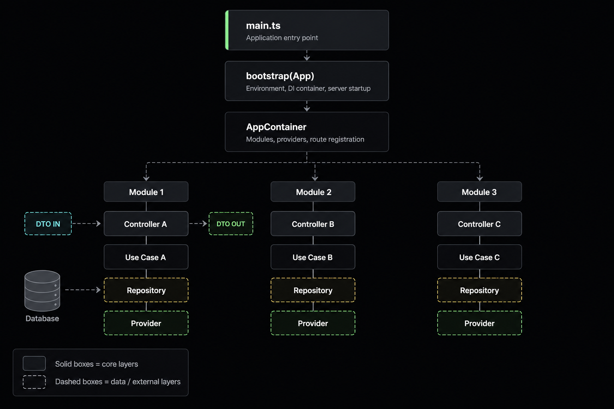

import Tabs from "@theme/Tabs";
import TabItem from "@theme/TabItem";

# First steps

Get started with ExpressoTS. This guide covers the essential concepts and setup.

## Overview

ExpressoTS is a TypeScript framework for building server-side applications on Node.js. It provides an abstraction layer over Express.js with dependency injection, decorators, and architectural patterns.

ExpressoTS uses TypeScript as the primary language and is compatible with JavaScript. Examples in this documentation use TypeScript.

## Architecture

ExpressoTS uses an IoC (Inversion of Control) container for dependency injection. The container manages dependencies in class constructors and properties, automatically loading modules and controllers.

Application components:



> -   **DTO**: Data transfer objects for request/response data structures
> -   **Controller**: Handles HTTP requests and routes
> -   **Use Case**: Contains business logic for specific operations
> -   **Provider**: Provides external services (database, APIs, etc.)
> -   **Repository**: Manages data access layer

## Prerequisites

-   Node.js version 20.18.0 or higher
-   npm, yarn, or pnpm

## Setup

Install the ExpressoTS CLI globally:

```bash
npm i -g @expressots/cli
```

Create a new project:

```bash
expressots new <project-name>
```

## Project Templates

ExpressoTS provides two project templates:

-   **Full Featured**: Complete application structure with controllers, modules, and configuration files
-   **Minimal**: Single-file microservice template for lightweight APIs

<Tabs>
    <TabItem label="Full Featured" value="full-featured">

#### Full Featured project structure

```tree
project-name/
├── src/
│   ├── app.controller.ts
│   ├── app.ts
│   ├── main.ts
├── test/
│   ├── app.controller.spec.ts
├── expressots.config.ts
├── jest.config.ts
├── tsconfig.json
└── package.json
```

| File Name                                               | Description                   |
| ------------------------------------------------------- | ----------------------------- |
| <span class="span-table"> app.controller.ts</span>      | Controller with example route |
| <span class="span-table"> app.ts</span>                 | Application configuration     |
| <span class="span-table"> main.ts</span>                | Application entry point       |
| <span class="span-table"> app.controller.spec.ts</span> | Unit test for controller      |
| <span class="span-table"> expressots.config.ts</span>   | ExpressoTS configuration      |
| <span class="span-table"> jest.config.ts</span>         | Jest test configuration       |

    </TabItem>

    <TabItem label="Minimal" value="minimal">

#### Minimal project structure

```tree
project-name/
├── src/
│   └── api.ts
├── test/
│   └── api.spec.ts
├── expressots.config.ts
├── jest.config.ts
├── tsconfig.json
└── package.json
```

| File Name                                             | Description                                        |
| ----------------------------------------------------- | -------------------------------------------------- |
| <span class="span-table"> api.ts</span>               | Single-file API entry point with routes and config |
| <span class="span-table"> api.spec.ts</span>          | Unit test for API                                  |
| <span class="span-table"> expressots.config.ts</span> | ExpressoTS configuration                           |
| <span class="span-table"> jest.config.ts</span>       | Jest test configuration                            |

    </TabItem>

</Tabs>
## Main Entry Point

The entry point bootstraps the application and starts the server. Full Featured templates use `main.ts`, while Minimal templates use `api.ts`.

### Bootstrap Function

The `bootstrap()` function handles environment loading, port configuration, and server startup:

<Tabs>
    <TabItem label="Full Featured" value="full-featured">

```typescript
import { bootstrap } from "@expressots/core";
import { App } from "./app";

await bootstrap(App);
```

    </TabItem>

    <TabItem label="Minimal" value="minimal">

```typescript
import { createMicroAPI } from "@expressots/adapter-express";

const microAPI = createMicroAPI();
const app = microAPI.build();

app.Route.get("/", (req, res) => {
    res.json({ message: "Hello from ExpressoTS!" });
});

app.listen(3000);
```

    </TabItem>

</Tabs>

The `bootstrap()` function automatically handles:

-   Environment detection and .env file loading
-   Port determination from environment or options
-   Package.json metadata extraction
-   Application initialization
-   Server startup with graceful shutdown

Application configuration is handled in the [App class](./app-provider.mdx) (`app.ts`). For comprehensive bootstrap options, see the [Bootstrap](./bootstrap.mdx) guide.

## Running the Application

Start the development server:

```bash
npm run dev
```

Build for production:

```bash
npm run build
```

Run in production mode:

```bash
npm run prod
```

Access the application at `http://localhost:3000/`. You should see "Hello from ExpressoTS!" displayed.

## Development Tools

Lint code:

```bash
npm run lint
```

Format code:

```bash
npm run format
```

Run tests:

```bash
npm run test
```

ExpressoTS projects include ESLint, Prettier, and Jest configured by default.

---

## Support us ❤️

ExpressoTS is an MIT-licensed open source project. It's an independent project with ongoing development made possible thanks to your support.
If you'd like to help, please read our **[support guide](../support-us.mdx)**.
