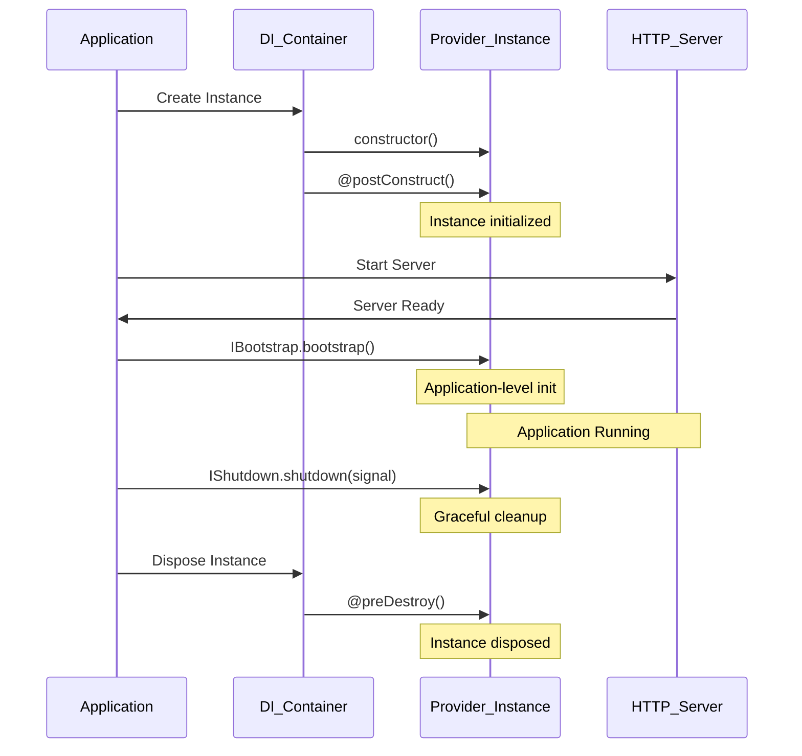

# Lifecycle Hooks

Lifecycle hooks allow you to run code at specific points during your application's startup and shutdown phases. ExpressoTS provides two complementary lifecycle systems that serve different purposes:

1. **DI Lifecycle** (`@postConstruct` / `@preDestroy`) - Instance-level hooks from InversifyJS
2. **Application Lifecycle** (`IBootstrap` / `IShutdown`) - Application-level hooks from ExpressoTS

Understanding when to use each system is key to building robust, production-ready applications.

## Overview



## Lifecycle Systems Comparison

| Aspect | @postConstruct / @preDestroy | IBootstrap / IShutdown |
| ------ | --------------------------- | ---------------------- |
| **Level** | DI Container (Instance) | Application (Server) |
| **Frequency** | Every instance creation | Once per app lifecycle |
| **Timing** | After constructor / Before disposal | After server ready / On shutdown |
| **Signal Awareness** | No | Yes (shutdown receives signal) |
| **Parallel Execution** | No | Yes (all hooks run in parallel) |
| **Error Handling** | Throws immediately | Bootstrap: fail-fast, Shutdown: error-tolerant |
| **Scope Requirement** | Any scope | **Must be Singleton** |
| **Purpose** | Instance initialization | Application initialization |

## DI Lifecycle Hooks

These hooks come from InversifyJS (the underlying DI container) and run at the instance level.

### @postConstruct

The `@postConstruct` decorator marks a method to be called immediately after the class instance is created by the DI container.

```typescript title="Post-construct example"
import { provide, postConstruct } from "@expressots/core";

@provide(UserService)
class UserService {
    private logger: Logger;

    constructor() {
        // Constructor runs first
    }

    @postConstruct()
    init(): void {
        // Runs RIGHT AFTER constructor, EVERY TIME instance is created
        this.logger = new Logger("UserService");
        console.log("UserService instance initialized");
    }
}
```

**When to use:**
- Setting up instance properties that depend on the fully constructed object
- Running synchronous initialization logic
- Validating constructor injection results

### @preDestroy

The `@preDestroy` decorator marks a method to be called immediately before the instance is removed from the DI container.

```typescript title="Pre-destroy example"
import { provide, preDestroy } from "@expressots/core";

@provide(ConnectionPool)
class ConnectionPool {
    private connections: Connection[] = [];

    @preDestroy()
    cleanup(): void {
        // Runs when instance is removed from DI container
        this.connections.forEach((conn) => conn.close());
        console.log("ConnectionPool disposed");
    }
}
```

**When to use:**
- Cleaning up resources when the instance is disposed
- Closing connections or file handles
- Releasing memory or external resources

:::info
`@postConstruct` and `@preDestroy` are tied to instance creation and disposal in the DI container. They run every time an instance is created or removed, which depends on the scope (Singleton, Request, Transient).
:::

## Application Lifecycle Hooks

These hooks are provided by ExpressoTS and run at the application level, once during startup and shutdown.

### IBootstrap Interface

Implement `IBootstrap` to run initialization code after the application is fully ready and listening.

```typescript title="IBootstrap interface"
export interface IBootstrap {
    bootstrap(): void | Promise<void>;
}
```

**When is `bootstrap()` called?**
- After the server is fully ready and listening
- After `postServerInitialization()` completes
- Before accepting requests

```typescript title="Database service with bootstrap"
import { IBootstrap, provideSingleton } from "@expressots/core";

@provideSingleton(DatabaseService)
export class DatabaseService implements IBootstrap {
    private connected: boolean = false;

    async bootstrap(): Promise<void> {
        // Runs ONCE after server starts
        await this.connectToDatabase();
        this.connected = true;
        console.log("Database connected");
    }

    private async connectToDatabase(): Promise<void> {
        // Connection logic here
    }
}
```

### IShutdown Interface

Implement `IShutdown` to run cleanup code when the application shuts down.

```typescript title="IShutdown interface"
export interface IShutdown {
    shutdown(signal?: NodeJS.Signals): void | Promise<void>;
}
```

**When is `shutdown()` called?**
- During application shutdown (SIGTERM, SIGINT, etc.)
- Called with the signal that triggered shutdown
- All shutdown hooks execute in parallel

```typescript title="Cache service with shutdown"
import { IShutdown, provideSingleton } from "@expressots/core";

@provideSingleton(CacheService)
export class CacheService implements IShutdown {
    private cache: Map<string, unknown> = new Map();

    async shutdown(signal?: NodeJS.Signals): Promise<void> {
        console.log(`Shutting down cache (signal: ${signal})`);

        // Clear cache before shutdown
        this.cache.clear();
        console.log("Cache cleared");
    }
}
```

### Signal Handling

The `shutdown()` method receives the signal that triggered the shutdown, allowing you to implement different cleanup strategies:

```typescript title="Signal-aware shutdown"
import { IShutdown, provideSingleton } from "@expressots/core";

@provideSingleton(DatabaseService)
export class DatabaseService implements IShutdown {
    async shutdown(signal?: NodeJS.Signals): Promise<void> {
        if (signal === "SIGTERM") {
            // Graceful shutdown (e.g., Kubernetes pod termination)
            console.log("Graceful shutdown: finishing pending queries...");
            await this.finishPendingQueries();
        } else if (signal === "SIGINT") {
            // Immediate shutdown (e.g., Ctrl+C)
            console.log("Immediate shutdown: closing connections...");
        }

        await this.disconnect();
    }
}
```

**Common signals:**
- `SIGTERM` - Graceful termination request (Kubernetes, Docker, systemd)
- `SIGINT` - Interrupt signal (Ctrl+C in terminal)
- `SIGHUP` - Terminal hangup

:::warning
Always use `@provideSingleton()` for providers implementing `IBootstrap` or `IShutdown`. Singleton scope ensures:
- The bootstrapped instance is the **same one** used throughout the application
- The shutdown hook runs on the **actual instance** with its runtime state
- Transient-scoped providers would create a **new instance** for the shutdown call, missing the actual instance's state
:::

## Complete Examples

### Database Service

A full example demonstrating both bootstrap and shutdown with signal handling:

```typescript title="Database service with full lifecycle"
import { IBootstrap, IShutdown, provideSingleton } from "@expressots/core";

@provideSingleton(DatabaseService)
export class DatabaseService implements IBootstrap, IShutdown {
    private connected: boolean = false;
    private connectionTime: Date | null = null;

    /**
     * Called automatically after the server is ready and listening.
     * Use this for initialization that requires the full app context.
     */
    async bootstrap(): Promise<void> {
        // Simulate database connection
        await new Promise((resolve) => setTimeout(resolve, 100));
        this.connected = true;
        this.connectionTime = new Date();
        console.log("Database connected");
    }

    /**
     * Called automatically when the app shuts down.
     * The signal parameter tells you why the shutdown was triggered.
     */
    async shutdown(signal?: NodeJS.Signals): Promise<void> {
        console.log(`Shutting down database (signal: ${signal || "unknown"})`);

        if (signal === "SIGTERM") {
            // Graceful shutdown - finish pending operations
            console.log("Waiting for pending queries...");
            await new Promise((resolve) => setTimeout(resolve, 50));
        }

        this.connected = false;
        this.connectionTime = null;
        console.log("Database disconnected");
    }

    isConnected(): boolean {
        return this.connected;
    }

    getStatus(): { connected: boolean; uptime: number | null } {
        const uptime = this.connectionTime
            ? Math.floor((Date.now() - this.connectionTime.getTime()) / 1000)
            : null;

        return { connected: this.connected, uptime };
    }
}
```

### Cache Service

A cache service that initializes on startup and clears on shutdown:

```typescript title="Cache service with lifecycle"
import { IBootstrap, IShutdown, provideSingleton } from "@expressots/core";

@provideSingleton(CacheService)
export class CacheService implements IBootstrap, IShutdown {
    private ready: boolean = false;
    private cache: Map<string, unknown> = new Map();

    async bootstrap(): Promise<void> {
        // Simulate cache initialization (warming, connecting to Redis, etc.)
        await new Promise((resolve) => setTimeout(resolve, 50));
        this.ready = true;
        console.log("Cache initialized");
    }

    async shutdown(signal?: NodeJS.Signals): Promise<void> {
        console.log(`Shutting down cache (signal: ${signal || "unknown"})`);

        const cacheSize = this.cache.size;
        this.cache.clear();
        this.ready = false;

        console.log(`Cache cleared (${cacheSize} entries)`);
    }

    set(key: string, value: unknown): void {
        if (!this.ready) throw new Error("Cache not ready");
        this.cache.set(key, value);
    }

    get(key: string): unknown {
        if (!this.ready) throw new Error("Cache not ready");
        return this.cache.get(key);
    }
}
```

### Metrics Service

A service that only needs bootstrap (no cleanup required):

```typescript title="Metrics service with bootstrap only"
import { IBootstrap, provideSingleton } from "@expressots/core";

@provideSingleton(MetricsService)
export class MetricsService implements IBootstrap {
    private collecting: boolean = false;
    private requestCount: number = 0;

    async bootstrap(): Promise<void> {
        this.collecting = true;
        console.log("Started collecting metrics");
    }

    incrementRequestCount(): void {
        if (this.collecting) {
            this.requestCount++;
        }
    }

    getStatus(): { collecting: boolean; requestCount: number } {
        return {
            collecting: this.collecting,
            requestCount: this.requestCount,
        };
    }
}
```

## Best Practices

### Use Singleton Scope

Always use `@provideSingleton()` with lifecycle hooks to ensure the same instance is used throughout the application:

```typescript
// Correct - singleton scope
@provideSingleton(MyService)
export class MyService implements IBootstrap, IShutdown {
    // ...
}

// Incorrect - request scope creates new instances
@provide(MyService) // Don't use this with lifecycle hooks
export class MyService implements IBootstrap, IShutdown {
    // ...
}
```

### Parallel Execution

Bootstrap and shutdown hooks execute in parallel for performance. Design your services to be independent:

```typescript
// Both services bootstrap in parallel
@provideSingleton(DatabaseService)
export class DatabaseService implements IBootstrap {
    async bootstrap(): Promise<void> {
        await this.connect(); // Runs in parallel with CacheService
    }
}

@provideSingleton(CacheService)
export class CacheService implements IBootstrap {
    async bootstrap(): Promise<void> {
        await this.warmCache(); // Runs in parallel with DatabaseService
    }
}
```

### Error Handling Differences

- **Bootstrap hooks**: Fail-fast behavior. If one bootstrap hook fails, the error is thrown and startup may be interrupted.
- **Shutdown hooks**: Error-tolerant behavior. If one shutdown hook fails, the error is logged but other hooks continue to execute.

```typescript
// Bootstrap - errors are thrown
async bootstrap(): Promise<void> {
    try {
        await this.connect();
    } catch (error) {
        // Error will be thrown and logged
        throw error;
    }
}

// Shutdown - errors are caught internally
async shutdown(signal?: NodeJS.Signals): Promise<void> {
    try {
        await this.cleanup();
    } catch (error) {
        // Error is logged but won't stop other shutdown hooks
        console.error("Cleanup failed:", error);
    }
}
```

## Common Use Cases

| Use Case | Recommended Hook | Reason |
| -------- | --------------- | ------ |
| Database connection | IBootstrap + IShutdown | Connect after server ready, disconnect gracefully |
| Cache warming | IBootstrap | Pre-load data after server starts |
| External service health check | IBootstrap | Verify dependencies before accepting requests |
| Metrics collection | IBootstrap | Start collecting after server is ready |
| Message queue connection | IBootstrap + IShutdown | Connect/disconnect with graceful handling |
| File handle cleanup | IShutdown | Close files on shutdown |
| Graceful drain | IShutdown | Finish pending requests before exit |
| Instance property setup | @postConstruct | Initialize after constructor |
| Connection pool cleanup | @preDestroy | Clean up when instance is disposed |

## Choosing the Right Hook

Use this decision tree to choose the appropriate lifecycle hook:

1. **Does it need to run after the server is ready?**
   - Yes → Use `IBootstrap`
   - No → Continue to step 2

2. **Does it need to run on application shutdown?**
   - Yes → Use `IShutdown`
   - No → Continue to step 3

3. **Does it need to run immediately after instance creation?**
   - Yes → Use `@postConstruct`
   - No → Continue to step 4

4. **Does it need to run when the instance is disposed?**
   - Yes → Use `@preDestroy`
   - No → Use constructor or regular methods

## Troubleshooting

### Bootstrap hook not being called

1. **Check the scope**: Ensure you're using `@provideSingleton()`, not `@provide()` or `@provideTransient()`.
2. **Check the interface**: Make sure you implement `IBootstrap` and have a `bootstrap()` method.
3. **Check provider registration**: Ensure the provider is properly registered in a module.

### Shutdown hook not being called

1. **Check the scope**: Same as bootstrap - use `@provideSingleton()`.
2. **Check the interface**: Make sure you implement `IShutdown` and have a `shutdown()` method.
3. **Signal handling**: Ensure your process receives the shutdown signal (not killed with SIGKILL).

### Instance not initialized in bootstrap

If your service isn't initialized when `bootstrap()` is called, ensure the service is injected somewhere in your application so the DI container creates the instance.

```typescript
// The service must be injected somewhere for bootstrap to run
@controller("/api")
export class MyController {
    constructor(@inject(DatabaseService) private db: DatabaseService) {}
}
```

### Multiple instances being created

If you see multiple instances being created, you're likely using the wrong scope:

```typescript
// Wrong - creates new instance per request
@provide(MyService)

// Correct - single instance for entire app
@provideSingleton(MyService)
```

## Support us ❤️

ExpressoTS is an MIT-licensed open source project. It's an independent project with ongoing development made possible thanks to your support.
If you'd like to help, please read our **[support guide](../support-us.mdx)**.
