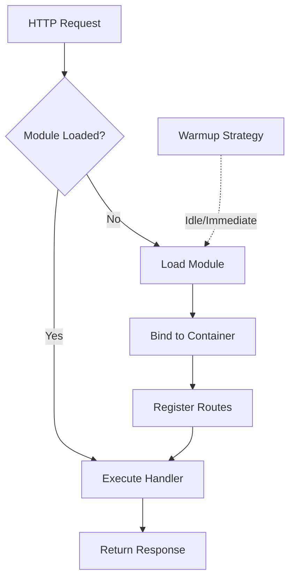

import Tabs from "@theme/Tabs";
import TabItem from "@theme/TabItem";

# Lazy Loading

Zero-config module loading with automatic route detection.

## Overview

| Feature | Description |
|---------|-------------|
| Zero-Config | Routes auto-detected from `@controller()` |
| One-Liner Setup | `setupLazyLoadingForExpress()` |
| Warmup Strategies | Idle, immediate, manual |
| Preload Hints | Low, medium, high, never |
| Performance Metrics | Built-in tracking |
| Auto Middleware | Loads middleware for lazy routes |



---

## Quick Start

### 1. Create Lazy Modules

```typescript
import { CreateLazyModule } from "@expressots/core";
import { ReportsController } from "./reports.controller";
import { AdminController } from "./admin.controller";

// Reports module - loads when /reports routes are accessed
export const ReportsLazyModule = CreateLazyModule(
    [ReportsController],
    { name: "ReportsModule" }
).withPreloadHint("low");

// Admin module - only loads when accessed
export const AdminLazyModule = CreateLazyModule(
    [AdminController],
    { name: "AdminModule" }
).withPreloadHint("never");
```

### 2. Setup Lazy Loading

```typescript
import { setupLazyLoadingForExpress } from "@expressots/adapter-express";

export class App extends AppExpress {
    private config: AppContainer = this.configContainer([
        // Eager modules (loaded at startup)
        CoreModule,
        AuthModule,
        UserModule,
        
        // Don't add lazy modules here!
    ]);

    async configureServices(): Promise<void> {
        // One-liner setup!
        const { lazyModulesCount, middleware, routeMappings } = 
            setupLazyLoadingForExpress(this.config.Container, {
                lazyModules: [ReportsLazyModule, AdminLazyModule],
                globalPrefix: "/api",
                enableMetrics: true,
                enableWarmup: true,
                warmupConfig: {
                    strategy: "idle",
                    delay: 10000,
                    hints: ["low", "medium"]
                }
            });

        // Add auto-load middleware
        if (middleware) {
            this.Middleware.add(middleware);
        }

        console.log(`Registered ${lazyModulesCount} lazy modules`);
        console.log("Auto-detected routes:", routeMappings);
    }
}
```

### 3. Define Controllers

Routes are automatically detected from `@controller()` decorators:

```typescript
// routes automatically detected!
@controller("/reports")
export class ReportsController {
    @Get("/")
    getAllReports() {
        return { reports: [] };
    }

    @Get("/generate")
    generateReport() {
        return { status: "generating" };
    }
}
```

**No manual route mapping needed!** The system automatically:
- Detects `/api/reports/*` routes
- Maps them to `ReportsLazyModule`
- Loads module on first access

---

## Auto-Detection System

### How It Works

The lazy loading system automatically detects routes from your controllers:

```typescript
@controller("/admin")
export class AdminController {
    @Get("/dashboard")      // Detected: /api/admin/dashboard
    dashboard() {}

    @Get("/users")          // Detected: /api/admin/users
    users() {}
}
```

**Behind the scenes**:
1. System scans `@controller()` decorators
2. Extracts route prefixes (`"/admin"`)
3. Combines with `globalPrefix` (`"/api"`)
4. Maps routes to lazy modules automatically

**Result**: `/api/admin/*` → `AdminLazyModule`

### Manual Route Mapping (Optional)

For complex scenarios, provide manual mappings:

```typescript
setupLazyLoadingForExpress(container, {
    lazyModules: [ReportsLazyModule],
    routePrefixes: ["/api/reports", "/api/analytics"],  // Manual mapping
    globalPrefix: "/api"
});
```

---

## Preload Hints

Control when/if modules are preloaded using hints:

### Never (Default for Admin Modules)

Never preload - only load when accessed:

```typescript
const AdminLazyModule = CreateLazyModule(
    [AdminController],
    { name: "AdminModule" }
).withPreloadHint("never");
```

**Use for**: Admin panels, rarely-used features

### Low Priority

Preload during idle time (low priority):

```typescript
const ReportsLazyModule = CreateLazyModule(
    [ReportsController],
    { name: "ReportsModule" }
).withPreloadHint("low");
```

**Use for**: Features used by some users occasionally

### Medium Priority

Preload after initial startup:

```typescript
const AnalyticsLazyModule = CreateLazyModule(
    [AnalyticsController],
    { name: "AnalyticsModule" }
).withPreloadHint("medium");
```

**Use for**: Features used by many users

### High Priority

Preload immediately after startup:

```typescript
const SearchLazyModule = CreateLazyModule(
    [SearchController],
    { name: "SearchModule" }
).withPreloadHint("high");
```

**Use for**: Features used by almost all users

---

## Warmup Strategies

### Idle Warmup (Recommended)

Preload modules during idle time:

```typescript
setupLazyLoadingForExpress(container, {
    lazyModules: [ReportsLazyModule, AdminLazyModule],
    enableWarmup: true,
    warmupConfig: {
        strategy: "idle",           // Load during idle
        delay: 10000,               // Wait 10s after startup
        hints: ["low", "medium"]    // Only preload low/medium priority
    }
});
```

**Best for**: Most applications (doesn't block startup)

### Immediate Warmup

Preload all modules immediately after startup:

```typescript
warmupConfig: {
    strategy: "immediate",
    hints: ["low", "medium", "high"]
}
```

**Best for**: Applications where startup time isn't critical

### Manual Warmup

Control warmup timing manually:

```typescript
warmupConfig: {
    strategy: "manual"
}

// Later in code
const lazyManager = this.Provider.get(LazyLoadingManager);
await lazyManager.warmupModules(["ReportsModule", "AdminModule"]);
```

**Best for**: Custom warmup logic based on conditions

### No Warmup

Only load on-demand (maximum lazy):

```typescript
enableWarmup: false
```

**Best for**: Microservices, minimal memory usage

---

## Advanced Configuration

### Prefetch Configuration

Configure when to prefetch modules:

```typescript
const AdminLazyModule = CreateLazyModule(
    [AdminController],
    { name: "AdminModule" }
)
.withPreloadHint("never")
.withLazyConfig({
    prefetchOn: [
        { 
            route: "/dashboard", 
            reason: "Admin link visible in menu" 
        }
    ],
    prefetchAfterIdle: 30000  // Prefetch after 30s idle
});
```

**Use cases**:
- Prefetch when user hovers over link
- Prefetch when user visits dashboard (admin likely next)
- Prefetch after idle timeout

### Load Timeout

Configure maximum load time:

```typescript
const HeavyLazyModule = CreateLazyModule(
    [HeavyController],
    { name: "HeavyModule" }
).withLazyConfig({
    loadTimeout: 5000  // 5 second timeout
});
```

### Retry Configuration

Configure retry behavior for failed loads:

```typescript
.withLazyConfig({
    retryOnError: true,
    maxRetries: 3,
    retryDelay: 1000
})
```

---

## Monitoring & Metrics

### Enable Metrics

```typescript
setupLazyLoadingForExpress(container, {
    lazyModules: [ReportsLazyModule, AdminLazyModule],
    enableMetrics: true  // Enable performance tracking
});
```

### Access Metrics

```typescript
import { LazyLoadingManager } from "@expressots/adapter-express";

@controller("/diagnostics")
export class DiagnosticsController {
    constructor(
        @inject(LazyLoadingManager) 
        private lazyManager: LazyLoadingManager
    ) {}

    @Get("/lazy-loading")
    getMetrics() {
        const metrics = this.lazyManager.getMetrics();

        return {
            totalModules: metrics.totalModules,
            loadedModules: metrics.loadedModules,
            loadTimes: metrics.loadTimes,
            averageLoadTime: metrics.averageLoadTime,
            moduleStatus: metrics.moduleStatus
        };
    }
}
```

**Metrics Available**:
- Total lazy modules
- Currently loaded modules
- Load times per module
- Average load time
- Module status (loaded/pending/failed)
- First load timestamp

### Real-Time Monitoring

```typescript
const lazyManager = this.Provider.get(LazyLoadingManager);

// Get specific module info
const reportModuleInfo = lazyManager.getModuleInfo("ReportsModule");
console.log(reportModuleInfo.loaded);      // true/false
console.log(reportModuleInfo.loadTime);    // milliseconds
console.log(reportModuleInfo.routes);       // ["/api/reports/*"]

// Check if module is loaded
if (lazyManager.isModuleLoaded("AdminModule")) {
    console.log("Admin module is ready");
}
```

---

## Route Mappings

After setup, inspect auto-detected routes:

```typescript
const { routeMappings } = setupLazyLoadingForExpress(container, {
    lazyModules: [ReportsLazyModule, AdminLazyModule]
});

console.log(routeMappings);
// [
//   { 
//     moduleName: "ReportsModule", 
//     prefix: "/api/reports",
//     controllers: ["ReportsController"]
//   },
//   { 
//     moduleName: "AdminModule", 
//     prefix: "/api/admin",
//     controllers: ["AdminController"]
//   }
// ]
```

---

## Performance Characteristics

### Startup Time Reduction

**Before Lazy Loading**:
```
Application startup: 2500ms
- CoreModule: 500ms
- AuthModule: 300ms
- UserModule: 400ms
- ReportsModule: 800ms  ← Heavy module
- AdminModule: 500ms    ← Rarely used
```

**After Lazy Loading**:
```
Application startup: 1200ms (52% faster!)
- CoreModule: 500ms
- AuthModule: 300ms
- UserModule: 400ms
- ReportsModule: Lazy (on-demand)
- AdminModule: Lazy (on-demand)
```

### Memory Usage

**Before**: 450MB (all modules loaded)  
**After**: 280MB (only eager modules loaded)  
**Savings**: 170MB (38% reduction)

### First Request Latency

**Initial Load**: +50-200ms (one-time cost)  
**Subsequent Requests**: 0ms overhead  
**Warmup**: Eliminates first-request latency

---

## Best Practices

### 1. Identify Good Candidates

**✅ Good candidates for lazy loading**:
- Admin panels (rarely accessed)
- Reporting modules (heavy, occasional use)
- Feature flags (may not be enabled)
- Premium features (limited user access)
- Analytics dashboards
- Export functionality
- Batch processing endpoints

**❌ Poor candidates**:
- Authentication modules
- Core API endpoints
- High-traffic routes
- Small, lightweight modules

### 2. Use Appropriate Hints

```typescript
// ✅ Good: Logical hints
AdminModule → "never"        // Rarely used
ReportsModule → "low"        // Occasional use
SearchModule → "medium"      // Frequent use
CoreApiModule → "high"       // Critical, but large

// ❌ Bad: Everything "never"
AdminModule → "never"
ReportsModule → "never"
SearchModule → "never"       // Search is frequently used!
```

### 3. Configure Warmup

```typescript
// ✅ Good: Idle warmup for production
warmupConfig: {
    strategy: "idle",
    delay: 10000,
    hints: ["low", "medium"]
}

// ❌ Bad: Immediate warmup (defeats purpose)
warmupConfig: {
    strategy: "immediate",
    hints: ["low", "medium", "high", "never"]  // Loads everything!
}
```

### 4. Monitor Performance

```typescript
// ✅ Good: Enable metrics in development
setupLazyLoadingForExpress(container, {
    enableMetrics: process.env.NODE_ENV === "development"
});

// ❌ Bad: No metrics (can't optimize)
setupLazyLoadingForExpress(container, {
    enableMetrics: false
});
```

### 5. Test Lazy Loading

```typescript
// ✅ Good: Test lazy routes
test("Reports module loads on demand", async () => {
    const response = await request(app)
        .get("/api/reports")
        .expect(200);

    // Verify module loaded
    const manager = app.get(LazyLoadingManager);
    expect(manager.isModuleLoaded("ReportsModule")).toBe(true);
});
```

---

## Migration from Eager Loading

### Before (v3 / Eager Loading)

```typescript
export class App extends AppExpress {
    private config: AppContainer = this.configContainer([
        CoreModule,
        AuthModule,
        UserModule,
        ReportsModule,    // Always loaded (slow startup)
        AdminModule,      // Always loaded (rarely used)
        AnalyticsModule   // Always loaded (heavy)
    ]);
}
```

**Startup**: 2500ms  
**Memory**: 450MB

### After (v4 / Lazy Loading)

```typescript
// 1. Create lazy modules
export const ReportsLazyModule = CreateLazyModule([ReportsController], { name: "ReportsModule" }).withPreloadHint("low");
export const AdminLazyModule = CreateLazyModule([AdminController], { name: "AdminModule" }).withPreloadHint("never");
export const AnalyticsLazyModule = CreateLazyModule([AnalyticsController], { name: "AnalyticsModule" }).withPreloadHint("medium");

// 2. Setup
export class App extends AppExpress {
    private config: AppContainer = this.configContainer([
        CoreModule,
        AuthModule,
        UserModule
        // Lazy modules NOT included here
    ]);

    async configureServices(): Promise<void> {
        const { middleware } = setupLazyLoadingForExpress(
            this.config.Container,
            {
                lazyModules: [
                    ReportsLazyModule,
                    AdminLazyModule,
                    AnalyticsLazyModule
                ],
                globalPrefix: "/api",
                enableMetrics: true,
                enableWarmup: true,
                warmupConfig: {
                    strategy: "idle",
                    delay: 10000,
                    hints: ["low", "medium"]
                }
            }
        );

        if (middleware) {
            this.Middleware.add(middleware);
        }
    }
}
```

**Startup**: 1200ms (52% faster)  
**Memory**: 280MB (38% reduction)

---

## Troubleshooting

### Module Not Loading

**Check route mapping**:
```typescript
const { routeMappings } = setupLazyLoadingForExpress(...);
console.log(routeMappings);  // Verify routes detected
```

**Check controller decorator**:
```typescript
// ✅ Good
@controller("/reports")
export class ReportsController {}

// ❌ Bad: No decorator
export class ReportsController {}
```

### Routes Not Auto-Detected

**Provide manual mapping**:
```typescript
setupLazyLoadingForExpress(container, {
    lazyModules: [ReportsLazyModule],
    routePrefixes: ["/api/reports"]  // Manual mapping
});
```

### Module Loads Too Slowly

**Reduce load timeout**:
```typescript
CreateLazyModule([Controller], { name: "Module" })
.withLazyConfig({
    loadTimeout: 3000  // Reduce from default 5000ms
});
```

**Check module dependencies**:
- Heavy imports?
- Database connections in constructor?
- Synchronous operations?

### Warmup Not Working

**Check strategy**:
```typescript
// ✅ Good
warmupConfig: {
    strategy: "idle",
    hints: ["low"]  // Only warm up modules with "low" hint
}

// ❌ Bad: Wrong hint
warmupConfig: {
    strategy: "idle",
    hints: ["high"]  // But module has "low" hint!
}
```

---

## API Reference

### setupLazyLoadingForExpress()

```typescript
function setupLazyLoadingForExpress(
    container: Container,
    options: {
        lazyModules: LazyModule[];
        routePrefixes?: string[];  // Optional manual mapping
        globalPrefix?: string;
        enableMetrics?: boolean;
        enableWarmup?: boolean;
        warmupConfig?: {
            strategy: "idle" | "immediate" | "manual";
            delay?: number;
            hints?: ("low" | "medium" | "high" | "never")[];
        };
    }
): {
    lazyModulesCount: number;
    manager: LazyLoadingManager;
    middleware: RequestHandler | null;
    routeMappings: RouteMapping[];
}
```

### CreateLazyModule()

```typescript
function CreateLazyModule(
    controllers: any[],
    options: { name: string }
): {
    withPreloadHint: (hint: "low" | "medium" | "high" | "never") => LazyModule;
    withLazyConfig: (config: LazyConfig) => LazyModule;
}
```

### LazyLoadingManager

```typescript
interface LazyLoadingManager {
    getMetrics(): LazyLoadingMetrics;
    getModuleInfo(moduleName: string): ModuleInfo;
    isModuleLoaded(moduleName: string): boolean;
    warmupModules(moduleNames: string[]): Promise<void>;
    getRouteMapping(route: string): string | null;
}
```

---

## Comparison with Other Frameworks

| Feature | ExpressoTS | NestJS | Spring Boot |
|---------|------------|--------|-------------|
| **Zero-Config** | ✅ Auto-detection | ❌ Manual | ❌ Manual |
| **One-Liner Setup** | ✅ Yes | ❌ Complex setup | ❌ Complex setup |
| **Preload Hints** | ✅ 4 priorities | ❌ Not available | ❌ Not available |
| **Warmup Strategies** | ✅ 3 strategies | ❌ Not available | ⚠️ Custom only |
| **Auto Route Detection** | ✅ From decorators | ❌ Manual | ❌ Manual |
| **Performance Metrics** | ✅ Built-in | ❌ Custom only | ⚠️ Via actuator |
| **Prefetch Hints** | ✅ Built-in | ❌ Not available | ❌ Not available |

---

## Support the Project

ExpressoTS is MIT-licensed open source. See the **[support guide](../support-us.mdx)** to contribute.
