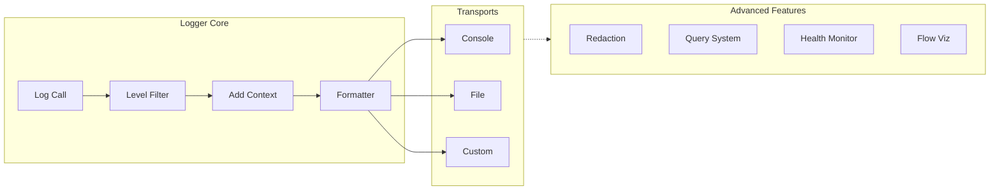

import Tabs from "@theme/Tabs";
import TabItem from "@theme/TabItem";

# Logging System

Production-ready logging with 11 phases.

## Overview

| Feature | Description |
|---------|-------------|
| Log Levels | TRACE, DEBUG, INFO, WARN, ERROR, FATAL |
| Structured Logging | Objects with full metadata |
| Transports | Console, File, Custom |
| Context Management | Child loggers and context tracking |
| Data Redaction | Automatic sensitive data protection |
| Performance Tracking | Built-in metrics |
| Query & Export | In-memory buffer with search |
| Flow Visualization | Event flow tracking |
| Error Suggestions | Helpful hints for common errors |
| Health Monitoring | CPU, memory, system health |



---

## Quick Start

### Basic Usage

```typescript
import { provide, inject, Logger } from "@expressots/core";

@provide(MyService)
export class MyService {
    constructor(@inject(Logger) private logger: Logger) {}

    doSomething() {
        this.logger.info("User created", { userId: 123 });
        this.logger.warn("Cache miss", { key: "user:123" });
        this.logger.error("Database error", new Error("Connection failed"));
    }
}
```

### Registration

Register logger in your application:

```typescript
export class App extends AppExpress {
    async configureServices(): Promise<void> {
        // Register Logger as Singleton
        this.Provider.register(Logger, Scope.Singleton);
    }
}
```

---

## Log Levels

Six log levels with intelligent filtering:

| Level | Value | Use Case | Example |
|-------|-------|----------|---------|
| **TRACE** | 0 | Ultra-detailed debug info | Function entry/exit, variable values |
| **DEBUG** | 1 | Detailed diagnostic information | Processing steps, state changes |
| **INFO** | 2 | General information | User actions, system events |
| **WARN** | 3 | Warning messages | Deprecated API usage, potential issues |
| **ERROR** | 4 | Error messages | Handled exceptions, failed operations |
| **FATAL** | 5 | Fatal errors | Unrecoverable errors, system crashes |

### Using Log Levels

```typescript
// All log levels
this.logger.trace("Ultra detailed debug info");
this.logger.debug("Detailed diagnostic info");
this.logger.info("General information");
this.logger.warn("Warning message");
this.logger.error("Error message");
this.logger.fatal("Fatal error");
```

### Filtering by Level

Only logs at or above the configured level are output:

```typescript
import { Logger, LogLevel } from "@expressots/core";

// Set minimum level to INFO
this.logger.configure({ level: LogLevel.INFO });

this.logger.trace("Not shown"); // Below INFO
this.logger.debug("Not shown"); // Below INFO
this.logger.info("Shown");      // INFO and above
this.logger.warn("Shown");      // Above INFO
this.logger.error("Shown");     // Above INFO
```

---

## Structured Logging

Log complex data with full TypeScript support:

### Basic Structured Data

```typescript
this.logger.info("User created", {
    userId: 123,
    email: "user@example.com",
    plan: "premium",
    timestamp: new Date()
});
```

### With Context

```typescript
this.logger.info("Order processed", "OrderService", {
    orderId: 456,
    total: 99.99,
    items: 3,
    paymentMethod: "credit_card"
});
```

### Error Objects

```typescript
try {
    await database.connect();
} catch (error) {
    this.logger.error(
        "Database connection failed",
        "DatabaseService",
        error as Error
    );
}
```

**Output (Development)**:
```
[ExpressoTS] 2026-01-10 10:30:45 [PID:12345] ERROR [DatabaseService] Database connection failed
  ├─ error: Error: Connection timeout
  └─ stack:
     at Database.connect (database.ts:42:15)
     at DatabaseService.initialize (service.ts:18:30)
```

---

## Context Management

### Using `withContext()`

Temporarily set context for a single log:

```typescript
this.logger.withContext("PaymentService").info("Processing payment");
// [ExpressoTS] ... INFO [PaymentService] Processing payment

this.logger.withContext("EmailService").debug("Sending welcome email");
// [ExpressoTS] ... DEBUG [EmailService] Sending welcome email
```

### Child Loggers

Create a child logger with persistent context:

```typescript
export class UserService {
    private serviceLogger: Logger;

    constructor(@inject(Logger) private logger: Logger) {
        // Create child with permanent context
        this.serviceLogger = logger.child("UserService");
    }

    createUser(data: CreateUserDto) {
        this.serviceLogger.info("Creating user", { email: data.email });
        this.serviceLogger.debug("Validating user data");
        this.serviceLogger.info("User created successfully", { userId: 123 });
    }
}
```

---

## Transport System

Transports control log destinations.

### Console Transport

#### Development Format (Pretty, Colored)

```typescript
import { Logger, ConsoleTransport } from "@expressots/core";

this.logger.configure({
    transports: [ConsoleTransport.forDevelopment()]
});
```

**Output**:
```
[ExpressoTS] 2026-01-10 10:30:45 [PID:12345] INFO  [UserService] User created
  ├─ userId: 123
  ├─ email: "user@example.com"
  └─ plan: "premium"
```

#### Production Format (JSON)

```typescript
this.logger.configure({
    transports: [ConsoleTransport.forProduction()]
});
```

**Output**:
```json
{"timestamp":"2026-01-10T10:30:45.123Z","level":"INFO","context":"UserService","message":"User created","data":{"userId":123,"email":"user@example.com","plan":"premium"}}
```

### File Transport

#### Daily Rotating Files

```typescript
import { Logger, FileTransport } from "@expressots/core";

this.logger.configure({
    transports: [
        ConsoleTransport.forDevelopment(),
        FileTransport.daily({ 
            directory: "logs",
            filename: "app" // Creates app-YYYY-MM-DD.log
        })
    ]
});
```

#### Size-Based Rotation

```typescript
FileTransport.rotating({
    directory: "logs",
    filename: "app.log",
    maxSize: "10m",     // Rotate at 10MB
    maxFiles: 5         // Keep 5 files
})
```

#### Fixed Filename

```typescript
FileTransport.fixed({
    directory: "logs",
    filename: "application.log"
})
```

### Custom Transports

Create custom transports for databases, external services, etc.:

```typescript
import { Transport, LogEntry } from "@expressots/core";

class DatabaseTransport implements Transport {
    async write(entry: LogEntry): Promise<void> {
        await database.logs.insert({
            level: entry.level,
            message: entry.message,
            context: entry.context,
            timestamp: entry.timestamp,
            data: entry.data
        });
    }
}

// Use it
this.logger.configure({
    transports: [
        ConsoleTransport.forDevelopment(),
        new DatabaseTransport()
    ]
});
```

### Multiple Transports

Log to multiple destinations simultaneously:

```typescript
this.logger.configure({
    transports: [
        ConsoleTransport.forDevelopment(),
        FileTransport.daily({ directory: "logs" }),
        FileTransport.fixed({ 
            directory: "logs/errors",
            filename: "errors.log",
            level: LogLevel.ERROR  // Only errors
        }),
        new DatabaseTransport(),
        new CloudWatchTransport()
    ]
});
```

---

## Configuration

### Complete Configuration

```typescript
import { Logger, LogLevel, ConsoleTransport, FileTransport } from "@expressots/core";

const appLogger = this.Provider.get(Logger);

appLogger.configure({
    // Minimum log level
    level: LogLevel.DEBUG,

    // Transports (where to write logs)
    transports: [
        ConsoleTransport.forDevelopment(),
        FileTransport.daily({ directory: "logs" })
    ],

    // Error suggestions (Phase 8)
    suggestions: {
        enabled: true,
        showRouteSuggestions: true,
        showErrorHints: true,
        maxRouteSuggestions: 3,
        minSimilarityThreshold: 0.3
    },

    // Flow visualization (Phase 7)
    flow: {
        enabled: true,
        showVisualization: true,
        trackMemory: true,
        trackNested: true
    },

    // Health monitoring (Phase 9)
    health: {
        enabled: true,
        interval: 30000,          // Check every 30s
        memoryThreshold: 80,       // Alert at 80% memory
        cpuThreshold: 90,          // Alert at 90% CPU
        alertsEnabled: true
    },

    // Query & export (Phase 11)
    query: {
        enabled: true,
        bufferSize: 1000,          // Keep last 1000 logs
        enableExport: true
    },

    // Performance tracking (Phase 5)
    performance: {
        enabled: true,
        slowThreshold: 1000        // Warn if operation > 1s
    },

    // Redaction (Phase 4)
    redaction: {
        enabled: true,
        partialRedaction: true,
        revealLastChars: 4
    }
});
```

### Environment-Based Configuration

```typescript
const isDevelopment = process.env.NODE_ENV !== "production";

this.logger.configure({
    level: isDevelopment ? LogLevel.DEBUG : LogLevel.WARN,
    transports: [
        isDevelopment 
            ? ConsoleTransport.forDevelopment()
            : ConsoleTransport.forProduction(),
        ...(isDevelopment ? [] : [FileTransport.daily({ directory: "logs" })])
    ],
    suggestions: { enabled: isDevelopment },
    flow: { enabled: isDevelopment },
    health: { enabled: !isDevelopment },
    query: { enabled: isDevelopment }
});
```

---

## Sensitive Data Redaction

Automatically redact sensitive data (passwords, API keys, credit cards).

### Automatic Redaction

Redaction is enabled by default in production:

```typescript
this.logger.info("User login", {
    email: "user@example.com",
    password: "secret123",        // Automatically redacted
    apiKey: "sk_live_abc123",     // Automatically redacted
    creditCard: "4532015112830366" // Automatically redacted
});
```

**Output**:
```
email: "user@example.com"
password: "••••••••"
apiKey: "••••••••"
creditCard: "••••••••"
```

### Partial Redaction

Show last N characters:

```typescript
import { configureGlobalRedactor } from "@expressots/core";

configureGlobalRedactor({
    enabled: true,
    partialRedaction: true,
    revealLastChars: 4
});

this.logger.info("Payment processed", {
    creditCard: "4532015112830366"  // Shows last 4 digits
});
// creditCard: "••••••••••••0366"
```

### Default Patterns

**Field Patterns** (40+ patterns):
- `password`, `passwd`, `pwd`
- `secret`, `apiKey`, `api_key`
- `token`, `accessToken`, `refreshToken`
- `creditCard`, `cardNumber`, `cvv`
- `ssn`, `socialSecurity`
- And 30+ more...

**Regex Patterns** (9 patterns):
- Credit cards: `/^\d{4}[\s-]?\d{4}[\s-]?\d{4}[\s-]?\d{4}$/`
- SSN: `/^\d{3}-\d{2}-\d{4}$/`
- AWS keys: `/^AKIA[0-9A-Z]{16}$/`
- JWT tokens: `/^eyJ[a-zA-Z0-9_-]+\./`
- Stripe keys: `/^sk_live_[a-zA-Z0-9]{24,}$/`
- And more...

### Custom Patterns

Add your own sensitive fields:

```typescript
configureGlobalRedactor({
    enabled: true,
    customFieldPatterns: [
        "internalCode",
        "employeeId",
        "companySecret"
    ],
    customRegexPatterns: [
        {
            name: "custom_id",
            pattern: /^CUST-\d{8}$/,
            replacement: "CUST-••••••••"
        }
    ]
});
```

### Whitelist

Prevent redaction of specific fields:

```typescript
configureGlobalRedactor({
    enabled: true,
    whitelist: [
        "password_reset_token_expires",  // Won't be redacted
        "api_version"                     // Won't be redacted
    ]
});
```

### Per-Transport Configuration

Different redaction for different transports:

```typescript
this.logger.configure({
    transports: [
        ConsoleTransport.forDevelopment({
            redaction: { enabled: false }  // No redaction in dev console
        }),
        FileTransport.daily({
            directory: "logs",
            redaction: { enabled: true }   // Redaction in files
        })
    ]
});
```

---

## Performance Monitoring

Track operation duration and metrics:

### Basic Performance Tracking

```typescript
this.logger.withPerformance("Database Query", async () => {
    return await database.users.findMany();
});
// Logs: "Database Query completed in 45ms"
```

### Manual Timing

```typescript
const start = Date.now();

// Your operation
await processData();

this.logger.info("Operation completed", {
    duration: Date.now() - start
});
```

### Slow Operation Warnings

```typescript
this.logger.configure({
    performance: {
        enabled: true,
        slowThreshold: 1000  // Warn if > 1 second
    }
});

// Automatically warns if slow
await this.logger.withPerformance("Heavy Operation", async () => {
    return await heavyComputation();
});
// ⚠️ WARNING: "Heavy Operation completed in 2500ms (slow)"
```

---

## Log Grouping

Group related logs:

```typescript
this.logger.group("User Registration Flow", () => {
    this.logger.info("Validating user data");
    this.logger.debug("Checking email uniqueness");
    this.logger.info("Creating user record");
    this.logger.info("Sending welcome email");
});
```

**Output**:
```
┌─ User Registration Flow
│  INFO  Validating user data
│  DEBUG Checking email uniqueness
│  INFO  Creating user record
│  INFO  Sending welcome email
└─ User Registration Flow (completed in 150ms)
```

### Nested Groups

```typescript
this.logger.group("Order Processing", () => {
    this.logger.info("Validating order");
    
    this.logger.group("Payment Processing", () => {
        this.logger.debug("Checking payment method");
        this.logger.info("Charging credit card");
    });
    
    this.logger.info("Order confirmed");
});
```

---

## Flow Visualization

Visualize event flow:

### Enable Flow Tracking

```typescript
this.logger.configure({
    flow: {
        enabled: true,
        showVisualization: true,
        trackMemory: true,
        trackNested: true
    }
});
```

### Automatic Visualization

When events are emitted, see the flow:

```bash
UserCreatedEvent
  ├── SendWelcomeEmailHandler (12ms)
  ├── CreateUserProfileHandler (8ms)
  ├── LogAnalyticsHandler (2ms)
  └── NotifyAdminHandler (5ms)
Total: 27ms
```

### Access Flow Data

```typescript
const flowData = this.logger.getFlowData(requestId);
console.log(flowData.events);
console.log(flowData.handlers);
console.log(flowData.totalDuration);
```

---

## Error Suggestions

Helpful suggestions for common errors:

### Route Suggestions

When a 404 occurs:

```
❌ Route not found: GET /api/usr/profile

💡 Did you mean one of these?
   - GET /api/user/profile (similarity: 0.91)
   - GET /api/users/profile (similarity: 0.85)
   - GET /api/user/preferences (similarity: 0.72)
```

### Error Hints

Helpful hints for common errors:

```
❌ Database connection failed

💡 Common causes:
   - Check DATABASE_URL environment variable
   - Verify database is running
   - Check network connectivity
   - Verify credentials are correct
```

### Configuration

```typescript
this.logger.configure({
    suggestions: {
        enabled: true,
        showRouteSuggestions: true,
        showErrorHints: true,
        maxRouteSuggestions: 3,
        minSimilarityThreshold: 0.3
    }
});
```

---

## Health Monitoring

Continuous system health monitoring:

### Enable Health Monitoring

```typescript
this.logger.configure({
    health: {
        enabled: true,
        interval: 30000,          // Check every 30 seconds
        memoryThreshold: 80,       // Alert at 80% memory usage
        cpuThreshold: 90,          // Alert at 90% CPU usage
        alertsEnabled: true,
        logLevel: "info",
        alertLogLevel: "warn"
    }
});
```

### Health Metrics

The logger automatically tracks:

- **Memory Usage**: Heap used, heap total, RSS
- **CPU Usage**: Average CPU load
- **Uptime**: Process uptime
- **Event Loop Lag**: Node.js event loop delay

**Automatic Alerts**:
```
⚠️  [Health] High memory usage: 85% (680MB / 800MB)
⚠️  [Health] High CPU usage: 92%
```

### Manual Health Check

```typescript
const health = this.logger.getHealthMetrics();

console.log(health.memory.heapUsedPercentage);  // 45
console.log(health.cpu.average);                 // 23
console.log(health.uptime);                      // 3600 (seconds)
```

---

## Query & Export

Query and export logs from in-memory buffer:

### Enable Query System

```typescript
this.logger.configure({
    query: {
        enabled: true,
        bufferSize: 1000,      // Keep last 1000 logs
        enableExport: true
    }
});
```

### Query Logs

#### By Level

```typescript
const errors = this.logger.queryLogs({
    level: LogLevel.ERROR
});
```

#### By Context

```typescript
const userServiceLogs = this.logger.queryLogs({
    context: "UserService"
});
```

#### By Time Range

```typescript
const recentLogs = this.logger.queryLogs({
    startTime: Date.now() - 3600000,  // Last hour
    endTime: Date.now()
});
```

#### By Search Term

```typescript
const searchResults = this.logger.queryLogs({
    search: "authentication"
});
```

#### By Regex

```typescript
const matches = this.logger.queryLogs({
    regex: /user-\d+/
});
```

### Chainable Query API

Build complex queries:

```typescript
const results = this.logger.query()
    .level(LogLevel.ERROR)
    .context("PaymentService")
    .search("timeout")
    .startTime(Date.now() - 3600000)
    .sort("desc")
    .limit(10)
    .execute();
```

### Export to Markdown

```typescript
const markdown = this.logger.exportLogsToMarkdown({
    query: { level: LogLevel.ERROR },
    title: "Error Logs Report",
    includeStats: true,
    groupBy: "level"
});

// Save to file
fs.writeFileSync("error-report.md", markdown);
```

**Generated Markdown**:
```markdown
# Error Logs Report

## Statistics
- Total Logs: 156
- Errors: 45
- Warnings: 67
- Info: 44

## Errors by Context
### DatabaseService (12 errors)
- 2026-01-10 10:30:45 - Connection timeout
- 2026-01-10 10:32:15 - Query failed
...
```

### Export Options

```typescript
// Group by level
this.logger.exportLogsToMarkdown({ groupBy: "level" });

// Group by context
this.logger.exportLogsToMarkdown({ groupBy: "context" });

// Filter before export
this.logger.exportLogsToMarkdown({
    query: { 
        level: LogLevel.ERROR,
        context: "PaymentService"
    }
});
```

### Statistics

```typescript
const stats = this.logger.getLogStats();

console.log(stats.total);        // 1000
console.log(stats.byLevel);      // { ERROR: 45, WARN: 67, INFO: 888 }
console.log(stats.byContext);    // { UserService: 234, OrderService: 156, ... }
console.log(stats.oldest);       // timestamp
console.log(stats.newest);       // timestamp
```

### Clear Logs

```typescript
this.logger.clearLogs();
```

---

## Request Logging Middleware

Log HTTP requests automatically:

```typescript
import { createRequestLoggingMiddleware } from "@expressots/core";

export class App extends AppExpress {
    async configureServices(): Promise<void> {
        const logger = this.Provider.get(Logger);

        this.Middleware.add(
            createRequestLoggingMiddleware(logger, {
                verbosity: "detailed",      // "minimal" | "standard" | "detailed"
                logBody: true,               // Log request body
                logHeaders: false,           // Log headers
                slowRequestThreshold: 1000,  // Warn if request > 1s
                requestIdHeader: "x-request-id",
                correlationIdHeader: "x-correlation-id"
            })
        );
    }
}
```

**Output**:
```
→ GET /api/users/123
  ├─ Request ID: abc-123-def
  ├─ User-Agent: Mozilla/5.0...
  └─ Body: {"filter":"active"}

← 200 GET /api/users/123 (45ms)
  ├─ Request ID: abc-123-def
  └─ Body: {"id":123,"name":"John"}
```

---

## Backward Compatibility

The legacy logger API still works:

```typescript
// Legacy API (still supported)
this.logger.info("Message", "ModuleName");
this.logger.warn("Warning", "ModuleName");
this.logger.error("Error", "ModuleName");
this.logger.msg("Message", "ModuleName");

// New API (recommended)
this.logger.info("Message", { userId: 123 });
this.logger.withContext("ModuleName").info("Message");
```

---

## Best Practices

### 1. Use Appropriate Log Levels

```typescript
// ✅ Good
this.logger.debug("User query parameters", { filter: "active" });
this.logger.info("User created", { userId: 123 });
this.logger.warn("Cache miss", { key: "user:123" });
this.logger.error("Database error", error);

// ❌ Bad
this.logger.info("Detailed debug info...");  // Use debug
this.logger.error("Warning message");        // Use warn
```

### 2. Include Contextual Data

```typescript
// ✅ Good
this.logger.error("Payment failed", {
    userId: 123,
    amount: 99.99,
    paymentMethod: "credit_card",
    errorCode: "INSUFFICIENT_FUNDS"
});

// ❌ Bad
this.logger.error("Payment failed");
```

### 3. Use Child Loggers for Services

```typescript
// ✅ Good
export class UserService {
    private logger: Logger;

    constructor(@inject(Logger) logger: Logger) {
        this.logger = logger.child("UserService");
    }

    createUser() {
        this.logger.info("Creating user");  // Auto-includes context
    }
}

// ❌ Bad
this.logger.withContext("UserService").info(...);  // Repetitive
```

### 4. Configure Per Environment

```typescript
// ✅ Good
const config = process.env.NODE_ENV === "production"
    ? {
        level: LogLevel.WARN,
        transports: [
            ConsoleTransport.forProduction(),
            FileTransport.daily({ directory: "logs" })
        ],
        redaction: { enabled: true },
        suggestions: { enabled: false }
    }
    : {
        level: LogLevel.DEBUG,
        transports: [ConsoleTransport.forDevelopment()],
        redaction: { enabled: false },
        suggestions: { enabled: true }
    };

this.logger.configure(config);
```

### 5. Handle Errors Properly

```typescript
// ✅ Good
try {
    await database.connect();
} catch (error) {
    this.logger.error(
        "Database connection failed",
        "DatabaseService",
        error as Error  // Pass full error object
    );
    throw error;
}

// ❌ Bad
catch (error) {
    this.logger.error("Error");  // Missing details
}
```

---

## Performance Considerations

### Memory Usage

- **Buffer Size**: Default 1000 logs (~1-5MB)
- **Circular Buffer**: Prevents unbounded growth
- **Production**: Disable query features to save memory

```typescript
// Production: Minimal memory usage
this.logger.configure({
    query: { enabled: false },     // Disable buffer
    health: { enabled: true },     // Keep health monitoring
    flow: { enabled: false }       // Disable flow tracking
});
```

### CPU Impact

- **Redaction**: < 1ms per log entry
- **Query**: O(n) where n = buffer size
- **Export**: O(n) where n = logs to export
- **Health Monitoring**: Minimal (every 30s)

### Recommendations

| Environment | Level | Transports | Query | Redaction | Health |
|-------------|-------|------------|-------|-----------|--------|
| **Development** | DEBUG | Console (pretty) | ✅ Enabled | ❌ Disabled | ❌ Disabled |
| **Staging** | INFO | Console + File | ✅ Enabled | ✅ Enabled | ✅ Enabled |
| **Production** | WARN | File only | ❌ Disabled | ✅ Enabled | ✅ Enabled |

---

## Troubleshooting

### Logs Not Appearing

**Check log level**:
```typescript
this.logger.configure({ level: LogLevel.TRACE });
```

**Check transports**:
```typescript
this.logger.configure({
    transports: [ConsoleTransport.forDevelopment()]
});
```

### File Transport Not Creating Files

**Check directory exists**:
```bash
mkdir -p logs
chmod 755 logs
```

**Verify configuration**:
```typescript
FileTransport.daily({
    directory: "logs",  // Relative or absolute path
    filename: "app"
})
```

### Redaction Not Working

**Enable redaction**:
```typescript
import { configureGlobalRedactor } from "@expressots/core";

configureGlobalRedactor({ enabled: true });
```

**Check patterns**:
```typescript
configureGlobalRedactor({
    enabled: true,
    customFieldPatterns: ["myField"]  // Add custom fields
});
```

### Performance Issues

**Disable expensive features in production**:
```typescript
this.logger.configure({
    level: LogLevel.WARN,
    query: { enabled: false },
    flow: { enabled: false },
    suggestions: { enabled: false }
});
```

### Memory Usage High

**Reduce buffer size**:
```typescript
this.logger.configure({
    query: {
        enabled: true,
        bufferSize: 100  // Smaller buffer
    }
});
```

**Or disable query entirely**:
```typescript
this.logger.configure({
    query: { enabled: false }
});
```

---

## API Reference

### Logger Methods

| Method | Description |
|--------|-------------|
| `trace(message, context?, data?)` | Log TRACE level |
| `debug(message, context?, data?)` | Log DEBUG level |
| `info(message, context?, data?)` | Log INFO level |
| `warn(message, context?, data?)` | Log WARN level |
| `error(message, context?, data?)` | Log ERROR level |
| `fatal(message, context?, data?)` | Log FATAL level |
| `withContext(context)` | Set temporary context |
| `child(context)` | Create child logger |
| `configure(options)` | Configure logger |
| `queryLogs(options?)` | Query log buffer |
| `query()` | Create chainable query |
| `getAllLogs()` | Get all logs |
| `getLogStats()` | Get statistics |
| `clearLogs()` | Clear log buffer |
| `exportLogsToMarkdown(options?)` | Export to markdown |
| `getHealthMetrics()` | Get health metrics |
| `getFlowData(requestId)` | Get flow data |

### Configuration Options

```typescript
interface LoggerConfig {
    level?: LogLevel | string;
    transports?: Transport[];
    suggestions?: SuggestionsConfig;
    flow?: FlowConfig;
    health?: HealthConfig;
    query?: QueryConfig;
    performance?: PerformanceConfig;
    redaction?: RedactionConfig;
}
```

---

## Migration from v3

### Logger is now injectable

**v3**:
```typescript
import console from "console";
console.log("Message");
```

**v4**:
```typescript
@provide(MyService)
export class MyService {
    constructor(@inject(Logger) private logger: Logger) {}

    doSomething() {
        this.logger.info("Message");
    }
}
```

### New log levels

**v3**: info, warn, error, msg  
**v4**: trace, debug, info, warn, error, fatal (+ legacy methods)

### Structured logging

**v3**:
```typescript
this.logger.info("User: " + userId + " Email: " + email);
```

**v4**:
```typescript
this.logger.info("User created", { userId, email });
```

---

## Comparison with Other Frameworks

| Feature | ExpressoTS | NestJS | Fastify |
|---------|------------|--------|---------|
| **Log Levels** | 6 levels | 5 levels | Custom |
| **Structured Logging** | ✅ Built-in | ✅ Via Winston | ✅ Via Pino |
| **Multiple Transports** | ✅ Built-in | ✅ Via Winston | ✅ Via Pino |
| **Data Redaction** | ✅ Automatic | ❌ Manual | ❌ Manual |
| **Query & Export** | ✅ Built-in | ❌ Not available | ❌ Not available |
| **Health Monitoring** | ✅ Built-in | ⚠️ Via terminus | ⚠️ Custom |
| **Flow Visualization** | ✅ Built-in | ❌ Not available | ❌ Not available |
| **Error Suggestions** | ✅ Built-in | ❌ Not available | ❌ Not available |

---

## Testing Logger

### Unit Testing

Test logger in isolation with mocked transports:

```typescript
describe("LoggerService", () => {
    let logger: Logger;
    let mockTransport: jest.Mocked<Transport>;

    beforeEach(() => {
        mockTransport = {
            write: jest.fn().mockResolvedValue(undefined),
        } as any;

        logger = new Logger();
        logger.configure({
            transports: [mockTransport],
        });
    });

    it("should log info messages", () => {
        logger.info("Test message", { data: 123 });

        expect(mockTransport.write).toHaveBeenCalledWith(
            expect.objectContaining({
                level: "INFO",
                message: "Test message",
            })
        );
    });

    it("should respect log level filtering", () => {
        logger.configure({ level: LogLevel.WARN });

        logger.debug("Debug message"); // Should not log
        logger.warn("Warning message"); // Should log

        expect(mockTransport.write).toHaveBeenCalledTimes(1);
    });
});
```

### Testing Redaction

```typescript
describe("Data Redaction", () => {
    it("should redact sensitive fields", () => {
        const capture = captureLogOutput();

        logger.info("User login", {
            email: "user@example.com",
            password: "secret123",
        });

        const log = capture.logs[0];
        expect(log).toContain("user@example.com");
        expect(log).not.toContain("secret123");
        expect(log).toContain("••••••••");
    });
});
```

### E2E Testing

```typescript
describe("Logger E2E", () => {
    let app: IWebServerPublic;

    beforeAll(async () => {
        app = await bootstrap(App, { port: 0 });
    });

    afterAll(async () => {
        await app.close();
    });

    it("should log request/response cycle", async () => {
        const capture = captureLogOutput();

        await fetch(`http://localhost:${await app.getPort()}/users`);

        expect(capture.logs).toContainEqual(
            expect.objectContaining({ context: "RequestLogger" })
        );
    });
});
```

---

## Support the Project

ExpressoTS is MIT-licensed open source. See the **[support guide](../support-us.mdx)** to contribute.
