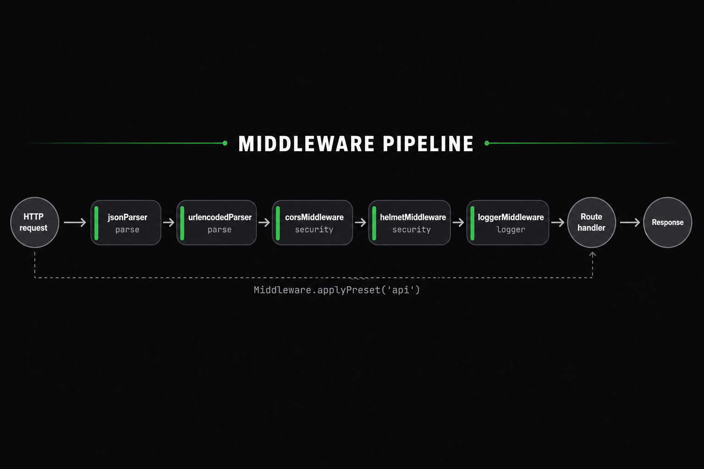

# Middleware

Middlewares play a crucial role in the request-response cycle of an ExpressoTS application. They allow you to execute code, modify request and response objects, end the cycle, or pass control to the next middleware in the stack. To prevent request timeouts, it's important to call `next()` unless your middleware completes the cycle.

ExpressoTS supports function and class-based middleware. Function-based middleware is the simplest form of middleware, while class-based middleware allows you to create reusable middleware with a constructor and methods.

ExpressoTS integrates smoothly with Express middleware, allowing you to leverage its extensive ecosystem to enhance your application.

:::note ExpressoTS fully supports [Express](https://expressjs.com/en/resources/middleware.html) middleware out-of-the-box.
:::

## Add middleware

ExpressoTS application supports adding middleware globally to the application as well as per route. It offers all the middleware supported by [Expressjs](https://expressjs.com/en/resources/middleware.html) team out-of-the-box.

In the `app.ts` file, you can add middleware to the application using the `this.Middleware` property. The `this.Middleware` property is an instance of the `Middleware` class, which provides a unified API for configuring middleware.

```ts title="Adding middleware globally in app.ts (v4 API)"
export class App extends AppExpress {
    async configureServices(): Promise<void> {
        // Unified body parsing (JSON, URL encoded, cookies)
        this.Middleware.parse({
            json: { limit: "10mb" },
            urlencoded: { extended: true },
            cookies: true,
        });

        // Unified security (CORS, Helmet, rate limiting)
        this.Middleware.security("api");

        // Error handling
        this.Middleware.setErrorHandler({
            showStackTrace: await this.isDevelopment(),
        });
    }
}
```

In ExpressoTS, middleware options are available to be added as needed, but the actual middleware packages are not pre-installed to keep the application lightweight. When you choose to add middleware, the system checks if the necessary package is installed.

If the middleware package isn't installed, the application will warn you with a message, but will continue running.

```bash
🖥️ Middleware [cors] not installed. Please install it using your package manager.
```

Once you install the required middleware, the warning will disappear on hot reload, and the middleware will be ready for use.

## Unified Middleware API (v4)

ExpressoTS v4 introduces a unified, intuitive middleware API:

| Method              | Description                                                    |
| ------------------- | -------------------------------------------------------------- |
| `parse()`           | Unified body parsing (JSON, URL encoded, cookies)              |
| `security()`        | Unified security (CORS, Helmet, rate limiting) with presets    |
| `compress()`        | Auto-detect compression (shrink-ray or compression)            |
| `static()`          | Enhanced static file serving with SPA support                  |
| `logger()`          | Pluggable logging (auto-detects pino, winston, morgan)         |
| `register()`        | Middleware registry for route-level use                        |
| `when()`            | Conditional middleware execution                               |
| `applyPreset()`     | Apply built-in presets (api, production, development, minimal) |
| `definePreset()`    | Define custom middleware presets                               |
| `add()`             | Add custom middleware                                          |
| `setErrorHandler()` | Configure error handling                                       |
| `addValidation()`   | Smart validation with auto-detection                           |
| `addContentNegotiation()` | Content negotiation with multiple formatters             |

### parse() - Unified Body Parsing

Replaces individual body parsers with one unified method:

```typescript
// Before (v3)
this.Middleware.addBodyParser();
this.Middleware.addUrlEncodedParser();
this.Middleware.addCookieParser();

// After (v4) - One unified call
this.Middleware.parse({
    json: { limit: "10mb" },
    urlencoded: { extended: true },
    cookies: true,
});

// Or with defaults
this.Middleware.parse();
```

### security() - Unified Security

Replaces individual security middleware with presets:

```typescript
// Before (v3)
this.Middleware.addCors();
this.Middleware.addHelmet();
this.Middleware.addRateLimiter();

// After (v4) - Use security presets
this.Middleware.security("standard");  // Balanced security
this.Middleware.security("strict");    // Maximum security
this.Middleware.security("api");       // API-optimized
this.Middleware.security("minimal");   // Development-friendly
this.Middleware.security("relaxed");   // Minimal restrictions
```

### compress() - Auto-Detect Compression

```typescript
// Auto-detects shrink-ray or compression
this.Middleware.compress({ threshold: 1024 });
```

### static() - Enhanced Static Files

```typescript
// Basic static file serving
this.Middleware.static({
    path: path.join(process.cwd(), "public"),
    prefix: "/static",
    maxAge: "1d",
    etag: true,
});

// SPA mode with fallback
this.Middleware.static({
    path: "./dist",
    spaMode: true,
    fallback: "index.html",
});
```

### logger() - Pluggable Logging

```typescript
// Auto-detects pino → winston → morgan → console
this.Middleware.logger();

// Or specify implementation
this.Middleware.logger({ implementation: "pino" });
```

:::caution
If you add a middleware that is not installed as dependency, the application will throw a warning message and continue to run.
:::

## Middleware Registry

The middleware registry allows you to register named middleware for use at the route level:

```typescript
export class App extends AppExpress {
    async configureServices(): Promise<void> {
        this.Middleware.parse();

        // Register individual middleware
        this.Middleware.register("verify-jwt", verifyJwtMiddleware);
        this.Middleware.register("require-auth", requireAuthMiddleware);
        this.Middleware.register("request-id", requestIdMiddleware);

        // Register middleware chains
        this.Middleware.register("auth-chain", [verifyJwt, requireAuth]);
        this.Middleware.register("admin", [verifyJwt, requireAuth, requireAdmin]);
    }
}
```

Then use in controllers with the `@middleware()` decorator:

```typescript
@controller("/admin")
@middleware("admin")  // Use registered chain
export class AdminController {
    @Get("/dashboard")
    @middleware("verify-jwt")  // Use single middleware
    dashboard() {
        return { admin: true };
    }
}
```

## Conditional Middleware

Execute middleware based on conditions:

```typescript
export class App extends AppExpress {
    async configureServices(): Promise<void> {
        this.Middleware.parse();

        // Only in development
        this.Middleware.when(process.env.NODE_ENV === "development", () => {
            console.log("🔧 Development mode: Extra logging enabled");
            this.Middleware.logger();
        });

        // Only in production
        this.Middleware.when(process.env.NODE_ENV === "production", () => {
            this.Middleware.compress();
            this.Middleware.security("strict");
        });
    }
}
```

## Middleware Presets

Pre-configured middleware bundles for common scenarios:

```typescript
export class App extends AppExpress {
    async configureServices(): Promise<void> {
        // Built-in presets
        this.Middleware.applyPreset("api");         // JSON, CORS, security, compression
        this.Middleware.applyPreset("production");  // All security + compression
        this.Middleware.applyPreset("development"); // Logging + relaxed security
        this.Middleware.applyPreset("minimal");     // Just body parsing
    }
}
```

### Custom Presets

Define your own presets for reuse:

```typescript
export class App extends AppExpress {
    async configureServices(): Promise<void> {
        // Define a custom preset
        this.Middleware.definePreset("my-company-api", {
            parse: { json: { limit: "5mb" }, urlencoded: true },
            logger: { implementation: "auto" },
            security: "api",
            compress: true,
        });

        // Apply your custom preset
        this.Middleware.applyPreset("my-company-api");
    }
}
```

## Adding Custom Middleware

Use the `add()` method for custom middleware:

```typescript
// Function middleware
this.Middleware.add((req, res, next) => {
    req.requestTime = Date.now();
    next();
});

// Express middleware from NPM
import cors from "cors";
this.Middleware.add(cors({ origin: "https://example.com" }));

// Class-based middleware
this.Middleware.add(new CustomMiddleware());
```

:::note Each route can have multiple middlewares.
:::

## Middleware in controller

If you want to apply a middleware to all routes under a specific controller, you can add it to the `@controller()` decorator. You can pass as many middlewares as you want to the `@controller()` decorator.

```typescript
@controller("/app", express.json())
export class AppController {
    @Post("/create")
    createApp() {
        return "Create App";
    }

    @Patch("/update")
    updateApp() {
        return "Update App";
    }
}
```

## Middleware in http method

Or you add a middleware to a specific route in the controller class through the `http Method` decorators.

```typescript
@controller("/")
export class AppController {
    @Post("", express.json())
    execute() {
        return "Hello World";
    }
}
```

## Create expressoTS middleware

To create a custom class-based middleware, you need to extend the `ExpressoMiddleware` class and implement the `use` method. The `use`
method is the entry point of the middleware, and it receives the `Request`, `Response`, and `NextFunction` objects.

Use the CLI to create a new middleware class:

```bash
expressots g mi middleware-name
```

```ts title="Scaffold output"
import { ExpressoMiddleware, provide } from "@expressots/core";
import { NextFunction, Request, Response } from "express";

@provide(ExampleMiddleware)
export class ExampleMiddleware extends ExpressoMiddleware {
    use(req: Request, res: Response, next: NextFunction): void | Promise<void> {
        throw new Error("Method not implemented.");
    }
}
```

An example of a custom class-based middleware implementation:

```typescript title="Creating a custom class-base middleware"
class CustomMiddleware extends ExpressoMiddleware {
    private isOn: boolean;

    constructor(isOn: boolean) {
        super();
        this.isOn = isOn;
    }

    use(req: Request, res: Response, next: NextFunction): void | Promise<void> {
        // Do something
        if (this.isOn) {
            next();
        } else {
            res.status(403).send("Forbidden");
        }
    }
}
```

Custom middleware allows you to pass parameters to the constructor and use them as options in the `use` method of your middleware. This way, you can
create reusable middleware with different configurations.

## View middleware pipeline

You can view all the middlewares added to the application using the `this.middleware.viewMiddlewarePipeline()` method.
The goal of the `viewMiddlewarePipeline` method is to provide a visual representation of the middleware pipeline in the application.

Here is the output of the `viewMiddlewarePipeline` method:



## V4 Middleware Enhancements

ExpressoTS v4 introduces powerful new middleware capabilities:

### Conditional Middleware

Execute middleware based on conditions:

```typescript
import { when, unless } from "@expressots/adapter-express";

@Get("/admin",
    when(req => req.hostname.startsWith("admin."), AdminMiddleware),
    AuthMiddleware
)
async adminHandler() {}

@Get("/public",
    unless(req => req.headers.authorization, AuthMiddleware)
)
async publicHandler() {}
```

### Middleware Composition

Group and sequence middleware:

```typescript
import { combine, sequence } from "@expressots/adapter-express";

// Combine multiple middleware into a reusable group
@Get("/api", combine(AuthMiddleware, LoggingMiddleware, RateLimitMiddleware))
async apiHandler() {}

// Sequence middleware with dependencies
@Get("/data", sequence(ValidateMiddleware, TransformMiddleware, ProcessMiddleware))
async dataHandler() {}
```

### Class Reference Support

Use class references without `new`:

```typescript
// Before (still works)
@Get("/", new AuthMiddleware())

// After (v4 recommended - cleaner API)
@Get("/", AuthMiddleware)  // No 'new' needed!
```

### Middleware Presets

Pre-configured middleware bundles:

```typescript
import { usePreset } from "@expressots/adapter-express";

export class App extends AppExpress {
    async configureServices(): Promise<void> {
        // Use predefined presets
        this.Middleware.usePreset("api");         // CORS, Helmet, Body Parser, Compression, Rate Limiting
        this.Middleware.usePreset("production");  // All security middleware
        this.Middleware.usePreset("development"); // Development-friendly with detailed logging
    }
}
```

### Performance Profiling

Built-in middleware profiler:

```typescript
export class App extends AppExpress {
    async configureServices(): Promise<void> {
        // Enable profiling
        this.Middleware.enableProfiling();
        
        // Add middleware
        this.Middleware.addBodyParser();
        this.Middleware.addCors();
    }

    async postServerInitialization(): Promise<void> {
        // Access profiler stats
        const stats = this.Middleware.getProfilerStats();
        console.log(stats);
        // {
        //   "bodyParser": { avgTime: 2.3, callCount: 150, errors: 0 },
        //   "cors": { avgTime: 0.5, callCount: 150, errors: 0 }
        // }
    }
}
```

### Pipeline Introspection

Query middleware pipeline at runtime:

```typescript
// Get ordered list of all middleware
const pipeline = this.Middleware.getMiddlewarePipeline();

// Get detailed information
const info = this.Middleware.getMiddlewareInfo("cors");

// Filter by category
const security = this.Middleware.getMiddlewarePipeline({ category: "security" });
```

### New v4 Middleware

| Middleware Name        | Description                                              |
| ---------------------- | -------------------------------------------------------- |
| addContentNegotiation  | Add content negotiation with multiple formatters         |
| addValidation          | Add smart validation (zero-config with @validatedBody()) |
| addHealthCheck         | Add health check endpoint                                |
| usePreset              | Apply middleware preset (api, production, development)   |

### Content Negotiation

Built-in content negotiation with multiple formatters:

```typescript
export class App extends AppExpress {
    async configureServices(): Promise<void> {
        this.Middleware.addContentNegotiation({
            defaultFormat: "json",
            formatters: {
                json: { enabled: true },
                xml: { enabled: true },
                csv: { enabled: true },
                yaml: { enabled: true },
            },
        });
    }
}
```

### Smart Validation

Zero-config validation with helpful error messages:

```typescript
import { validatedBody } from "@expressots/core";

@Post("/users")
createUser(@validatedBody() dto: CreateUserDto) {
    // dto is automatically validated
    // TypeScript types are inferred
    return this.userService.create(dto);
}
```

## Advanced Patterns

### Async response handling with callback-based middleware

ExpressoTS v4 has a smart-response handler: when your controller method returns `undefined`, the framework calls `res.end()` automatically (or returns a 404 for `GET`, or a 204 for `DELETE`/`PUT`/`PATCH`). This is great for clean handlers - until you mix it with **callback-based async middleware** like `multer`, `busboy`, or anything that does its own `req`/`res` work via a continuation.

The trap:

```typescript
@Post("upload")
single(req: Request, res: Response) {
    upload.single("file")(req, res, (err) => {
        if (err) return res.status(400).json({ error: err.message });
        res.json({ ok: true });   // <- runs async, AFTER the handler returns
    });
    // handler returns `undefined` here, BEFORE multer finishes
}
```

What happens:
1. Multer kicks off async file parsing.
2. Your handler returns `undefined`.
3. Framework sees `undefined` + `res.headersSent === false` -> calls `res.end()`. Headers now sent.
4. Multer finishes, callback runs, `res.json(...)` -> "Cannot set headers after they are sent" crash.

The fix: make your handler `async` and `await` the middleware via a Promise wrapper.

```typescript
function runMulter(
    req: Request,
    res: Response,
    middleware: ReturnType<multer.Multer["single"]>,
): Promise<void> {
    return new Promise((resolve, reject) => {
        middleware(req, res, (err) => (err ? reject(err) : resolve()));
    });
}

@controller("/upload")
class UploadController {
    @Post("single")
    async single(req: Request, res: Response) {
        try {
            await runMulter(req, res, upload.single("file"));
        } catch (err) {
            res.status(400).json({ success: false, error: (err as Error).message });
            return;
        }

        res.json({ success: true, file: req.file });
    }
}
```

Now the framework awaits your handler's promise, which resolves only after multer has fully responded. No double-write.

The same pattern applies to any callback-style middleware that holds the response: `busboy`, custom file pipelines, raw stream consumers, third-party body parsers.

### Production-Ready Middleware Stacks

Create reusable middleware stacks for different scenarios:

```typescript
import { combine, sequence, when } from "@expressots/adapter-express";

// Define reusable stacks
const apiStack = combine(CorsMiddleware, LoggingMiddleware, CompressionMiddleware);
const authStack = combine(JwtMiddleware, RoleMiddleware);
const validationStack = sequence(ValidateMiddleware, TransformMiddleware);

// Use in controllers
@controller("/api/v1")
class ApiController {
    @Get("/public", apiStack)
    publicEndpoint() { /* ... */ }

    @Get("/protected", combine(apiStack, authStack))
    protectedEndpoint() { /* ... */ }

    @Post("/data", combine(apiStack, authStack, validationStack))
    dataEndpoint() { /* ... */ }
}
```

### Error Handling Best Practices

Handle errors at different points in the middleware chain:

```typescript
@provide(ErrorBoundaryMiddleware)
class ErrorBoundaryMiddleware extends ExpressoMiddleware {
    use(req: Request, res: Response, next: NextFunction): void {
        try {
            next();
        } catch (error) {
            // Handle sync errors
            next(error);
        }
    }
}

// Global error handler configuration
async configureServices(): Promise<void> {
    this.Middleware.setErrorHandler({
        showStackTrace: await this.isDevelopment(),
        logErrors: true,
        customHandler: (error, req, res, next) => {
            // Custom error formatting
        },
    });
}
```

### Performance Optimization Tips

1. **Order matters** - Put frequently-skipped conditional middleware early
2. **Use combine()** for parallel-safe middleware groups
3. **Use sequence()** when middleware has dependencies
4. **Avoid deep nesting** - Flatten composition when possible

```typescript
// Good: Flat and efficient
@Get("/api", combine(
    CorsMiddleware,
    when(() => process.env.NODE_ENV === "production", CompressionMiddleware),
    AuthMiddleware,
    LoggingMiddleware
))

// Avoid: Deeply nested
@Get("/api", combine(
    CorsMiddleware,
    combine(
        when(() => true, combine(AuthMiddleware, LoggingMiddleware)),
        CompressionMiddleware
    )
))
```

### Real-World Recipes

#### REST API with Full Security

```typescript
const secureApiStack = combine(
    CorsMiddleware,
    HelmetMiddleware,
    RateLimitMiddleware,
    JwtAuthMiddleware,
    AuditLogMiddleware
);

@controller("/api/v1/users", secureApiStack)
class UserController {
    @Get("/") listUsers() { /* ... */ }
    @Post("/", ValidationMiddleware) createUser() { /* ... */ }
    @Get("/:id") getUser() { /* ... */ }
}
```

#### Conditional Feature Flags

```typescript
@Get("/feature",
    when(() => featureFlags.isEnabled("new-feature"), NewFeatureMiddleware),
    unless(() => featureFlags.isEnabled("new-feature"), LegacyMiddleware)
)
featureEndpoint() { /* ... */ }
```

---

## Support the Project

ExpressoTS is MIT-licensed open source. See the **[support guide](../support-us.mdx)** to contribute.
