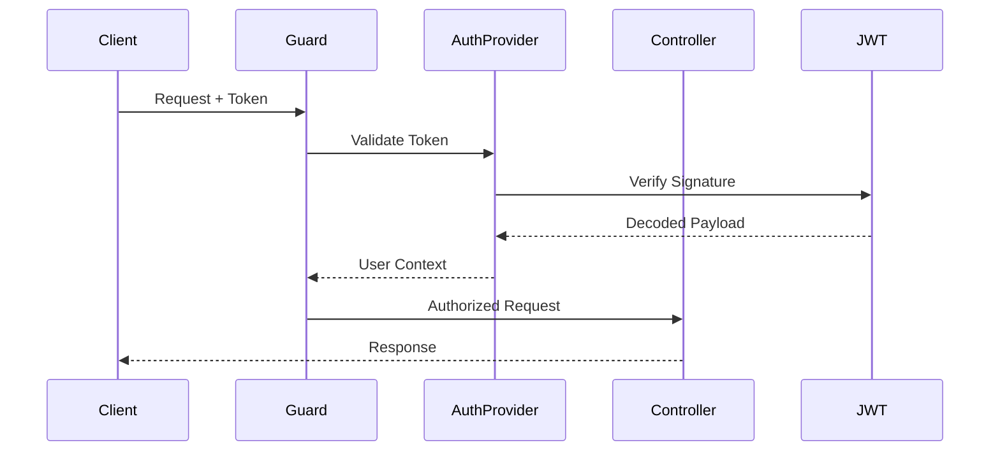

import Tabs from "@theme/Tabs";
import TabItem from "@theme/TabItem";

# Authentication Guide

This guide walks you through implementing JWT-based authentication in ExpressoTS, from basic setup to production-ready patterns.

## Overview



## Prerequisites

- ExpressoTS 4.0+ project
- Basic understanding of JWT tokens
- Familiarity with guards (see [Guards & Authorization](../features/guards.mdx))

## Step 1: Install Dependencies

```bash
npm install jsonwebtoken bcryptjs
npm install -D @types/jsonwebtoken @types/bcryptjs
```

## Step 2: Create Auth Configuration

Create a configuration file for authentication settings:

```typescript title="src/auth/auth.config.ts"
import { provide } from "@expressots/core";

@provide(AuthConfig)
export class AuthConfig {
    readonly jwtSecret = process.env.JWT_SECRET || "your-secret-key";
    readonly jwtExpiresIn = "1h";
    readonly refreshExpiresIn = "7d";
    readonly bcryptRounds = 10;
}
```

:::caution
Never hardcode secrets in production. Always use environment variables.
:::

## Step 3: Create User Entity

```typescript title="src/users/user.entity.ts"
import { provide } from "@expressots/core";
import { randomUUID } from "node:crypto";

@provide(User)
export class User {
    id: string;
    email: string;
    password: string; // Hashed
    roles: string[];
    createdAt: Date;

    constructor() {
        this.id = randomUUID();
        this.createdAt = new Date();
        this.roles = ["user"];
    }
}
```

## Step 4: Create Auth Service

```typescript title="src/auth/auth.service.ts"
import { provide, inject } from "@expressots/core";
import * as jwt from "jsonwebtoken";
import * as bcrypt from "bcryptjs";
import { AuthConfig } from "./auth.config";

interface TokenPayload {
    userId: string;
    email: string;
    roles: string[];
}

interface AuthTokens {
    accessToken: string;
    refreshToken: string;
}

@provide(AuthService)
export class AuthService {
    constructor(@inject(AuthConfig) private config: AuthConfig) {}

    async hashPassword(password: string): Promise<string> {
        return bcrypt.hash(password, this.config.bcryptRounds);
    }

    async verifyPassword(password: string, hash: string): Promise<boolean> {
        return bcrypt.compare(password, hash);
    }

    generateTokens(payload: TokenPayload): AuthTokens {
        const accessToken = jwt.sign(payload, this.config.jwtSecret, {
            expiresIn: this.config.jwtExpiresIn,
        });

        const refreshToken = jwt.sign(
            { userId: payload.userId },
            this.config.jwtSecret,
            { expiresIn: this.config.refreshExpiresIn }
        );

        return { accessToken, refreshToken };
    }

    verifyToken(token: string): TokenPayload | null {
        try {
            return jwt.verify(token, this.config.jwtSecret) as TokenPayload;
        } catch {
            return null;
        }
    }

    extractTokenFromHeader(authHeader: string | undefined): string | null {
        if (!authHeader?.startsWith("Bearer ")) {
            return null;
        }
        return authHeader.substring(7);
    }
}
```

## Step 5: Create Auth Provider

The auth provider integrates with ExpressoTS guards:

```typescript title="src/auth/auth.provider.ts"
import { provide, inject, IAuthProvider } from "@expressots/core";
import { Request } from "express";
import { AuthService } from "./auth.service";
import { UserRepository } from "../users/user.repository";

@provide(AuthProvider)
export class AuthProvider implements IAuthProvider {
    constructor(
        @inject(AuthService) private authService: AuthService,
        @inject(UserRepository) private userRepo: UserRepository
    ) {}

    async authenticate(req: Request): Promise<boolean> {
        const token = this.authService.extractTokenFromHeader(
            req.headers.authorization
        );

        if (!token) {
            return false;
        }

        const payload = this.authService.verifyToken(token);
        if (!payload) {
            return false;
        }

        // Attach user to request
        const user = await this.userRepo.findById(payload.userId);
        if (!user) {
            return false;
        }

        (req as any).user = user;
        return true;
    }

    async hasPermission(req: Request, permission: string): Promise<boolean> {
        const user = (req as any).user;
        if (!user) {
            return false;
        }

        // Check role-based permissions
        const rolePermissions: Record<string, string[]> = {
            admin: ["read", "write", "delete", "manage"],
            user: ["read", "write"],
            guest: ["read"],
        };

        for (const role of user.roles) {
            const permissions = rolePermissions[role] || [];
            if (permissions.includes(permission)) {
                return true;
            }
        }

        return false;
    }
}
```

## Step 6: Register Auth Provider

Configure the auth provider in your application:

```typescript title="src/app.ts"
import { AppExpress, AppContainer, Scope } from "@expressots/adapter-express";
import { setupAuthorizationForExpress } from "@expressots/adapter-express";
import { AuthProvider } from "./auth/auth.provider";

export class App extends AppExpress {
    private container: AppContainer = this.configContainer([AppModule]);

    protected configureServices(): void {
        // Setup authorization with your auth provider
        setupAuthorizationForExpress(this.app, this.container.Container, {
            authProvider: AuthProvider,
        });
    }
}
```

## Step 7: Create Auth Controller

<Tabs>
    <TabItem value="register" label="Register">

```typescript title="src/auth/auth.controller.ts"
import { controller, Post, body } from "@expressots/adapter-express";
import { provide, inject } from "@expressots/core";
import { Response } from "express";
import { AuthService } from "./auth.service";
import { UserRepository } from "../users/user.repository";
import { User } from "../users/user.entity";

interface RegisterDTO {
    email: string;
    password: string;
}

@provide(AuthController)
@controller("/auth")
export class AuthController {
    constructor(
        @inject(AuthService) private authService: AuthService,
        @inject(UserRepository) private userRepo: UserRepository
    ) {}

    @Post("/register")
    async register(@body() dto: RegisterDTO, res: Response) {
        // Check if user exists
        const existing = await this.userRepo.findByEmail(dto.email);
        if (existing) {
            return res.status(400).json({ error: "Email already registered" });
        }

        // Create user
        const user = new User();
        user.email = dto.email;
        user.password = await this.authService.hashPassword(dto.password);

        await this.userRepo.save(user);

        // Generate tokens
        const tokens = this.authService.generateTokens({
            userId: user.id,
            email: user.email,
            roles: user.roles,
        });

        return res.status(201).json({
            user: { id: user.id, email: user.email },
            ...tokens,
        });
    }
}
```

    </TabItem>
    <TabItem value="login" label="Login">

```typescript title="src/auth/auth.controller.ts (continued)"
interface LoginDTO {
    email: string;
    password: string;
}

@Post("/login")
async login(@body() dto: LoginDTO, res: Response) {
    // Find user
    const user = await this.userRepo.findByEmail(dto.email);
    if (!user) {
        return res.status(401).json({ error: "Invalid credentials" });
    }

    // Verify password
    const valid = await this.authService.verifyPassword(
        dto.password,
        user.password
    );
    if (!valid) {
        return res.status(401).json({ error: "Invalid credentials" });
    }

    // Generate tokens
    const tokens = this.authService.generateTokens({
        userId: user.id,
        email: user.email,
        roles: user.roles,
    });

    return res.json({
        user: { id: user.id, email: user.email },
        ...tokens,
    });
}
```

    </TabItem>
    <TabItem value="refresh" label="Refresh Token">

```typescript title="src/auth/auth.controller.ts (continued)"
interface RefreshDTO {
    refreshToken: string;
}

@Post("/refresh")
async refresh(@body() dto: RefreshDTO, res: Response) {
    const payload = this.authService.verifyToken(dto.refreshToken);
    if (!payload) {
        return res.status(401).json({ error: "Invalid refresh token" });
    }

    const user = await this.userRepo.findById(payload.userId);
    if (!user) {
        return res.status(401).json({ error: "User not found" });
    }

    const tokens = this.authService.generateTokens({
        userId: user.id,
        email: user.email,
        roles: user.roles,
    });

    return res.json(tokens);
}
```

    </TabItem>
</Tabs>

## Step 8: Protect Routes with Guards

Use guards to protect your routes:

```typescript title="src/users/user.controller.ts"
import { controller, Get, Delete, param } from "@expressots/adapter-express";
import { provide, inject, RequireAuth, RequireRoles, RequirePermissions } from "@expressots/core";
import { Response, Request } from "express";

@provide(UserController)
@controller("/users")
export class UserController {
    constructor(@inject(UserRepository) private userRepo: UserRepository) {}

    // Requires authentication
    @Get("/me")
    @RequireAuth()
    async getProfile(req: Request, res: Response) {
        const user = (req as any).user;
        return res.json({
            id: user.id,
            email: user.email,
            roles: user.roles,
        });
    }

    // Requires admin role
    @Get("/")
    @RequireRoles("admin")
    async getAllUsers(req: Request, res: Response) {
        const users = await this.userRepo.findAll();
        return res.json(users);
    }

    // Requires delete permission
    @Delete("/:id")
    @RequirePermissions("delete")
    async deleteUser(@param("id") id: string, res: Response) {
        await this.userRepo.delete(id);
        return res.status(204).send();
    }
}
```

## Step 9: Handle Auth Errors

Create custom error responses:

```typescript title="src/auth/auth.errors.ts"
import { AppError, StatusCode } from "@expressots/core";

export class UnauthorizedError extends AppError {
    constructor(message = "Authentication required") {
        super(StatusCode.Unauthorized, message);
    }
}

export class ForbiddenError extends AppError {
    constructor(message = "Access denied") {
        super(StatusCode.Forbidden, message);
    }
}

export class InvalidCredentialsError extends AppError {
    constructor() {
        super(StatusCode.Unauthorized, "Invalid email or password");
    }
}
```

## Complete Example

Here's a complete working example:

```typescript title="src/auth/auth.module.ts"
import { CreateModule } from "@expressots/core";
import { AuthController } from "./auth.controller";
import { AuthService } from "./auth.service";
import { AuthProvider } from "./auth.provider";
import { AuthConfig } from "./auth.config";

export const AuthModule = CreateModule([
    AuthController,
    AuthService,
    AuthProvider,
    AuthConfig,
]);
```

## Testing Authentication

```typescript title="test/auth.spec.ts"
import { createTestApp, request } from "@expressots/core";
import { App } from "../src/app";

describe("Authentication", () => {
    let testApp: any;
    let accessToken: string;

    beforeAll(async () => {
        testApp = await createTestApp(App);
    });

    afterAll(async () => {
        await testApp.close();
    });

    test("should register a new user", async () => {
        await request(testApp.app)
            .post("/auth/register")
            .send({ email: "test@example.com", password: "password123" })
            .expectStatus(201)
            .expectBody((body) => {
                expect(body.accessToken).toBeDefined();
                accessToken = body.accessToken;
            });
    });

    test("should access protected route with token", async () => {
        await request(testApp.app)
            .get("/users/me")
            .set("Authorization", `Bearer ${accessToken}`)
            .expectStatus(200)
            .expectBody((body) => {
                expect(body.email).toBe("test@example.com");
            });
    });

    test("should reject request without token", async () => {
        await request(testApp.app)
            .get("/users/me")
            .expectStatus(401);
    });
});
```

## Security Best Practices

| Practice | Implementation |
|----------|---------------|
| Strong Secrets | Use 256-bit keys, rotate regularly |
| Short Token Expiry | Access tokens: 15-60 minutes |
| Secure Storage | HttpOnly cookies for refresh tokens |
| Rate Limiting | Limit login attempts |
| Password Hashing | bcrypt with 10+ rounds |
| HTTPS Only | Never send tokens over HTTP |

## Common Patterns

### Role Hierarchy

```typescript
const roleHierarchy = {
    admin: ["admin", "moderator", "user"],
    moderator: ["moderator", "user"],
    user: ["user"],
};

function hasRole(userRoles: string[], requiredRole: string): boolean {
    return userRoles.some((role) => {
        const inherited = roleHierarchy[role] || [role];
        return inherited.includes(requiredRole);
    });
}
```

### Token Blacklisting

```typescript
@provide(TokenBlacklist)
export class TokenBlacklist {
    private blacklist = new Set<string>();

    add(token: string): void {
        this.blacklist.add(token);
    }

    isBlacklisted(token: string): boolean {
        return this.blacklist.has(token);
    }
}
```

---

## Support the Project

ExpressoTS is MIT-licensed open source. See the **[support guide](../support-us.mdx)** to contribute.
