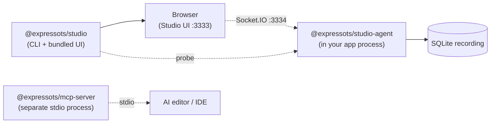

# Studio Overview

ExpressoTS Studio is a local developer experience platform that runs alongside your application during development. It records every HTTP request, captures every log line, snapshots your DI graph, scans your dependencies for vulnerabilities, and exposes everything through a single web UI.

Everything runs on your machine. Nothing is sent off the box.

## Why Studio

In v3, the framework gave you a black-box `app.listen()`. In v4, the framework already exposes a richer runtime (`AppContainer.introspect()`, lifecycle hooks, structured logger, interceptors). Studio is the interactive surface for all of that runtime data.

| Without Studio                                         | With Studio                                                                     |
| ------------------------------------------------------ | ------------------------------------------------------------------------------- |
| `console.log` until you find the failing request       | Click a request in the Timeline, see the full trace, body, headers, and stack   |
| Run `npm audit` once a sprint                          | Live security dashboard with reachability scoring and one-click fixes           |
| Guess which routes are slow                            | Per-route P50/P95/P99 and error rate from real traffic                          |
| Mentally rebuild the DI graph from `provide()` calls   | Architecture Map auto-generated from `AppContainer.introspect()`                |
| Reproduce a bug with `curl` and a notes file           | Replay any recorded request and diff the new response                           |

## Architecture

Studio is split into three packages so production builds stay lean:

| Package                       | Where it runs              | What it does                                                                                       |
| ----------------------------- | -------------------------- | -------------------------------------------------------------------------------------------------- |
| `@expressots/studio`          | Standalone dev process     | Boots the Web UI, probes the agent, opens the browser, owns the CLI.                               |
| `@expressots/studio-agent`    | **Inside your app process** | Instrumentation middleware, SQLite recorder, log capture, DI snapshot, security engine, WS server. |
| `@expressots/mcp-server`      | Separate stdio process     | MCP code-generation server consumed by Claude Desktop, Cursor, and other AI editors.               |

`@expressots/adapter-express` dynamically imports `@expressots/studio-agent` **only when it is installed and `NODE_ENV=development`**, so production deployments never load the agent code and never pay the runtime cost.

## Feature tour

| View                  | Highlights                                                                                                                         |
| --------------------- | ---------------------------------------------------------------------------------------------------------------------------------- |
| Status Dashboard      | App health, runtime info, DI scope counts, top routes, aggregate security score with a click-through to the Security view.        |
| Architecture Map      | Read-only graph of controllers / use-cases / providers / middleware, with DI scope badges and active-path highlighting.            |
| Request Timeline      | Live recording of every HTTP request to local SQLite. Filter, pause/resume, auto-scroll, clear, snapshot.                          |
| Trace Detail          | OpenTelemetry spans rendered per request, headers/body diff, one-click Replay against the running app.                             |
| Live Logs             | In-memory buffer of every framework + app log line. Filter by level, route, and context. Markdown export.                          |
| Error Inspector       | Aggregated runtime errors with stack frames and deep-links to source via `openInEditor`.                                           |
| [Security](./security.mdx) | `npm audit` + OSV.dev advisories, root-cause chains, reachability scoring, and one-click fixes. OWASP API Top 10 runtime posture. |
| API Client            | Built-in HTTP client (method / URL / headers / body / query) that fires requests at your app and shows live responses.             |
| Settings drawer       | Theme, recording cap, replay diff filters, keyboard shortcuts.                                                                     |

## Performance posture

Studio is built to disappear in production and stay out of the hot path in development:

- **Production builds**: the studio-agent module is never imported because `NODE_ENV !== "development"`. There is zero overhead, zero added port, zero file I/O.
- **Recording**: writes to a local SQLite file (`.studio/studio.db`) via prepared statements; writes are batched and never block the request thread.
- **Security scans**: `npm audit` runs as an async child process; results are cached on disk; the engine re-runs only when the lockfile changes or a fix completes.
- **Logs / metrics**: kept in a bounded in-memory ring buffer; oldest entries are dropped first.
- **UI broadcasts**: every frame is debounced and only emitted when at least one client is connected.

See [Installation](./installation.mdx) to add Studio to an existing project, or [Security](./security.mdx) for the new v4 security feature.
